> Week 1: **Examine TCP/IP and OSI Models in Action**
>
> Report by: Aisha Khalifan, cs-cns04-23014
>
> **Introduction**

This report presents the results of a Packet Tracer simulation activity
designed to investigate the TCP/IP

> and OSI models in action. The simulation focuses on two main areas:
>
> • Examining HTTP web traffic
>
> • Displaying elements of the TCP/IP protocol suite

The first part of the simulation uses Packet Tracer to generate web
traffic and examine the HTTP protocol.

This allows us to see how HTTP messages are structured and how they are
exchanged between a web

> browser and a web server.

The second part of the simulation uses Packet Tracer to display the
elements of the TCP/IP protocol suite.

This allows us to see how the different layers of the TCP/IP stack work
together to transmit data over a

> network.
>
> This report will discuss the following aspects of the TCP/IP and OSI
> models:
>
> • The different layers of the TCP/IP and OSI models
>
> • The protocols that are used at each layer
>
> • The role of each layer in the data transmission process
>
> • Examples of how the different layers of the TCP/IP and OSI models
> work together in Packet Tracer

The report will also provide a high-level overview of how the TCP/IP and
OSI models are used in real-

> world networks.
>
> **Objectives**

+-----------------------------------+-----------------------------------+
| > •\                              | > Part 1: Examine HTTP Web        |
| > •                               | > Traffic\                        |
|                                   | > Part 2: Display Elements of the |
|                                   | > TCP/IP Protocol Suite           |
+===================================+===================================+
+-----------------------------------+-----------------------------------+

> **Background**

This simulation activity taught me about the TCP/IP protocol suite and
the OSI model by showing how data

is broken down and put back together as it travels through the network.
I used Packet Tracer to simulate the

> process of requesting a web page from a web server.

This was a chance to learn how Packet Tracer works and to visualize the
encapsulation process, which is

> essential for data communication over networks.
>
> **Methodology**
>
> **[Part 1: Examine HTTP Web Traffic]{.underline}**
>
> **Step1: Switch from Realtime to Simulation mode**

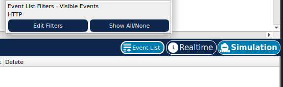{width="3.8472222222222223in"
height="1.1805555555555556in"}

> a)In this step, we were required to switch from Realtime mode to
> simulation mode this is because packet tracer always starts in
> Realtime mode. Click the Simulation mode icon to switch from Realtime
> mode to Simulation mode\
> b)Select HTTP from the Event List Filters.
>
> 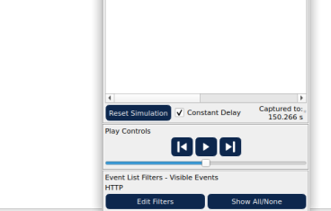{width="1.8416666666666666in"
> height="1.176388888888889in"}

HTTP may already be the only visible event. Click Edit Filters to
display the available visible events. Toggle the Show All/None check box
and notice how the check boxes switch from unchecked to checked or
checked to unchecked, depending on the current state.

Click the Show All/None check box until all boxes are cleared and then
select HTTP. Click anywhere outside of the Edit Filters box to hide it.
The Visible Events should now only display HTTP.

**Step 2:Generate web (HTTP) traffic**.

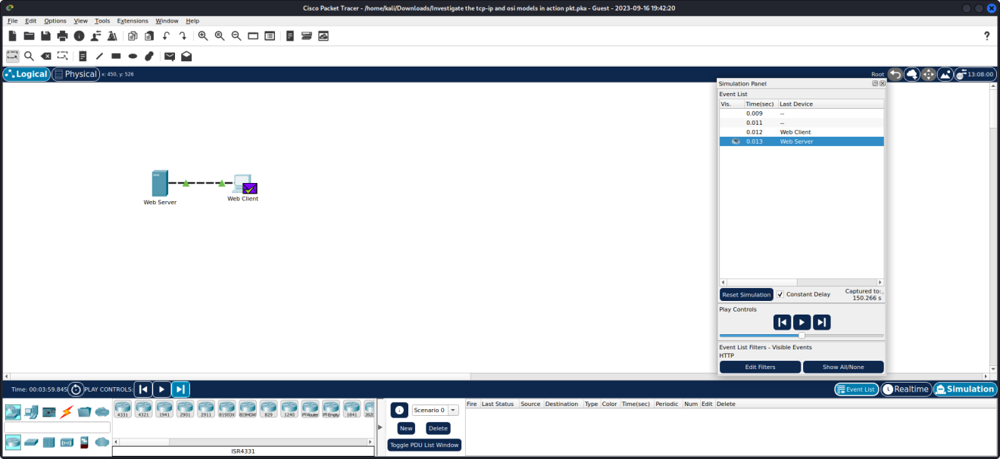{width="6.604166666666667in"
height="3.0375in"}

+-----------------------------------+-----------------------------------+
| > •\                              | > Checked the empty Simulation    |
| > •\                              | > Panel with six columns for      |
| > •                               | > events.                         |
|                                   | >                                 |
| •                                 | > Adjusted panel size and         |
|                                   | > accessed Web Client and Web     |
|                                   | > Server.                         |
|                                   | >                                 |
|                                   | > Followed the steps: a) Clicked  |
|                                   | > Web Client, b) Opened Web       |
|                                   | > Browser, c) Accessed            |
|                                   | > www.osi.local, d) Clicked       |
|                                   | > Capture/Forward four times,     |
|                                   | > resulting in four events in the |
|                                   | > Event List.                     |
|                                   | >                                 |
|                                   | > Confirmed the web page change   |
|                                   | > after the actions.              |
+===================================+===================================+
+-----------------------------------+-----------------------------------+

> 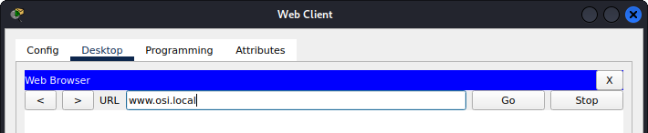{width="5.020833333333333in"
> height="1.0347222222222223in"}
>
> 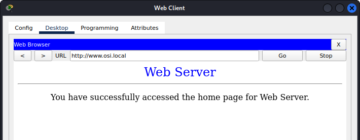{width="4.3041655730533686in"
> height="1.1652777777777779in"}

**Step 3: Explore the contents of the HTTP packet.**

+-----------------------------------+-----------------------------------+
| •                                 | > Executed Action: Clicked the    |
|                                   | > first colored square box under  |
|                                   | > the Event List \> Info column.  |
|                                   | > Expanded Simulation Panel as    |
|                                   | > necessary to view PDU           |
|                                   | > Information at Device: Web      |
|                                   | > Client window, featuring two    |
|                                   | > tabs (OSI Model and Outbound    |
|                                   | > PDU Details) indicating the     |
|                                   | > start of transmission.          |
+===================================+===================================+
+-----------------------------------+-----------------------------------+

> 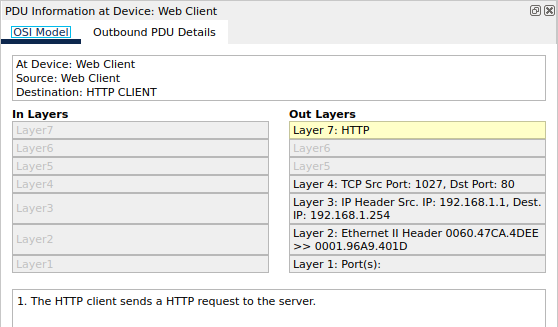{width="5.8125in"
> height="3.4097211286089237in"}

**Step 3b:**

+-----------------------------------+-----------------------------------+
| •                                 | > Verified OSI Model: Ensured OSI |
|                                   | > Model tab was selected,         |
|                                   | > highlighting Layer 7 box. Noted |
|                                   | > \"HTTP\" displayed next to      |
|                                   | > Layer 7 label. Additionally,    |
|                                   | > identified step 1 under In      |
|                                   | > Layers and Out Layers boxes,    |
|                                   | > describing the HTTP request     |
|                                   | > from client to server.          |
+===================================+===================================+
+-----------------------------------+-----------------------------------+

• Layer 4 Analysis: Clicked Next Layer, highlighting Layer 4. Recorded
**Dst Port value: 80.**

> 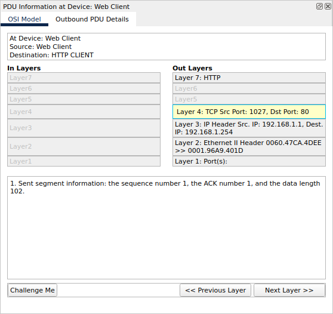{width="2.8333333333333335in"
> height="2.6708333333333334in"}

+-----------------------------------+-----------------------------------+
| •                                 | > Layer 3 Analysis: Clicked Next  |
|                                   | > Layer, highlighting Layer 3.    |
| •                                 | > Noted **Dest. IP value:         |
|                                   | > 192.168.1.254.**                |
|                                   | >                                 |
|                                   | > {width="3.1875in" |
|                                   | > height="3.0041655730533683in"}  |
|                                   | >                                 |
|                                   | > Layer 2 Analysis: Clicked Next  |
|                                   | > Layer, displaying Layer 2       |
|                                   | > information including Ethernet  |
|                                   | > II Header and inbound/outbound  |
|                                   | > MAC addresses.                  |
+===================================+===================================+
+-----------------------------------+-----------------------------------+

> 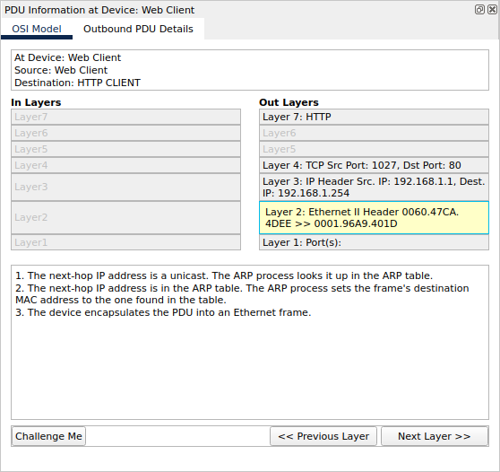{width="3.3125in"
> height="3.1222222222222222in"}
>
> **Step3 c:**

+-----------------------------------+-----------------------------------+
| •                                 | > PDU Details Comparison: Clicked |
|                                   | > the Outbound PDU Details tab,   |
| •                                 | > comparing information with OSI  |
|                                   | > Model tab. Recognized           |
| •                                 | > **detailed Ethernet II          |
|                                   | > information and commonalities   |
|                                   | > in SRC/DST MAC at Layer 2.**    |
|                                   | >                                 |
|                                   | > {width="3.3402777777777777in" |
|                                   | > height="3.1486111111111112in"}  |
|                                   | >                                 |
|                                   | > Layer 1 Observation: Clicked    |
|                                   | > next colored square box, noting |
|                                   | > Layer 1 activity where the      |
|                                   | > frame is moved from the buffer  |
|                                   | > to the network.                 |
|                                   | >                                 |
|                                   | > HTTP Info and Layers: Advanced  |
|                                   | > to the next HTTP Info box,      |
|                                   | > observing directional changes   |
|                                   | > in In Layers and Out Layers     |
|                                   | > columns. Compared differences   |
|                                   | > such as Src/Dst Ports, IPs, and |
|                                   | > MAC addresses.                  |
+===================================+===================================+
+-----------------------------------+-----------------------------------+

+-----------------------------------+-----------------------------------+
| •                                 | > HTTP Message Analysis: Clicked  |
|                                   | > the Outbound PDU Details tab,   |
| •                                 | > specifically examining HTTP     |
|                                   | > section and identifying the     |
|                                   | > first line of the HTTP message: |
|                                   | > \"HTTP/1.1 200 OK,\" indicating |
|                                   | > a successful request and server |
|                                   | > response.                       |
|                                   | >                                 |
|                                   | > Concluding Event: Clicked the   |
|                                   | > last colored square box,        |
|                                   | > revealing two tabs (OSI Model   |
|                                   | > and Inbound PDU Details) due to |
|                                   | > this being the receiving        |
|                                   | > device.                         |
+===================================+===================================+
+-----------------------------------+-----------------------------------+

Overall, the analysis provided a comprehensive understanding of the
network traffic events, encompassing the OSI Model, PDU Details, and
layer-specific information. Notable findings include successful HTTP
requests, directional data flow, and differences in layers during
transmission and reception.

**Step3e:**

+-----------------------------------+-----------------------------------+
| > In layers                       | > Out Layers                      |
+===================================+===================================+
| > Layer 7:HTTP\                   | > Layer 7:HTTP\                   |
| > The server receives a HTTP      | > The server sends back a HTTP    |
| > request.                        | > reply to the client.            |
+-----------------------------------+-----------------------------------+
| > Layer5 and 6:\                  | > Layer5 and 6:\                  |
| > Inactive                        | > Inactive                        |
+-----------------------------------+-----------------------------------+
| > Layer 4:TCP Src Port:1027,Dst   | > Layer 4:TCP Src Port:80,Dst     |
| > Port: 80\                       | > Port: 1027\                     |
| > 1. The device receives a TCP    | > 1. Sent segment information:    |
| > PUSH+ACK segment on the         | > the sequence number 1, the ACK  |
| > connection to 192.168.1.1 on    | > number 103, and the data length |
| > port 1027.                      | > 272.                            |
| >                                 |                                   |
| > 2\. Received segment            |                                   |
| > information: the sequence       |                                   |
| > number 1, the ACK number 1, and |                                   |
| > the data length 102.            |                                   |
| >                                 |                                   |
| > 3\. The TCP segment has the     |                                   |
| > expected peer sequence number.  |                                   |
| >                                 |                                   |
| > 4\. TCP processes payload data. |                                   |
| >                                 |                                   |
| > 5\. TCP reassembles all data    |                                   |
| > segments and passes to the      |                                   |
| > upper layer.                    |                                   |
+-----------------------------------+-----------------------------------+
| > **Layer 3: IP Header Src.       | > **Layer 3: IP Header Src.       |
| > IP:192.168.1.1,**\              | > IP:192.168.1.254,**\            |
| > **Dest. IP: 192.168.1.254**\    | > **Dest. IP: 192.168.1.1**\      |
| > 1. The packet\'s destination IP | > 1. The destination IP address   |
| > address matches the device\'s   | > is in the same subnet. The      |
| > IP address or the broadcast     | > device sets the next-hop to     |
| > address. The device             | > destination.                    |
| > de-encapsulates the packet.     |                                   |
+-----------------------------------+-----------------------------------+
| > **Layer 2:Ethernet II Header    | > **Layer 2:Ethernet II Header    |
| > 006.47CA.4DEE \>\>              | > 0001.96A9.401D \>\>             |
| > 0001.96A9.401D**\               | > 006.47CA.4DEE**\                |
| > 1. The frame\'s destination MAC | > 1. The next-hop IP address is a |
| > address matches the receiving   | > unicast. The ARP process looks  |
| > port\'s MAC address, the        | > it up in the ARP table.         |
| > broadcast address, or a         | >                                 |
| > multicast address.              | > 2\. The next-hop IP address is  |
| >                                 | > in the ARP table. The ARP       |
| > 2\. The device decapsulates the | > process sets the frame\'s       |
| > PDU from the Ethernet frame.    | > destination MAC address to the  |
|                                   | > one found in the table.         |
|                                   | >                                 |
|                                   | > 3\. The device encapsulates the |
|                                   | > PDU into an Ethernet frame.     |
+-----------------------------------+-----------------------------------+
| > **Layer 1:Port FastEthernet0**\ | > **Layer 1:Port(s)               |
| > 1. FastEthernet0 receives the   | > FastEthernet0**\                |
| > frame.                          | > 1. FastEthernet0 sends out the  |
|                                   | > frame.                          |
+-----------------------------------+-----------------------------------+

  ----------------------------------- -----------------------------------

  ----------------------------------- -----------------------------------

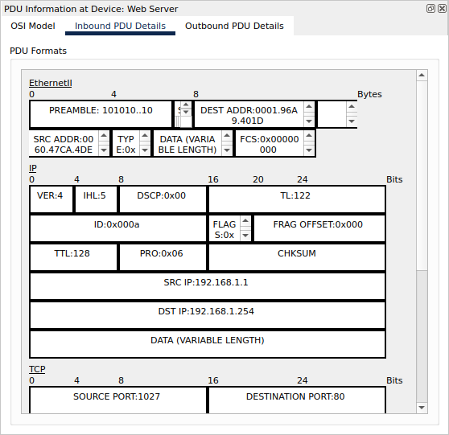{width="4.625in"
height="4.486111111111111in"}

**Step3f: Inbound and Outbound PDU Details**

{width="3.048611111111111in"
height="2.9555555555555557in"}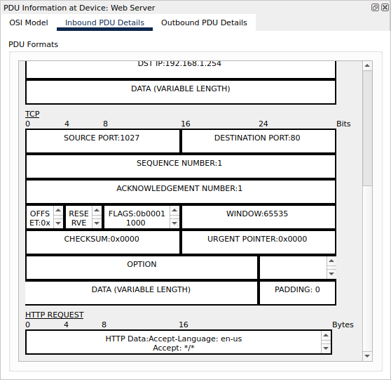{width="3.0277777777777777in"
height="2.937498906386702in"}

Information listed under the PDU Details is reflective of the layers
within the TCP/IP model.

**Step3g:**

Last colored box: It had only 2 tabs displayed with this event:**OSI
model and Inbound PDU details**

**In the OSI model**:We had only the Inlayers that was active but
Outlayers was active

+-----------------------------------+-----------------------------------+
| > In layers                       | > Description                     |
+===================================+===================================+
| > **Layer 7:HTTP**                | > 1\. The HTTP client receives a  |
|                                   | > HTTP reply from the server. It  |
|                                   | > displays the page in the web    |
|                                   | > browser.                        |
+-----------------------------------+-----------------------------------+
| > Layer5 and 6:                   |                                   |
+-----------------------------------+-----------------------------------+
| > **Layer 4:TCP Src Port:80,Dst   | > 1\. The device receives a TCP   |
| > Port: 1027**                    | > PUSH+ACK segment on the         |
|                                   | > connection to 192.168.1.254 on  |
|                                   | > port 80.                        |
|                                   | >                                 |
|                                   | > 2\. Received segment            |
|                                   | > information: the sequence       |
|                                   | > number 1, the ACK number 103,   |
|                                   | > and the data length 272.        |
|                                   | >                                 |
|                                   | > 3\. The TCP segment has the     |
|                                   | > expected peer sequence number.  |
|                                   | >                                 |
|                                   | > 4\. The TCP segment has the     |
|                                   | > expected ACK number. The device |
|                                   | > pops the last sent segment from |
|                                   | > the buffer.                     |
|                                   | >                                 |
|                                   | > 5\. TCP processes payload data. |
|                                   | >                                 |
|                                   | > 6\. TCP reassembles all data    |
|                                   | > segments and passes to the      |
|                                   | > upper layer.                    |
+-----------------------------------+-----------------------------------+
| > **Layer 3: IP Header Src.       | > 1\. The packet\'s destination   |
| > IP:192.168.1.254, Dest. IP:     | > IP address matches the          |
| > 192.168.1.1**                   | > device\'s IP address or the     |
|                                   | > broadcast address. The device   |
|                                   | > de-encapsulates the packet.     |
+-----------------------------------+-----------------------------------+
| > **Layer 2:Ethernet II Header    | > 1\. The frame\'s destination    |
| > 0001.96A9.401D \>\>             | > MAC address matches the         |
| > 006.47CA.4DEE**                 | > receiving port\'s MAC address,  |
|                                   | > the broadcast address, or a     |
|                                   | > multicast address.              |
|                                   | >                                 |
|                                   | > 2\. The device decapsulates the |
|                                   | > PDU from the Ethernet frame.    |
+-----------------------------------+-----------------------------------+
| > **Layer 1:Port FastEthernet0**  | > 1\. FastEthernet0 receives the  |
|                                   | > frame                           |
+-----------------------------------+-----------------------------------+

**[Part 2: Display Elements Of The Tcp/Ip Protocol Suite]{.underline}
Step1:View Additional events**\
**Step1a:Closed any open PDU information windows.**

**Step1b:Additional Event Types displayed**

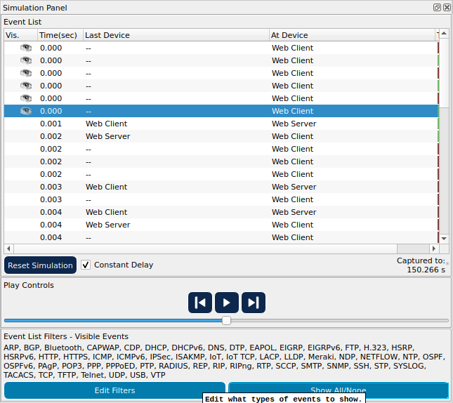{width="4.512498906386702in"
height="4.013888888888889in"}

ARP, DNS, TCP and HTTP.

**Step1c: First DNS event type**\
Click the first DNS event in the Info column. Explore the OSI Model and
PDU Detail tabs and note the encapsulation process. When you look at the
OSI Model tab with Layer 7 highlighted, a description of what is
occurring is listed directly below the In Layers and Out Layers ("1. The
DNS client sends a DNS query to the DNS server."). This is very useful
information to help understand what is occurring during the
communication process**.**

OSI Model and PDU Detail\
**OSI model** has two tabs: Inlayers which is active and Outlayers which
is Inactive **OSI model:Outlayers**

+-----------------------------------+-----------------------------------+
| > In layers                       | > Description                     |
+===================================+===================================+
| > Layer 7:DNS                     | > The DNS client sends an A DNS   |
|                                   | > query to the DNS server.        |
+-----------------------------------+-----------------------------------+
| > Layer5 and 6:Inactive           |                                   |
+-----------------------------------+-----------------------------------+
| > **Layer 4:UDP Src Port: 1025,   | > The device encapsulates the PDU |
| > Dst Port:53**                   | > into an UDP segment.            |
+-----------------------------------+-----------------------------------+
| > **Layer 3: IP Header Src.       | > 1\. The source IP address is    |
| > IP:192.168.1.1, Dest. IP:       | > not specified. The device sets  |
| > 192.168.1.254**                 | > it to the port\'s IP address.   |
|                                   | >                                 |
|                                   | > 2\. The destination IP address  |
|                                   | > is in the same subnet. The      |
|                                   | > device sets the next-hop to     |
|                                   | > destination.                    |
+-----------------------------------+-----------------------------------+

+-----------------------------------+-----------------------------------+
| > **Layer 2:**                    | > 1\. The next-hop IP address is  |
|                                   | > a unicast. The ARP process      |
|                                   | > looks it up in the ARP table.   |
|                                   | >                                 |
|                                   | > 2\. The next-hop IP address is  |
|                                   | > not in the ARP table. The ARP   |
|                                   | > process tries to send an ARP    |
|                                   | > request for that IP address and |
|                                   | > buffers this packet.            |
+-----------------------------------+-----------------------------------+
| > **Layer 1 Inactive**            |                                   |
+-----------------------------------+-----------------------------------+

**Step 1 d:Outbound PDU Details**\
In the DNS Query under the NAME (VARIABLE LENGTH) we get

  -----------------------------------------------------------------------------------------------------------------------------------------------------------------------------------------------
  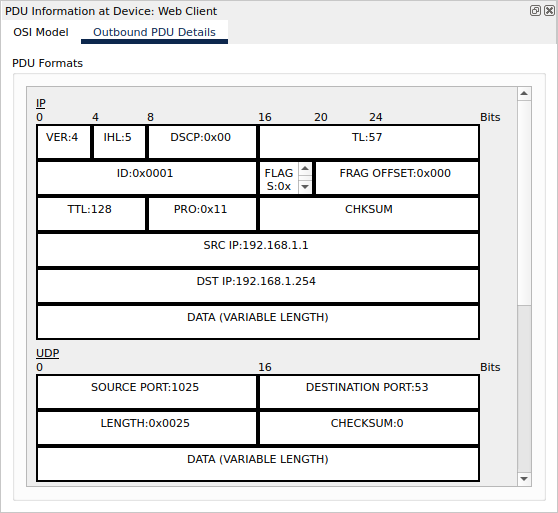{width="2.7777777777777777in"   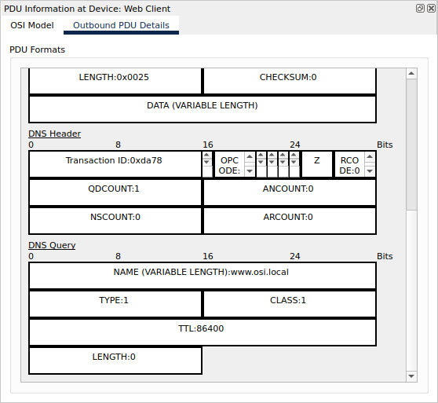{width="2.7277766841644793in"
  height="2.5555555555555554in"}                                                                  height="2.5097222222222224in"}
  ----------------------------------------------------------------------------------------------- -----------------------------------------------------------------------------------------------

  -----------------------------------------------------------------------------------------------------------------------------------------------------------------------------------------------

**Step 1 e:**\
When you click on the last DNS info colored square box in the event list
you get the device at which the the PDU was captured: Web Client(**SRC
IP:192.168.1.254** and the Destination IP DST **IP:192.168.1.1** ) The
value listed next to the **ADDRESS**: In the **DNS ANSWER** section of
the **Inbound PDU** details is: **192.168.1.254 -- Address of the Web
Server**

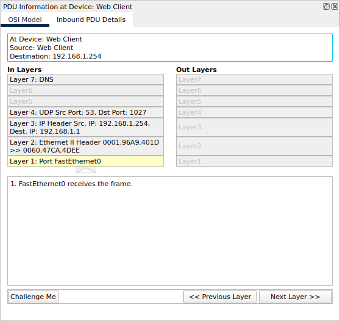{width="4.081943350831146in"
height="2.8152777777777778in"}

**Step 1 f:Layer 4: inlayers and outlayers**

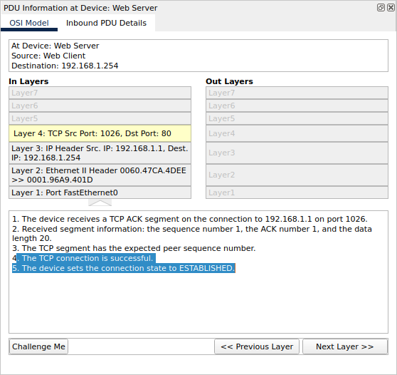{width="4.611111111111111in"
height="3.0069444444444446in"}

1\. The device receives a TCP ACK segment on the connection to
192.168.1.1 on port 1026. 2. Received segment information: the sequence
number 1, the ACK number 1, and the data length 20. 3. The TCP segment
has the expected peer sequence number.

4\. **The TCP connection is successful.**

**5. The device sets the connection state to ESTABLISHED.**

**Step g:** Layer 4: Click the last TCP event. Highlight Layer 4 in the
OSI Model tab. Examine the steps listed directly below In Layers and Out
Layers. What is the purpose of this event, based on the information
provided in the last item in the list (should be item 4)

**Closing the connection(4. The device sets the connection state to
CLOSED.)**

Based on the information that was inspected during the Packet Tracer
capture, what port number is the Web Server listening on for the web
request? **The first HTTP PDU being requested by the Web Client shows
port 80 under the layer 4 DST port.**

What port is the Web Server listening on for a DNS request? **The first
DNS PDU being requested by the Web Client shows a layer 4 destination of
port 53.** DNS requests are handled on port 53 for both TCP and UDP
protocols

**Conclusion**\
In this assignment, we explored TCP/IP and OSI models in a simulated
network. We first examined HTTP traffic, understanding data breakdown
into smaller units (PDUs) at each layer. Then, we explored additional
protocols like ARP, DNS, and TCP, gaining insights into their roles and
encapsulation processes. This exercise laid the foundation for
understanding how protocols facilitate communication and data transfer
in a network. It\'s a crucial step toward comprehending networking
protocols for further study and application
