> Week1: **Assignment 2:-Use Wireshark to Examine Network Traffic**
> Report by: **Aisha Khalifan, cs-cns04-23014**
>
> **Introduction**\
> **Topology**\
> Network topology is the interconnected pattern of network elements. A
> network topology may be physical, mapping hardware configuration, or
> logical, mapping the path that the data must take in order to travel
> around the network.

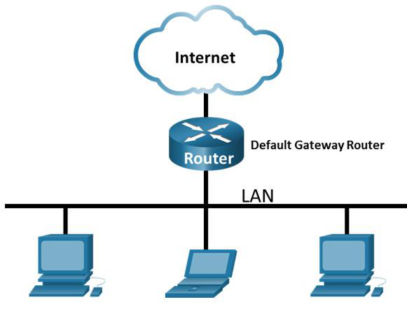{width="2.922221128608924in"
height="2.2180544619422573in"}

> **Objectives**\
> Part 1: Capture and Analyze Local ICMP Data in Wireshark\
> Part 2: Capture and Analyze Remote ICMP Data in Wireshark\
> **Background**\
> Wireshark is a software protocol analyzer, or "packet sniffer"
> application, used for network\
> troubleshooting, analysis, software and protocol development, and
> education. As data streams travel back and forth over the network, the
> sniffer "captures" each protocol data unit (PDU) and can decode and
> analyze its content according to the appropriate RFC or other
> specifications.
>
> Wireshark is a useful tool for anyone working with networks and can be
> used with most labs in the CCNA courses for data analysis and
> troubleshooting. In this lab, we use Wireshark to capture ICMP data
> packet IP addresses and Ethernet frame MAC addresses.
>
> **Required Resources**\
> 1 PC (Windows with internet access)\
> Additional PCs on a local-area network (LAN) were used to reply to
> ping requests.
>
> **Methodology**\
> **Instructions**
>
> 1

**Part 1: Capture and Analyze Local ICMP Data in Wireshark**

In Part 1 of this lab, you will ping another PC on the LAN and capture
ICMP requests and replies in Wireshark. You will also look inside the
frames captured for specific information. This analysis should help to
clarify how packet headers are used to transport data to their
destination.

**Step 1: Retrieve your PC interface addresses.**

For this lab, you will need to retrieve your PC IP address and its
network interface card (NIC) physical address, also called the MAC
address.

> a.In a command prompt window, enter ipconfig /all, to the IP address
> of your PC interface, its description, and its MAC (physical) address.
>
> 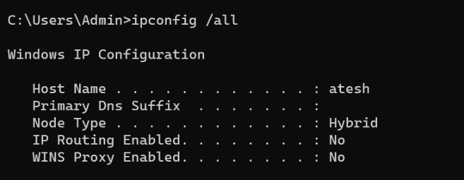{width="2.9152766841644793in"
> height="1.131943350831146in"}
>
> 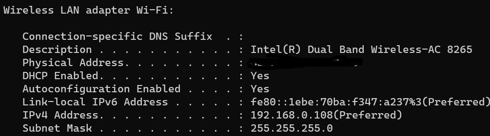{width="3.9777766841644793in"
> height="1.1083333333333334in"}
>
> b.Ask a team member or team members for their PC IP address and
> provide your PC IP address to them. Do not provide them with your MAC
> address at this time

**Step 2: Start Wireshark and begin capturing data.**

> a.Navigate to Wireshark. Double-click the desired interface to start
> the packet capture. Make sure the desired interface has traffic.
>
> 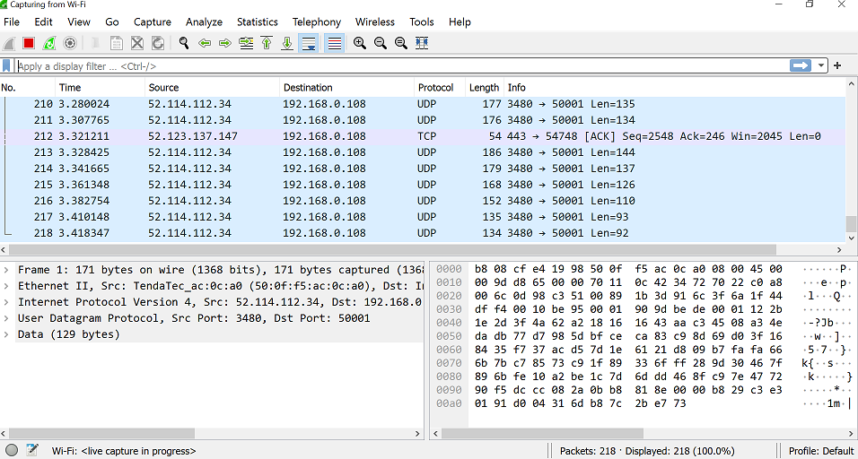{width="4.936111111111111in"
> height="2.6444433508311462in"}

2

> b.Information will start scrolling down the top section in Wireshark.
> The data lines will appear in different colors based on protocol
>
> This information can scroll by very quickly depending on what
> communication is taking place between your PC and the LAN. We can
> apply a filter to make it easier to view and work with the data that
> is being captured by Wireshark.
>
> For this lab, we are only interested in displaying **ICMP (ping)
> PDUs**. Type **icmp** in the Filter box at the top of Wireshark and
> press Enter, or click the Apply button (arrow sign) to view only
> **ICMP (ping) PDUs.**
>
> 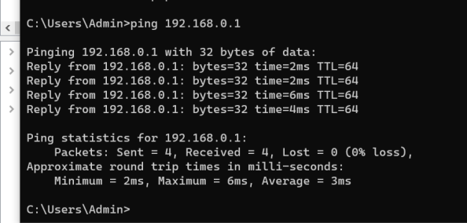{width="2.9722222222222223in"
> height="1.4236100174978128in"}
>
> c.This filter causes all data in the top window to disappear, but you
> are still capturing the traffic on the interface. Navigate to a
> command prompt window and ping the IP address that you received from
> your team member.
>
> **I did ping from my default gateway then captured the ICMP PDUS as
> seen below:**
>
> 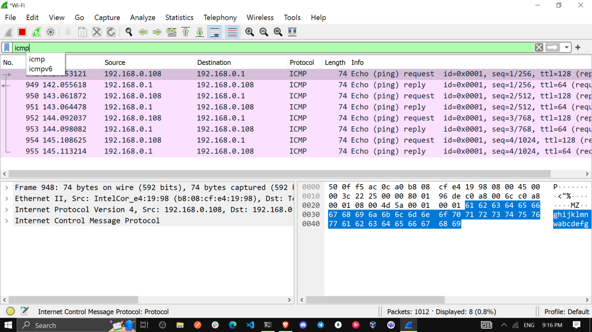{width="5.873611111111111in"
> height="3.304165573053368in"}
>
> d\. Stop capturing data by clicking the **Stop Capture** icon.

3

> **Step 3: Examine the captured data.**
>
> Examine the data that was generated by the ping requests of your team
> member PC. Wireshark data is displayed in three sections: 1) The top
> section displays the list of PDU frames captured with a summary of the
> IP packet information listed; 2) the middle section lists PDU
> information for the frame selected in the top part of the screen and
> separates a captured PDU frame by its protocol layers; and 3) the
> bottom section displays the raw data of each layer. The raw data is
> displayed in both hexadecimal and decimal form.

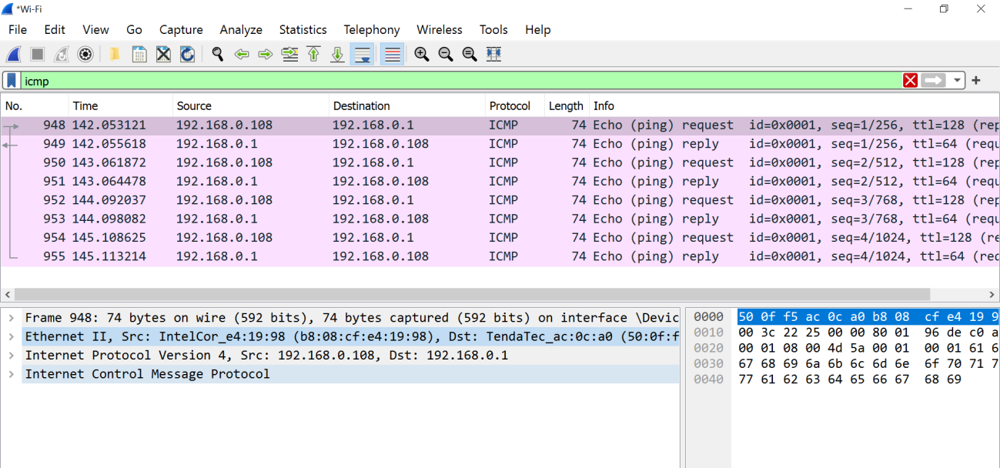{width="6.5in"
height="3.0416655730533684in"}

> a.Click the first ICMP request PDU frames in the top section of
> Wireshark. Notice that the Source column has your PC IP address, and
> the **Destination** column contains the IP address of the teammate PC
> that you pinged.
>
> **Source column IP address:**\
> **Destination column IP address:**
>
> b.With this PDU frame still selected in the top section, navigate to
> the middle section. Click the plus sign to the left of the Ethernet II
> row to view the destination and source MAC addresses.
>
> Does the source MAC address match your PC interface? Yes(Ethernet II,
> Src: IntelCor_e4:19:98 (b8:08:cf:e4:19:98),
>
> Does the destination MAC address in Wireshark match your team member
> MAC address? Yes(Dst: TendaTec_ac:0c:a0 (50:0f:f5:ac:0c:a0)) matches
> my other MAC address
>
> How is the MAC address of the pinged PC obtained by your PC?
>
> The MAC address is obtained through an Address Resolution
> Protocol(ARP) request. So I changed the search filter from icmp to ARP
> as illustrated in the following picture:
>
> 4
>
> 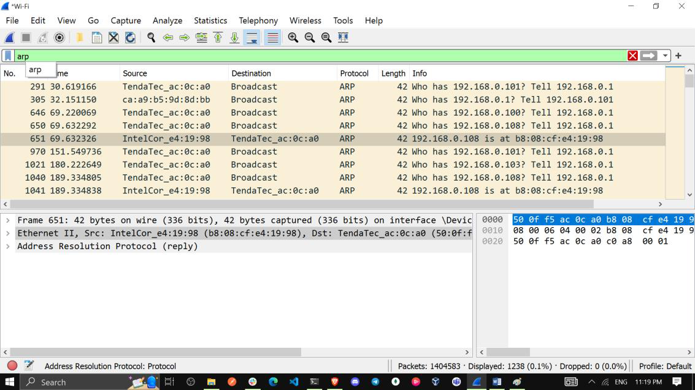{width="5.666666666666667in"
> height="3.1875in"}
>
> **Note:** In the preceding example of a captured ICMP request, ICMP
> data is encapsulated inside an IPv4 packet PDU (IPv4 header) which is
> then encapsulated in an Ethernet II frame PDU (Ethernet II header) for
> transmission on the LAN.
>
> **Part 2: Capture and Analyze Remote ICMP Data in Wireshark**\
> In Part 2, you will ping remote hosts (hosts not on the LAN) and
> examine the generated data from those pings. You will then determine
> what is different about this data from the data examined in Part 1.
>
> **Step 1: Start capturing data on the interface.**
>
> **a.Start the data capture again.**
>
> b.A window prompts you to save the previously captured data before
> starting another capture. It is not necessary to save this data. Click
> Continue without Saving.
>
> 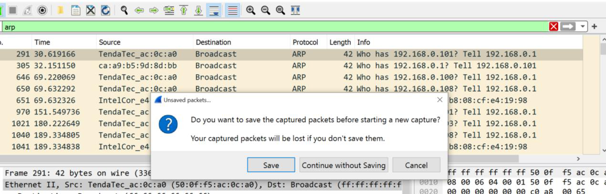{width="6.354166666666667in"
> height="2.0416666666666665in"}
>
> c.With the capture active, ping the following three website URLs from
> a Windows command prompt:
>
> 1\)
>
> 5
>
> 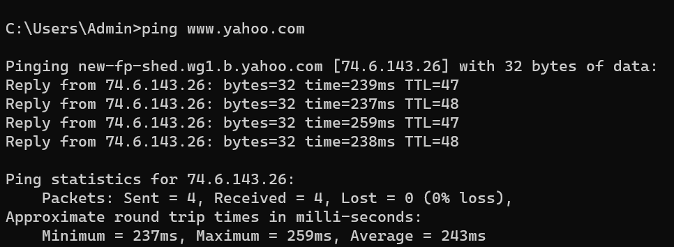{width="3.5944444444444446in"
> height="1.3166666666666667in"}
>
> **After ping:** The Domain Name Server (DNS) translates the URL to an
> IP address **So the IP address of** is 74.6.143.26\
> **MAC Address: b8:08:cf:e4:19:98(Default/Router)**
>
> 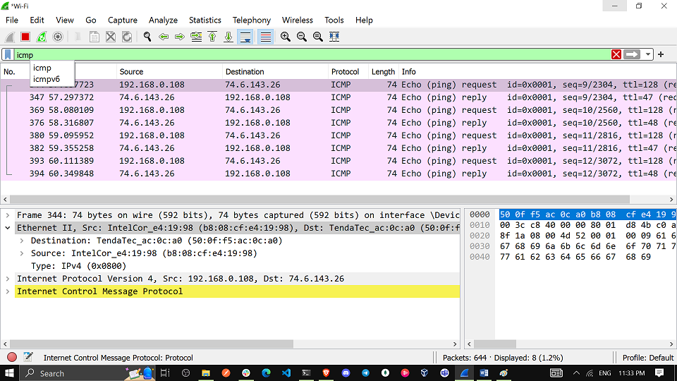{width="5.706944444444445in"
> height="3.209722222222222in"}
>
> 2\)
>
> 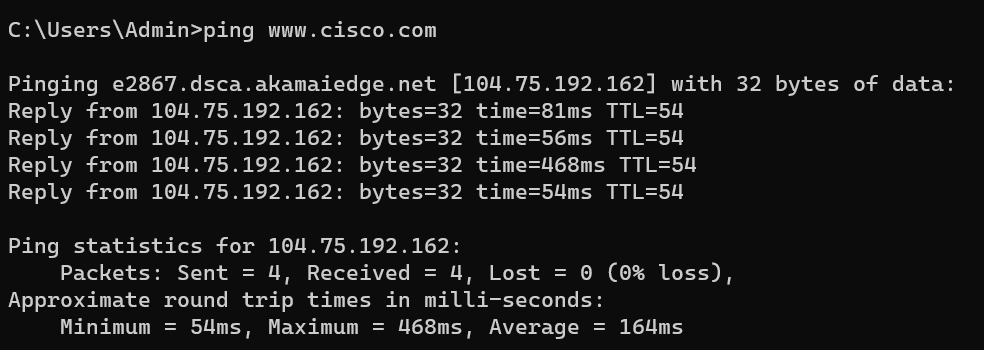{width="4.566666666666666in"
> height="1.625in"}
>
> **After ping:** The Domain Name Server (DNS) translates the URL to an
> IP address **So the IP address of** is **104.75.192.162**\
> **MAC address: b8:08:cf:e4:19:98(default gateway/router)**
>
> 6
>
> 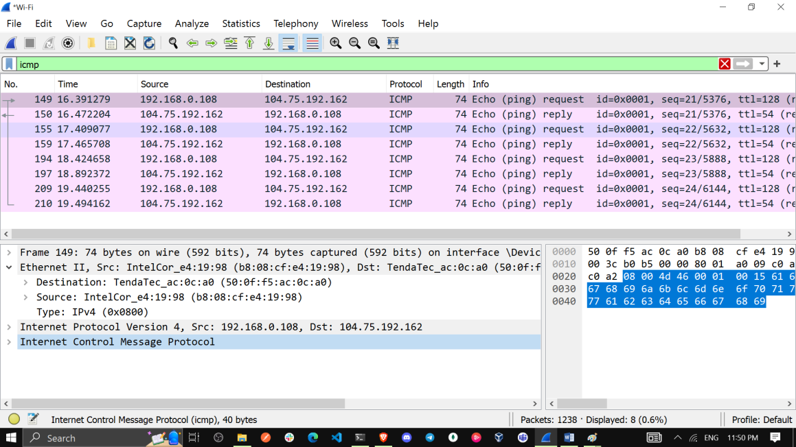{width="5.7972222222222225in"
> height="3.261111111111111in"}
>
> 3\)
>
> 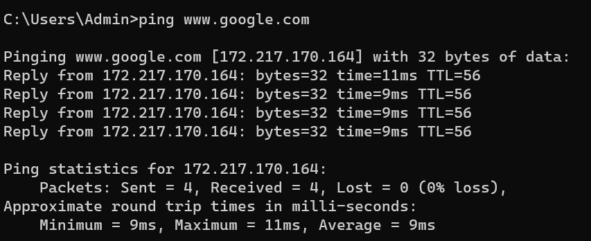{width="4.665277777777778in"
> height="1.9027777777777777in"}
>
> **After ping:** The Domain Name Server (DNS) translates the URL to an
> IP address **So the IP address of** is **172.217.170.164**\
> **MAC address: b8:08:cf:e4:19:98(default gateway/router)**
>
> 7
>
> 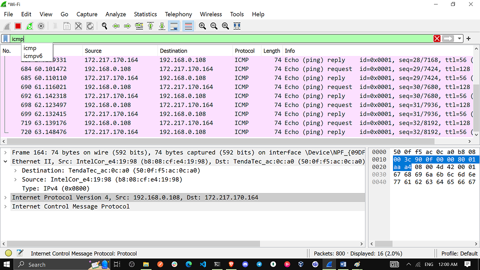{width="5.6097222222222225in"
> height="3.1555555555555554in"}
>
> **Note:** When you ping the URLs listed, notice that the Domain Name
> Server (DNS) translates the URL to an IP address. Note the IP address
> received for each URL.
>
> **d.You can stop capturing data by clicking the Stop Capture icon.**
>
> **Step 2: Examining and analyzing the data from the remote hosts.**
>
> Review the captured data in Wireshark and examine the IP and MAC
> addresses of the three locations that you pinged. List the destination
> IP and MAC addresses for all three locations in the space provided.
>
> **IP address for www.yahoo.com: 74.6.143.26**\
> **MAC address for www.yahoo.com: b8:08:cf:e4:19:98 IP address for
> www.cisco.com: 104.75.192.162**
>
> **MAC address for www.cisco.com: b8:08:cf:e4:19:98**\
> **IP address for www.google.com: 172.217.170.164**\
> **MAC address for www.google.com: b8:08:cf:e4:19:98**\
> IP addresses: **74.6.143.26, 104.75.192.162,172.217.170.164**-these IP
> addresses vary but:\
> **MAC address: will be the same for all three locations. It is the
> physical address of the default-gateway LAN interface of the router.**
>
> What is significant about this information?
>
> 8
>
> **The MAC addresses for all three locations are the same.**
>
> How does this information differ from the local ping information you
> received in Part 1?
>
> **When pinging a computer on the same network, you get the MAC address
> of that computer\'s network card. When pinging a computer outside your
> local network, you get the MAC address of your router\'s LAN
> interface.**
>
> Reflection Question\
> **Why does Wireshark show the actual MAC address of the local hosts,
> but not the actual MAC address for the remote hosts?**
>
> **When communicating with a remote host beyond the local network, the
> precise MAC addresses for those hosts are unknown within the local
> network. Therefore, the MAC address of the default gateway, acting as
> a central hub for external communications, is utilized. Upon reaching
> the default gateway router, the packet undergoes a process where the
> existing Layer 2 (Data Link Layer) information is stripped from the
> packet. Subsequently, a new Layer 2 header is affixed to the packet,
> containing the destination MAC address of the next hop router. This
> ensures the packet is directed accurately to its intended destination
> beyond the local network.**
>
> **Appendix A: Allowing ICMP Traffic Through a Firewall**\
> If the members of your team are unable to ping your PC, the firewall
> may be blocking those requests. This appendix describes **how to
> create a rule in the firewall to allow ping requests**. It also
> describes **how to disable the new ICMP rule after you have completed
> the lab.**
>
> **Part 1: Create a new inbound rule allowing ICMP traffic through the
> firewall.**
>
> **a.**Navigate to the Control Panel and click the System and Security
> option in the Category view. **b.**In the System and Security window,
> click Windows Defender Firewall or Windows Firewall.
>
> 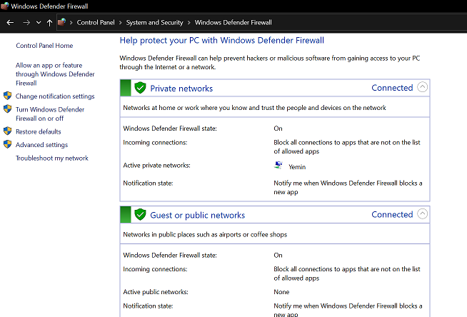{width="4.430555555555555in"
> height="3.0069444444444446in"}
>
> **c.**In the left pane of the Windows Defender Firewall or Windows
> Firewall window, click Advanced settings
>
> 9
>
> 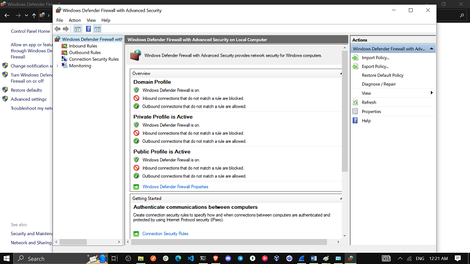{width="6.5in"
> height="3.6555555555555554in"}
>
> **d.** On the Advanced Security window, click the Inbound Rules option
> on the left sidebar and then click New Rule... on the right sidebar.
>
> 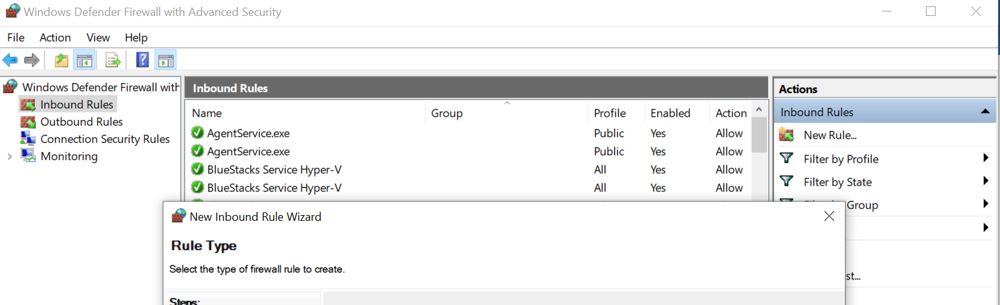{width="6.5in"
> height="1.9819444444444445in"}
>
> **e.**This launches the **New Inbound Rule** On the Rule Type screen,
> click **the Custom radio button** and click Next.
>
> 10

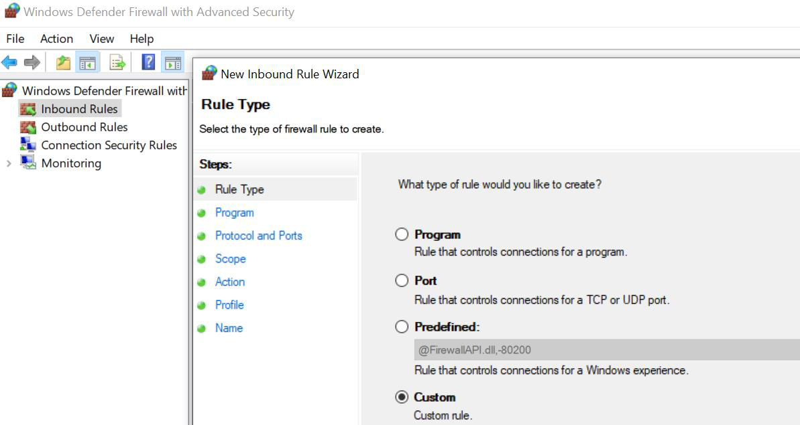{width="6.201388888888889in"
height="3.3in"}

> **f.** In the left pane, click the Protocol and Ports option and using
> the Protocol Type drop-down menu, select ICMPv4, and then click Next.
>
> 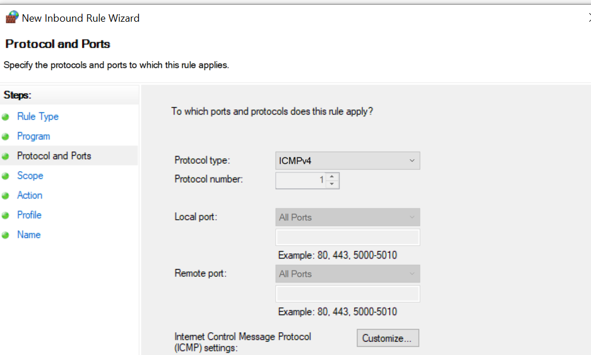{width="6.5in"
> height="3.9027777777777777in"}
>
> **g.**Verify that Any IP address for both the local and remote IP
> addresses are selected. Click Next to continue.
>
> 11
>
> 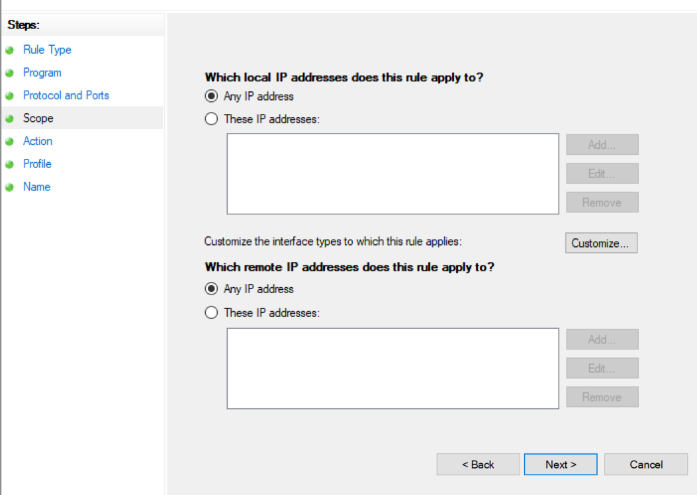{width="5.340277777777778in"
> height="3.7930555555555556in"}
>
> **h.**Select **Allow the connection**. Click Next to continue.
>
> 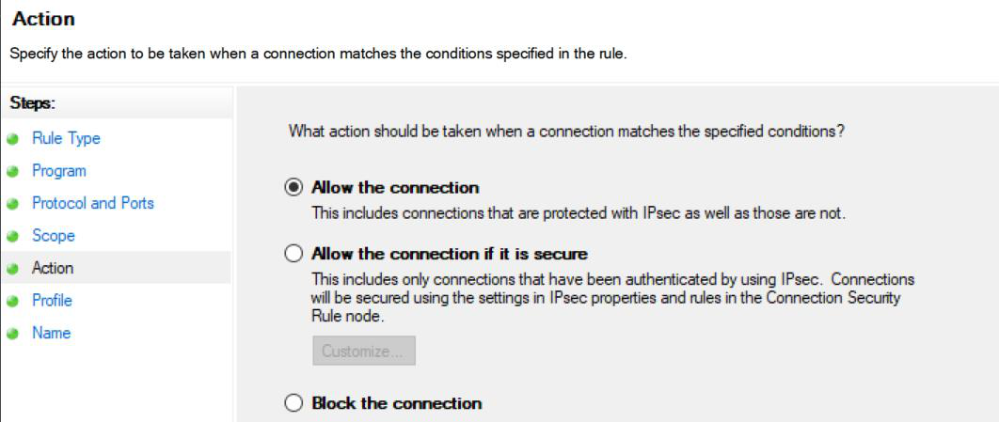{width="6.5in"
> height="2.7486100174978128in"}
>
> **i.** By default, this rule applies to all the profiles. Click Next
> to continue.
>
> 12
>
> 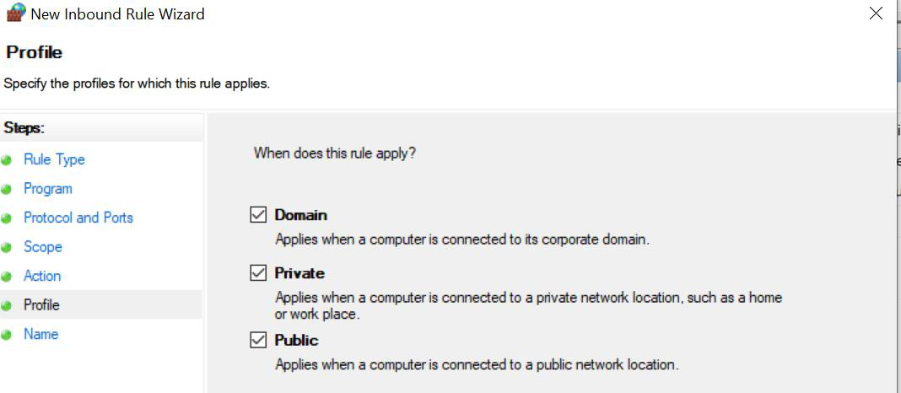{width="5.519444444444445in"
> height="2.408333333333333in"}
>
> **j.** Name the rule with **Allow ICMP Requests**. Click Finish to
> continue. This new rule should allow your team members to receive ping
> replies from your PC.
>
> 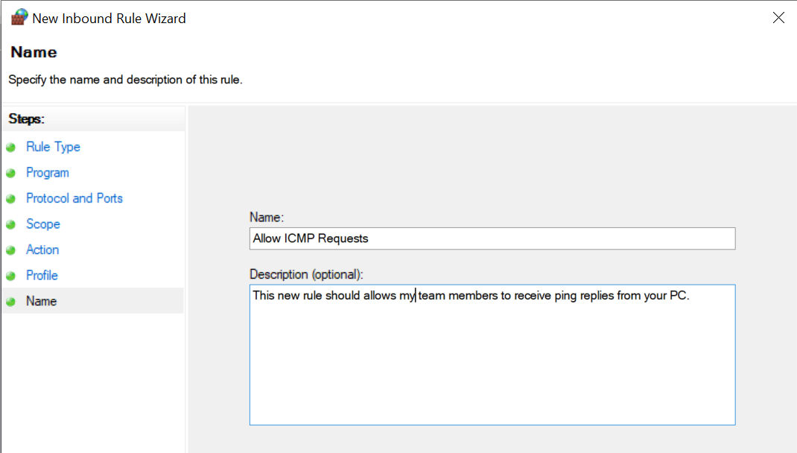{width="5.7555555555555555in"
> height="3.2708333333333335in"}
>
> **Part 2: Disabling or deleting the new ICMP rule.**
>
> After the lab is complete, you may want to disable or even delete the
> new rule you created in Step 1.
>
> Using the Disable Rule option allows you to enable the rule again at a
> later date. Deleting the rule permanently deletes it from the list of
> inbound rules.
>
> a.On the Advanced Security window, click Inbound Rules in the left
> pane and then locate the rule you created previously.
>
> 13

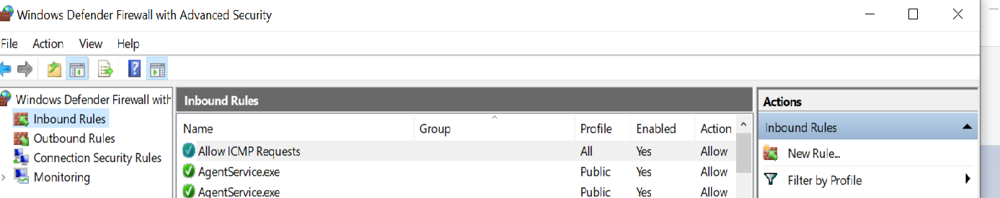{width="6.5in"
height="1.2944433508311461in"}

> b\. Right-click the ICMP rule and select Disable Rule if so desired.
> You may also select Delete if you want to permanently delete it. If
> you choose this option, you must re-create the rule again to allow
> ICMP replies.
>
> **I right clicked on the Rule and deleted it**
>
> **Conclusion**\
> In this project, we used Wireshark to capture and analyze ICMP data
> for both local and remote hosts. When pinging a local host, the MAC
> address of the PC\'s NIC was obtained, while for remote hosts, the MAC
> address of the default gateway LAN interface was retrieved. Notably,
> remote host MAC addresses were the same, representing the default
> gateway\'s LAN interface. This project illuminated the MAC address
> handling differences between local and remote ICMP communication,
> enhancing understanding of network protocols and data transportation.
>
> 14
