> Week2: **Assignment 1:-Packet Tracer - Build a Switch and Router
> Network** Report by: **Aisha Khalifan, cs-cns04-23014**\
> **Introduction**\
> This is a report on how we build a switch and a router network using
> Cisco packet tracer **Lab - Build a Switch and Router Network**\
> .
>
> **Topology**

  ----------------------------------------------------------------------------------------------
  {width="4.7652777777777775in"
  height="0.6388877952755906in"}
  ----------------------------------------------------------------------------------------------

  ----------------------------------------------------------------------------------------------

> **Addressing Table**

+-----------------+-----------------+-----------------+-----------------+
| **Device**      | **Interface**   | **IP Address /  | **Default       |
|                 |                 | Prefix**        | Gateway**       |
+=================+=================+=================+=================+
| > R1            | > G0/0/0        | > 192.168.0.1   | > N/A           |
|                 |                 | > /24           |                 |
+-----------------+-----------------+-----------------+-----------------+
|                 |                 | > 2001          |                 |
|                 |                 | :db8:acad::1/64 |                 |
+-----------------+-----------------+-----------------+-----------------+
|                 |                 | > fe80::1       |                 |
+-----------------+-----------------+-----------------+-----------------+
|                 | > G0/0/1        | > 192.168.1.1   | > N/A           |
|                 |                 | > /24           |                 |
+-----------------+-----------------+-----------------+-----------------+
|                 |                 | > 200:d         |                 |
|                 |                 | b8:acad:1::1/64 |                 |
+-----------------+-----------------+-----------------+-----------------+
|                 |                 | > fe80::1       |                 |
+-----------------+-----------------+-----------------+-----------------+
| > S1            | > VLAN 1        | > 192.168.1.2   | > 192.168.1.1   |
|                 |                 | > /24           |                 |
+-----------------+-----------------+-----------------+-----------------+
| > PC-A          | > NIC           | > 192.168.1.3   | > 192.168.1.1   |
|                 |                 | > /24           |                 |
+-----------------+-----------------+-----------------+-----------------+
|                 |                 | > 2001:d        | > fe80::1       |
|                 |                 | b8:acad:1::3/64 |                 |
+-----------------+-----------------+-----------------+-----------------+
| > PC-B          | > NIC           | > 192.168.0.3   | > 192.168.0.1   |
|                 |                 | > /24           |                 |
+-----------------+-----------------+-----------------+-----------------+
|                 |                 | > 2001          | > fe80::1       |
|                 |                 | :db8:acad::3/64 |                 |
+-----------------+-----------------+-----------------+-----------------+

> **Objectives**\
> **Part 1: Set Up the Topology and Initialize Devices**\
> **Part 2: Configure Devices and Verify Connectivity**\
> **Background / Scenario**\
> This is a comprehensive lab to review previously covered IOS commands.
> In this lab, you will cable the equipment as shown in the topology
> diagram. You will then configure the devices to match the addressing
> table. After the configurations have been saved, you will verify your
> configurations by testing for network connectivity.

After the devices have been configured and network connectivity has been
verified, you will use IOS

> commands to retrieve information from the devices to answer questions
> about your network equipment.

This lab provides minimal assistance with the actual commands necessary
to configure the router. Test your

> knowledge by trying to configure the devices without referring to the
> content or previous activities.

**Note:** The routers used with CCNA hands-on labs are Cisco 4221 with
Cisco IOS XE Release 16.9.4

(universalk9 image). The switches used in the labs are Cisco Catalyst
2960s with Cisco IOS Release 15.2(2)

(lanbasek9 image). Other routers, switches, and Cisco IOS versions can
be used. Depending on the model

and Cisco IOS version, the commands available and the output produced
might vary from what is shown

in the labs. Refer to the Router Interface Summary Table at the end of
the lab for the correct interface

> identifiers.

**Note:** Ensure that the routers and switches have been erased and have
no startup configurations. Consult

> with your instructor for the procedure to initialize and reload a
> router and switch.

The **default bias** template used by the Switch Database Manager (SDM)
does not provide IPv6 address

capabilities. Verify that SDM is using either the **dual-ipv4-and-ipv6**
template or the **lanbase-**

> **routing** template. The new template will be used after reboot even
> if the configuration is not saved.
>
> S1# **show sdm prefer**
>
> Use the following commands to assign the **dual-ipv4-and-ipv6**
> template as the default SDM template.
>
> **S1# configure terminal**
>
> **S1(config)# sdm prefer dual-ipv4-and-ipv6 default**
>
> **S1(config)# end**
>
> **S1# reload**
>
> **Required Resources**
>
> • 1 Router (**Cisco 4221** with **Cisco IOS XE Release 16.9.4
> universal image** or comparable)
>
> • 1 Switch (**Cisco 2960** with **Cisco IOS Release 15.2(2)
> lanbasek9** image or comparable)
>
> • 2 PCs (Windows with a terminal emulation program, such as Tera Term)
>
> • Console cables to configure the Cisco IOS devices via the console
> ports
>
> • Ethernet cables as shown in the topology

Note: The Gigabit Ethernet interfaces on Cisco 4221 routers are
autosensing and an Ethernet straight-

through cable may be used between the router and PC-B. If using another
model Cisco router, it may be

> necessary to use an Ethernet crossover cable.
>
> **Instructions**
>
> **[Part 1: Set Up Topology and Initialize Devices]{.underline}**
>
> **Step 1: Cable the network as shown in the topology.**
>
> a.Attach the devices shown in the topology diagram, and cable, as
> necessary.
>
> 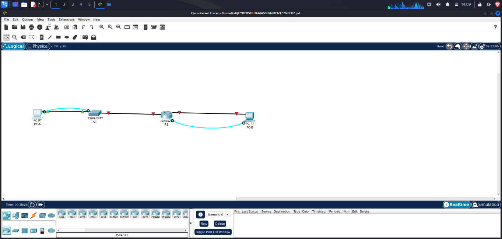{width="6.194444444444445in"
> height="2.9611111111111112in"}
>
> b.Power on all the devices in the topology.

**Step 2: Initialize and reload the router and switch.**

If configuration files were previously saved on the router and switch,
initialize and reload these devices back to their default
configurations.

**[Part 2: Configure Devices and Verify Connectivity]{.underline}**\
In Part 2, you will set up the network topology and configure basic
settings, such as the interface IP addresses, device access, and
passwords. Refer to the **Error! Reference source not found.** and
**Error!**

**Reference source not found**. at the beginning of this lab for device
names and address information. **[Step 1: Assign static IP information
to the PC interfaces.]{.underline}**

> a.Configure the IP address, subnet mask, and default gateway settings
> on PC-A.
>
> 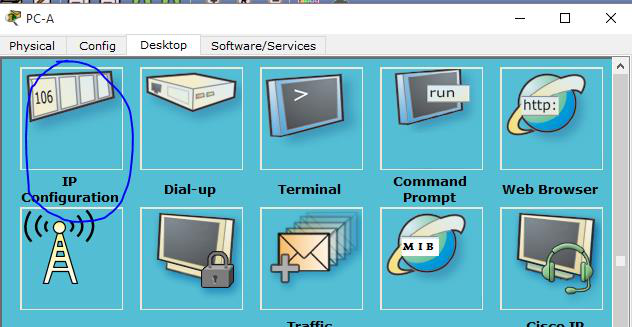{width="4.530555555555556in"
> height="2.0277777777777777in"}
>
> 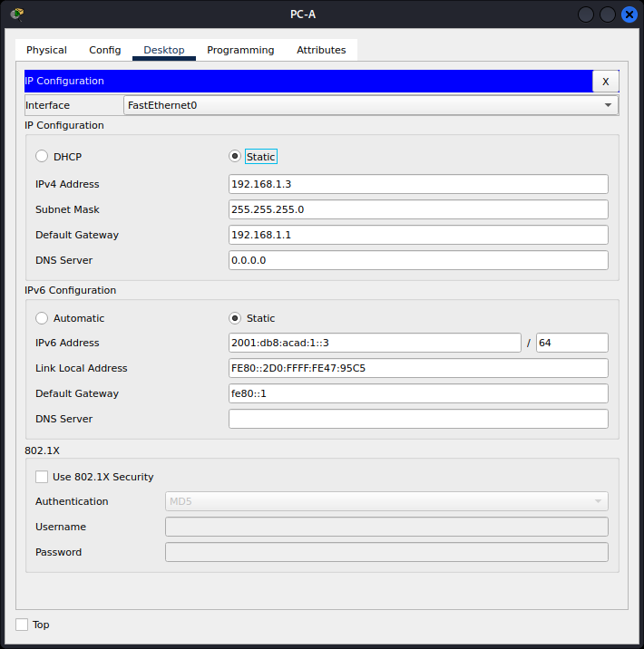{width="4.973611111111111in"
> height="5.016666666666667in"}
>
> **b.Configure the IP address, subnet mask, and default gateway
> settings on PC-B.**
>
> 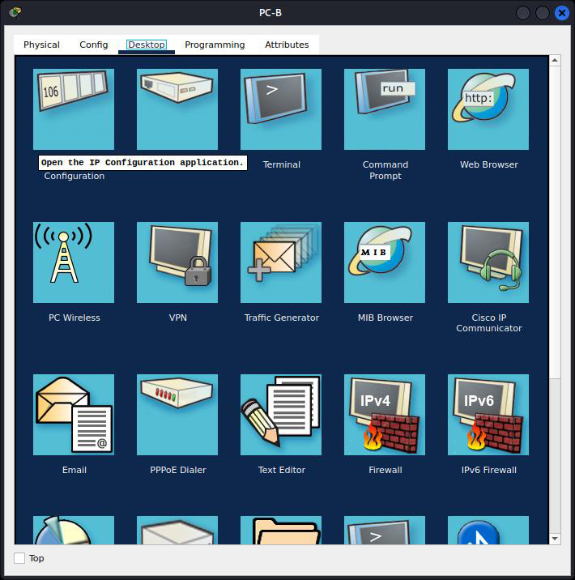{width="2.827777777777778in"
> height="2.852777777777778in"}
>
> 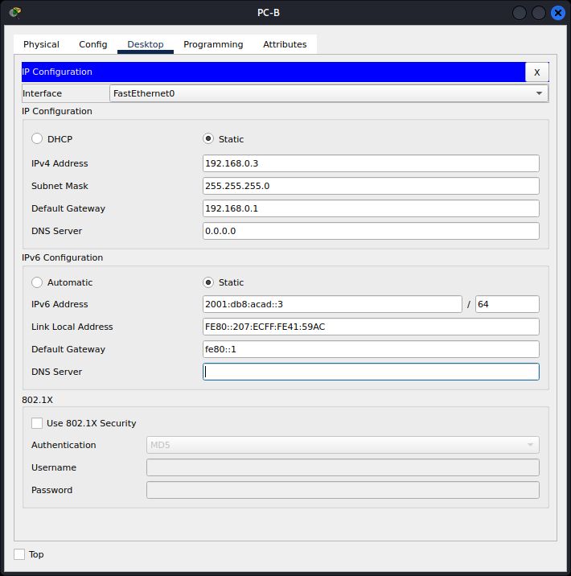{width="4.594444444444444in"
> height="4.633333333333334in"}
>
> **c.Ping PC-B from a command prompt window on PC-A.**
>
> 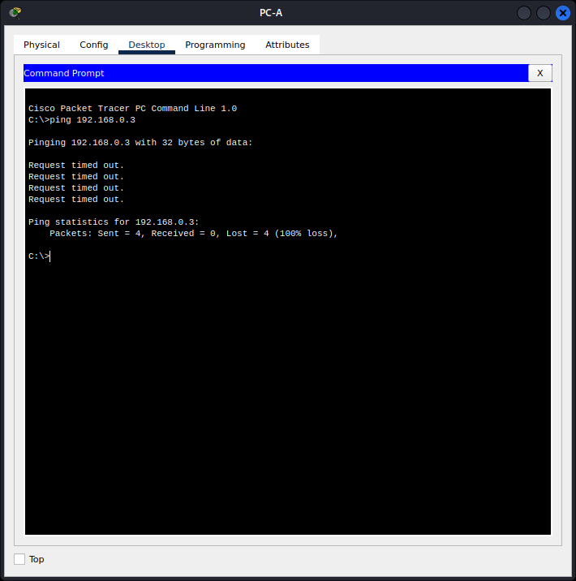{width="4.404166666666667in"
> height="4.441666666666666in"}

**Note:** If pings are not successful, the Windows Firewall may need to
be turned off.

**Why were the pings not successful?**

**The router interfaces (default gateways -which act as the main paths
for data) have not been configured yet so Layer 3 traffic is not being
routed between subnets**. **This means that data is not moving between
different networks as intended.**

**[Step 2: Configure the router]{.underline}.**

**a.**Console into the router and enable privileged EXEC mode.

Router\> **enable**\
**We connect to the router via PC-B since we have connected them via
console. Right click on PC-B, then select Terminal. Click OK. The
hash(#) in the terminal shows you that you're in the privileged EXEC
mode**

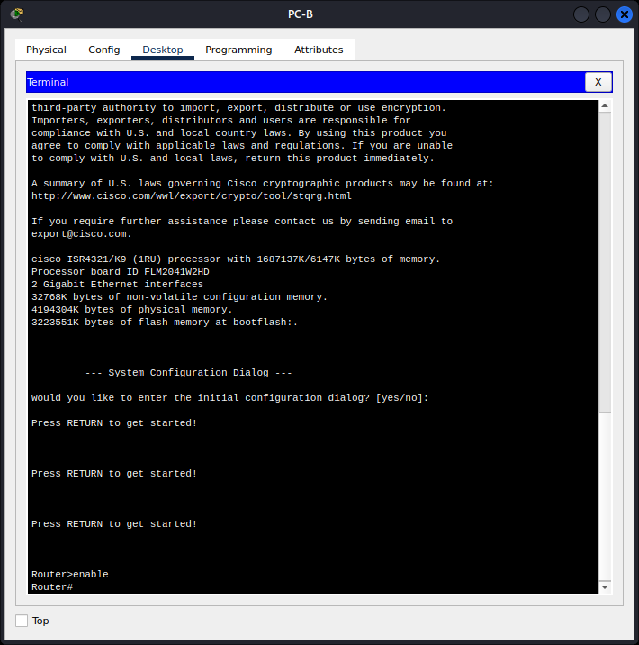{width="5.606944444444444in"
height="5.654166666666667in"}

b.Enter configuration mode.\
Router# **config terminal**

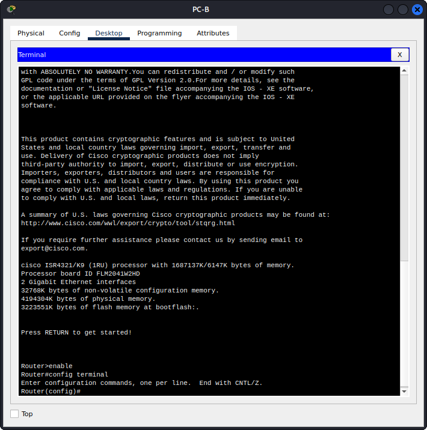{width="5.458333333333333in"
height="5.504166666666666in"}

c.Assign a device name to the router.

Router(config)# **hostname R1**\
**We assign a name R1 to our router as shown below:**

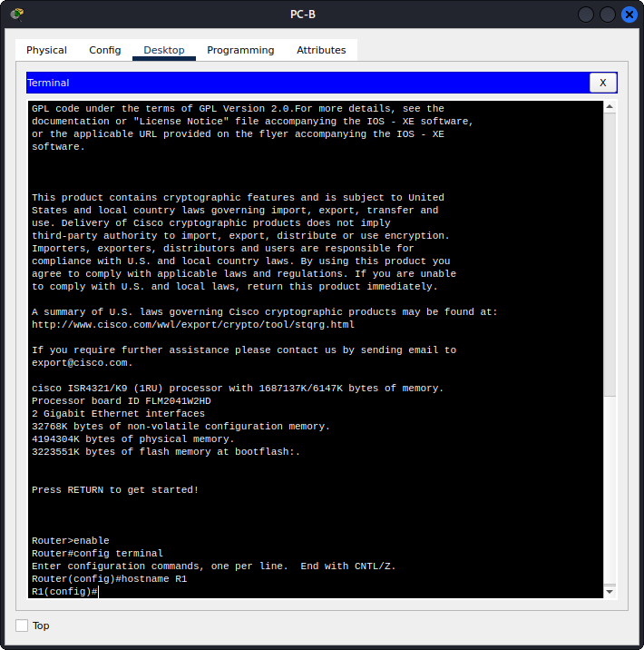{width="4.726388888888889in"
height="4.766666666666667in"}

d.Disable DNS lookup to prevent the router from attempting to translate
incorrectly entered commands as though they were host names.\
R1(config)# **no ip domain lookup**

> {width="4.152777777777778in"
> height="4.1875in"}

e.Assign class as the privileged EXEC encrypted password.

> R1(config)# **enable secret class**\
> **This command sets the encrypted password for privileged EXEC mode.
> The password \"class\" is being used here.**
>
> 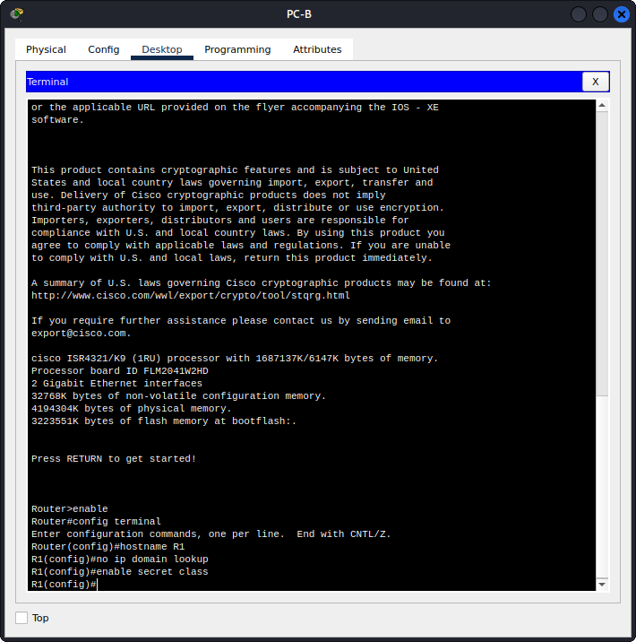{width="6.5in"
> height="6.555555555555555in"}

f.Assign cisco as the console password and enable login.

> R1(config)# **line console 0 This command enters global configuration
> mode and selects the console line for configuration. The console line
> number \"0\" is being specified, indicating the console port on the
> router.**
>
> R1(config-line)# **password cisco This command is configuring a
> password for the console line. The password \"cisco\" is being set,
> which means that anyone trying to access the console will need to
> enter this password.**
>
> R1(config-line)# **login This command enables login on the console
> line. When someone connects to the router via the console port, they
> will be prompted to enter the configured password (\"cisco\" in this
> case) in order to gain access to the router\'s command-line
> interface.**
>
> 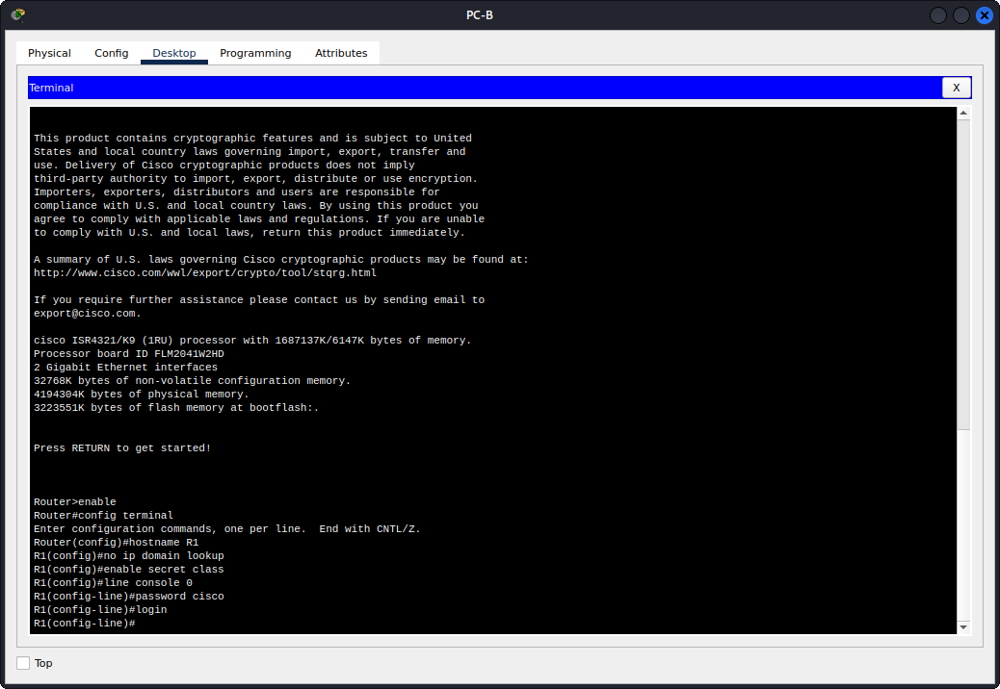{width="5.963888888888889in"
> height="4.113888888888889in"}

g.Assign cisco as the VTY password and enable login.

> R1(config)# **line vty 0 4 This command enters global configuration
> mode and selects the VTY lines for configuration. The range \"0 4\"
> indicates VTY lines from 0 to 4 are being configured, allowing up to
> five concurrent remote connections.**
>
> R1(config-line)# **password cisco is configuring a password for the
> VTY lines. The password \"cisco\" is being set, which means that
> anyone trying to access the router remotely via Telnet or SSH (using
> the specified VTY lines) will need to enter this password.**
>
> R1(config-line)# **login enables login on the VTY lines. When someone
> tries to connect to the router via Telnet or SSH using the configured
> VTY lines, they will be prompted to enter the configured password
> (\"cisco\" in this case) to gain access to the router\'s command-line
> interface.**
>
> 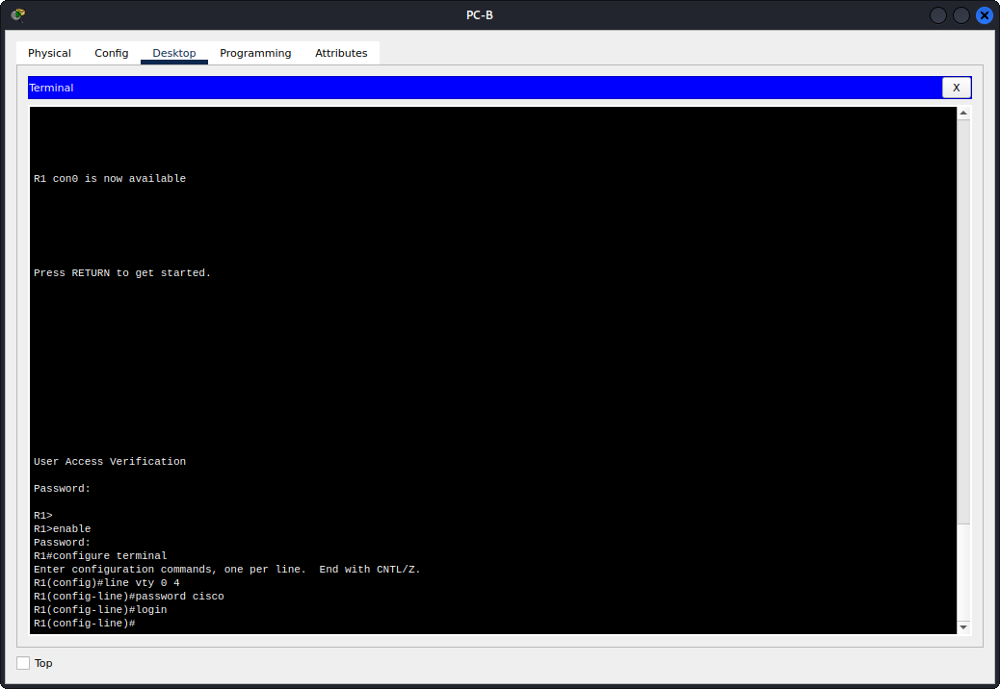{width="6.5in"
> height="4.483333333333333in"}

h.Encrypt the plaintext passwords.

R1(config)# **service password-encryption is used to enable password
encryption on a Cisco router.**

> 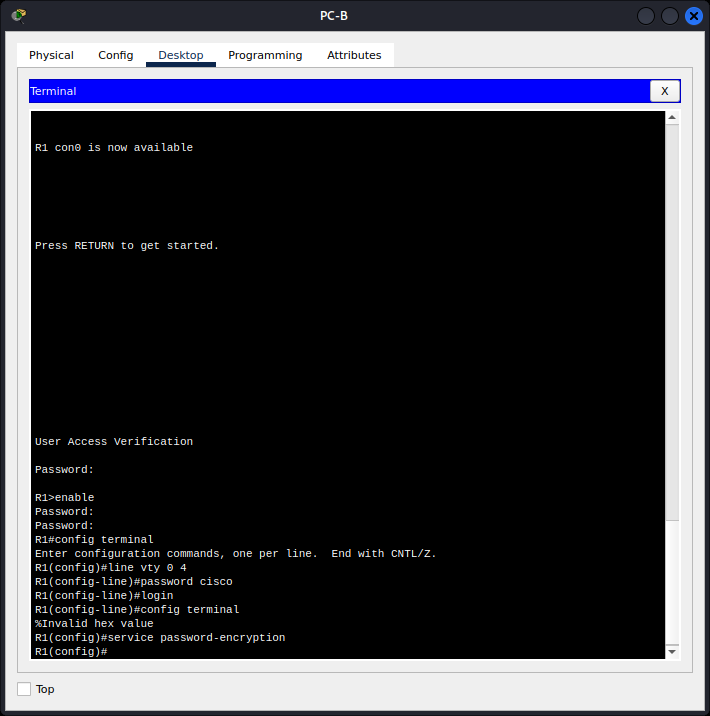{width="5.05in"
> height="5.093055555555556in"}

+-----------------------------------+-----------------------------------+
| i\.                               | > Create a banner that warns      |
|                                   | > anyone accessing the device     |
|                                   | > that unauthorized access is     |
|                                   | > prohibited. R1(config)#         |
|                                   | > **banner motd \$ Authorized     |
|                                   | > Users Only! \$**                |
+===================================+===================================+
+-----------------------------------+-----------------------------------+

+-----------------------------------+-----------------------------------+
| j\.                               | > {width="4.158332239720035in" |
|                                   | > height="4.193054461942257in"}   |
|                                   | >                                 |
|                                   | > Configure and activate both     |
|                                   | > interfaces on the router.       |
+===================================+===================================+
+-----------------------------------+-----------------------------------+

R1(config)# **interface g0/0/0**\
R1(config-if)# **ip address 192.168.0.1 255.255.255.0** R1(config-if)#
**ipv6 address 2001:db8:acad::1/64** R1(config-if)# **ipv6 address
FE80::1 link-local** R1(config-if)# **no shutdown**

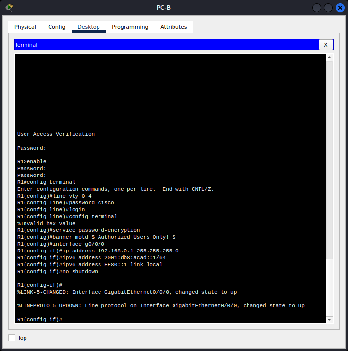{width="3.834722222222222in"
height="3.866665573053368in"}

R1(config-if)# **exit**\
R1(config)# **interface g0/0/1**\
R1(config-if)# **ip address 192.168.1.1 255.255.255.0** R1(config-if)#
**ipv6 address 2001:db8:acad:1::1/64** R1(config-if)# **ipv6 address
fe80::1 link-local**\
R1(config-if)# **no shutdown**\
R1(config-if)# **exit**

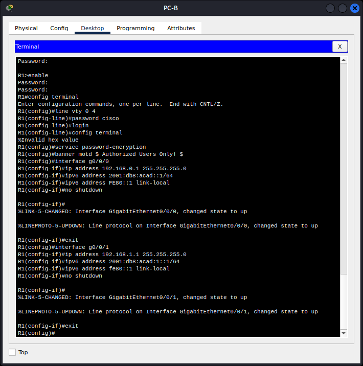{width="5.251388888888889in"
height="3.725in"}

**k.Configure an interface description for each interface indicating
which device is connected to it.**

R1(config)# **interface g0/0/1**\
R1(config-if)# **description Connected to F0/5 on S1** R1(config-if)#
**exit**\
R1(config)# **interface g0/0/0**\
R1(config-if)# **description Connected to Host PC-B** R1(config-if)#
**exit**

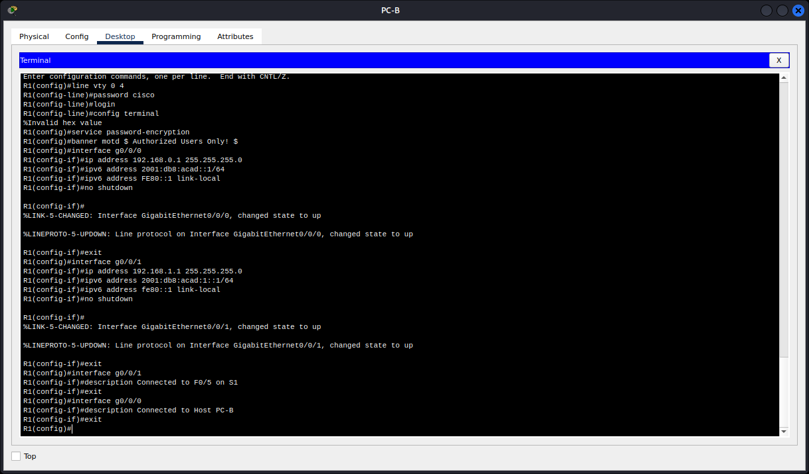{width="6.883333333333334in"
height="4.047221128608924in"}

**l.** **To enable IPv6 routing, enter the command ipv6
unicast-routing.** R1(config)# **ipv6 unicast-routing**

{width="6.5in"
height="3.820832239720035in"}

**m.Save the running configuration to the startup configuration file.**

R1(config)# **exit**\
R1# **copy running-config startup-config**

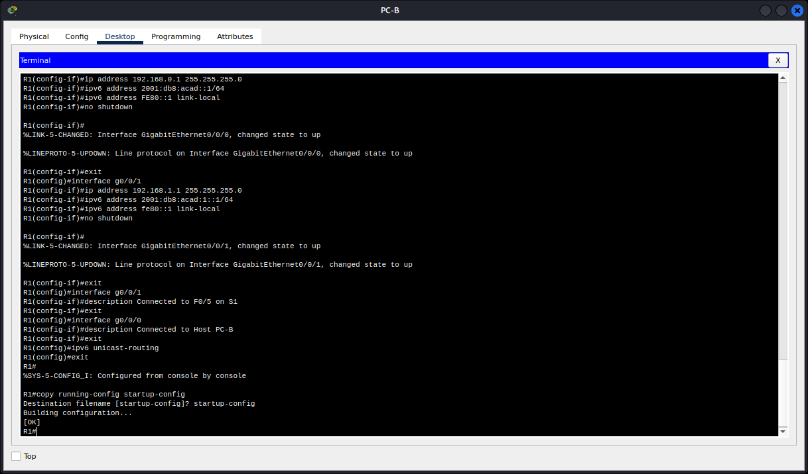{width="6.5in"
height="3.820832239720035in"}

**n.Set the clock on the router.**

R1# **clock set 15:30:00 27 Aug 2019**

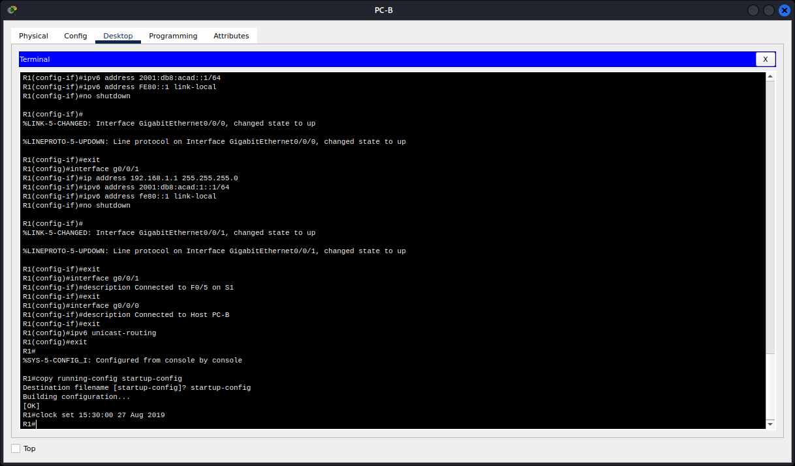{width="6.5in"
height="3.820832239720035in"}

**Note:** Use the question mark (?) to help with the correct sequence of
parameters needed to execute this command.

**o.Ping PC-B from a command prompt window on PC-A.**

> 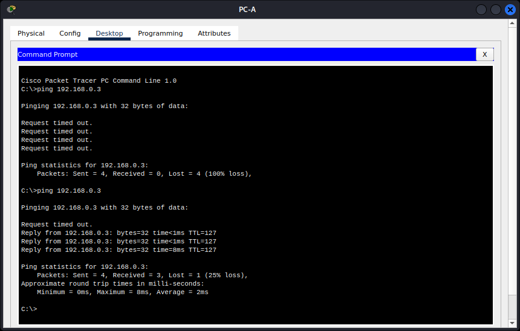{width="6.5in"
> height="4.141666666666667in"}

**Note:** If pings are not successful, the Windows Firewall may need to
be turned off.

Were the pings successful? Explain.

The first time we ping it was not successful but this time round it was
successful\
Yes. The router is routing the ping traffic across the two subnets. The
default settings for the 2960 switch will automatically turn up the
interfaces that are connected to devices.

**[Step 3: Configure the switch.]{.underline}**

In this step, you will configure the hostname, the VLAN 1 interface and
its default gateway. a.Console into the switch and enable privileged
EXEC mode.

> 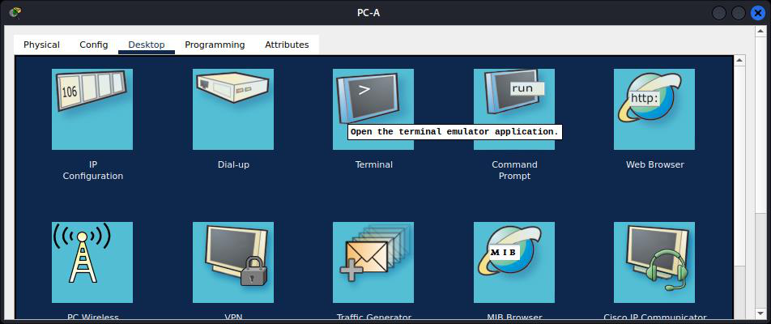{width="4.158332239720035in"
> height="1.7472222222222222in"}

Switch\> **enable**\
Enter configuration mode.

Switch# **config terminal**\
c. Assign a device name to the switch.

Switch(config)# **hostname S1**

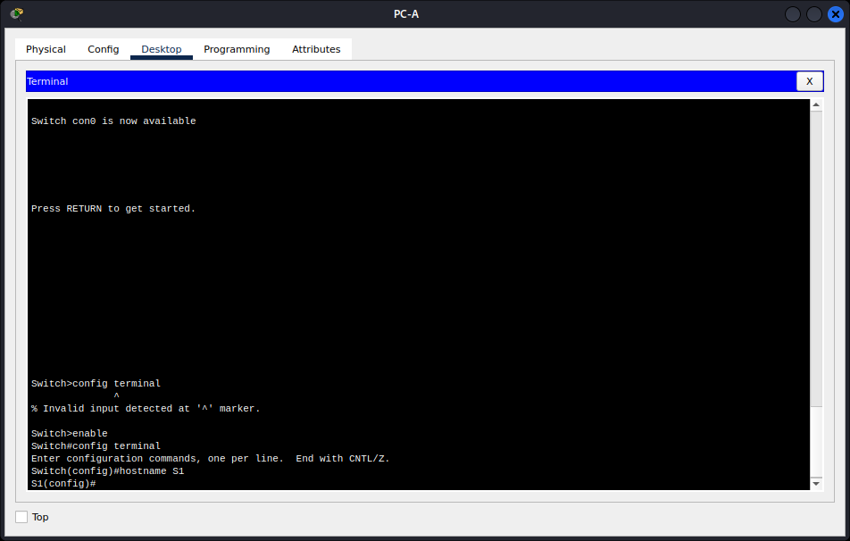{width="5.651388888888889in"
height="3.5972222222222223in"}

d\. Disable DNS lookup to prevent the router from attempting to
translate incorrectly entered commands as though they were host names.

S1(config)# **no ip domain-lookup**\
e. Configure and activate the VLAN interface on the switch S1.

S1(config)# **interface vlan 1**\
S1(config-if)# **ip address 192.168.1.2 255.255.255.0**

S1(config-if)# **no shutdown**\
S1(config-if)# **exit**

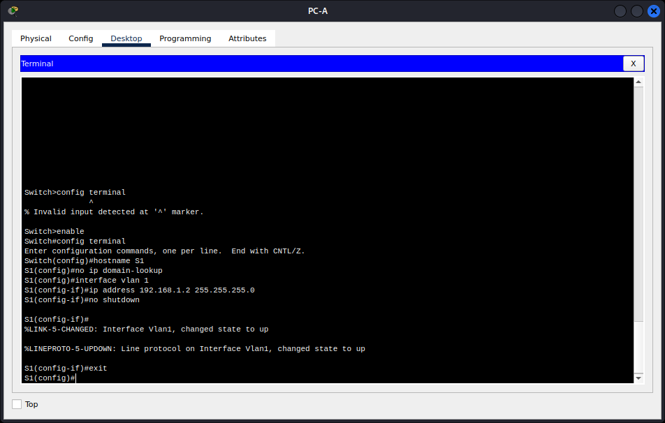{width="5.923611111111111in"
height="3.7708333333333335in"}

f\. Configure the default gateway for the switch S1.\
S1(config)# **ip default-gateway 192.168.1.1**\
S1(config-if)# **exit**

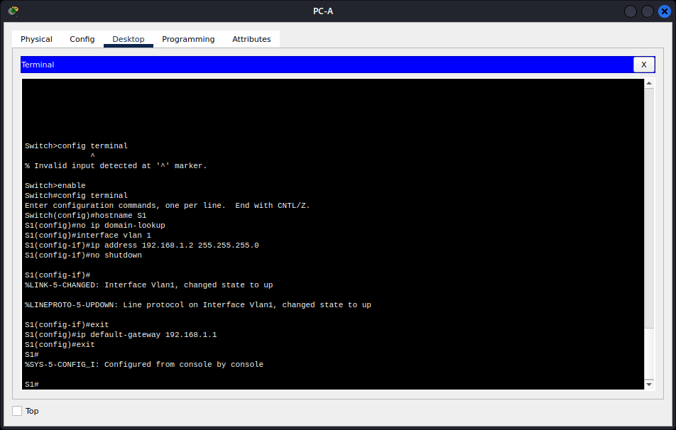{width="5.527777777777778in"
height="3.5194444444444444in"}

g\. Save the running configuration to the startup configuration file.
**[Step 4: Verify connectivity end-to-end connectivity.]{.underline}**\
a. From PC-A, ping PC-B.

b\. From S1, ping PC-B.

All the pings should be successful.

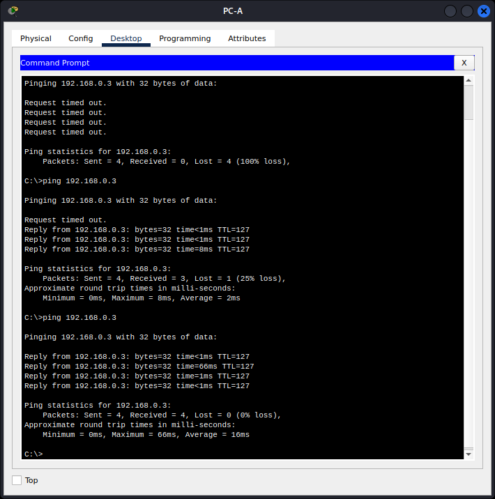{width="4.493055555555555in"
height="4.530555555555556in"}

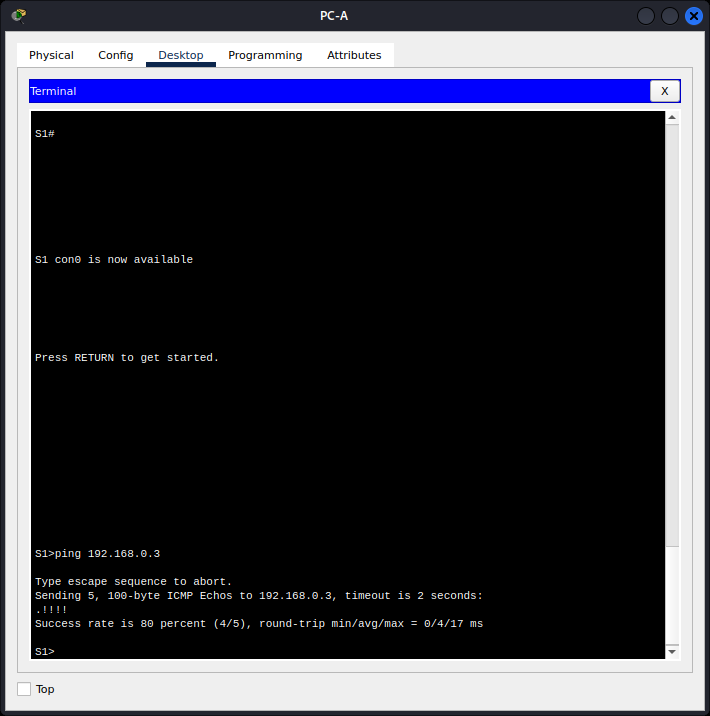{width="4.740277777777778in"
height="4.779166666666667in"}

All my pings were successful.

**[Part 3: Display Device Information]{.underline}**\
In Part 3, you will use **show** commands to retrieve interface and
routing information from the router and switch.

**Step 1: Display the routing table on the router.**

a.Use the **show ip route** command on the router R1 to answer the
following questions.

> R1# **show ip route**
>
> 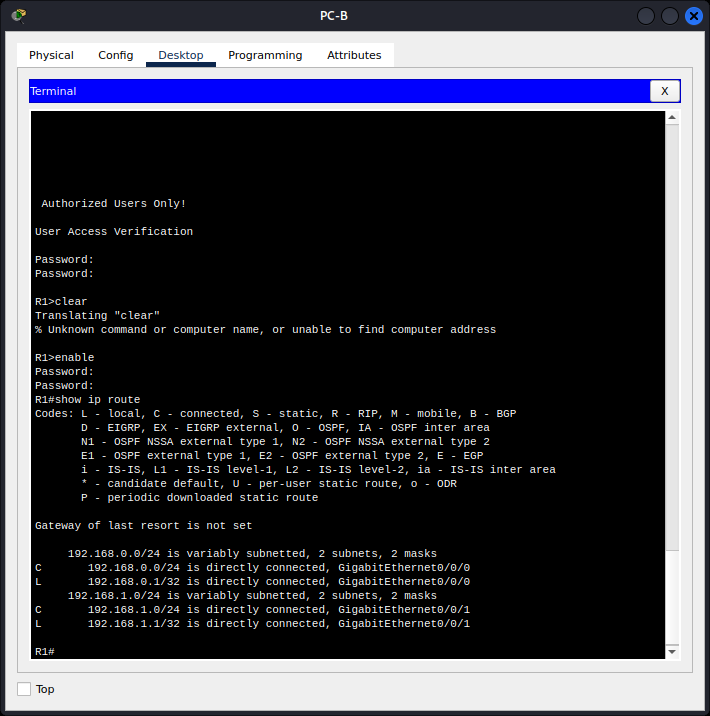{width="4.227776684164479in"
> height="4.262498906386702in"}

What code is used in the routing table to indicate a directly connected
network? The C designates a directly connected subnet. An L designates a
local interface.

How many route entries are coded with a C code in the routing table? 2
What interface types are associated to the C coded routes?

> GigabitEthernet0/0/0
>
> GigabitEthernet0/0/1

b\. Use the **show ipv6 route** command on router R1 to display the IPv6
routes. R1# **show ipv6 route**

> 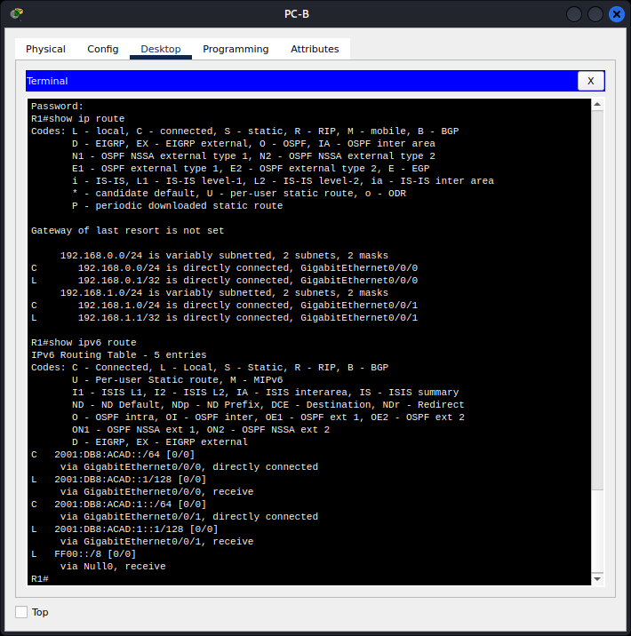{width="4.525in"
> height="4.5625in"}

**Step 2: Display interface information on the router R1.**

a\. Use the **show ip interface g0/0/1** to answer the following
questions.

R1# **show ip interface g0/0/1**

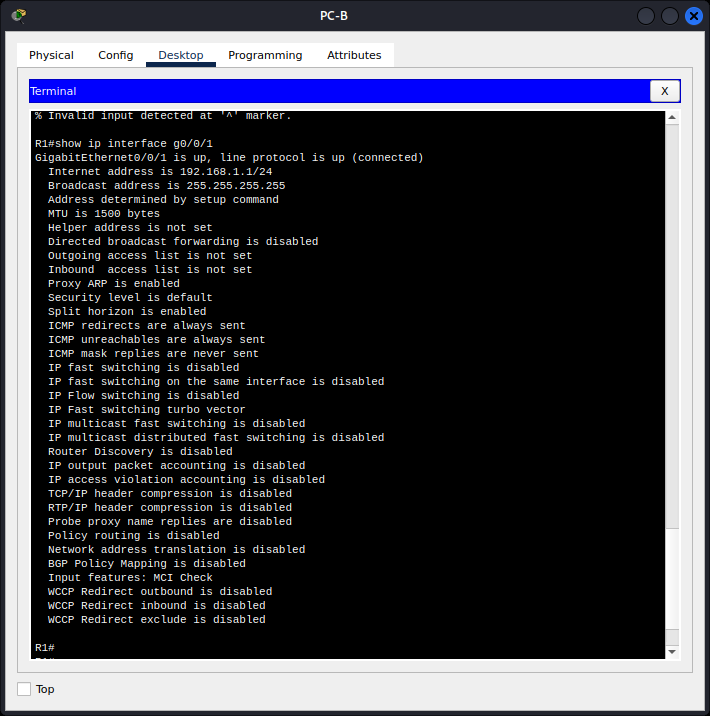{width="6.5in"
height="6.555555555555555in"}

What is the operational status of the G0/0/1 interface?

**GigabitEthernet0/0/1 is up, line protocol is up** ***Type your answers
here.***

What is the Media Access Control (MAC) address of the G0/1 interface?

**A MAC address is a unique identifier for a device\'s network interface
R1# configure terminal**\
**R1(config)# exit**\
**R1# show interfaces GigabitEthernet0/0/1 \| include Hardware**

> 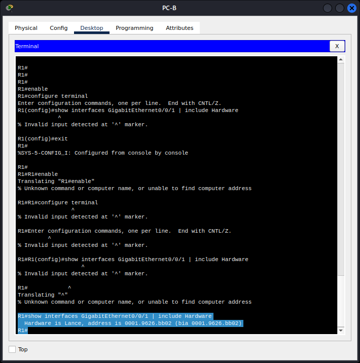{width="6.5in"
> height="6.554166666666666in"}

So from the above we get this: Hardware is Lance, address is
0001.9626.bb02 (bia\
0001.9626.bb02) bia stands for \"burned in address,\" which is another
term for the MAC address of the interface.

**So the MAC address is: 0001.9626.bb02**

> ***Type your answers here.***

How is the Internet address displayed in this command? **Internet
address is 192.168.1.1/24.**

> ***Type your answers here.***

b\. For the IPv6 information, enter the **show ipv6**\
**interface *interface ***command.

> R1# **show ipv6 interface g0/0/1**
>
> 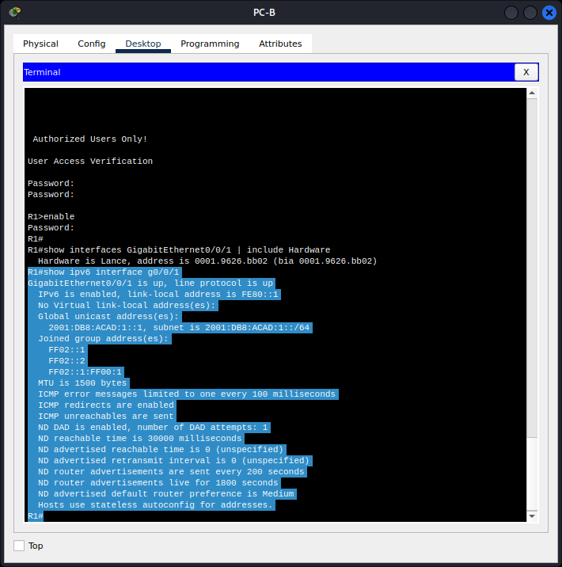{width="6.5in"
> height="6.555555555555555in"}

**[Step 3: Display a summary list of the interfaces on the router and
switch.]{.underline}**

There are several commands that can be used to verify an interface
configuration. One of the most useful of these is the show ip interface
brief command. The command output displays a summary list of the
interfaces on the device and provides immediate feedback to the status
of each interface.

a.Enter the **show ip interface brief**command on the router R1.

> 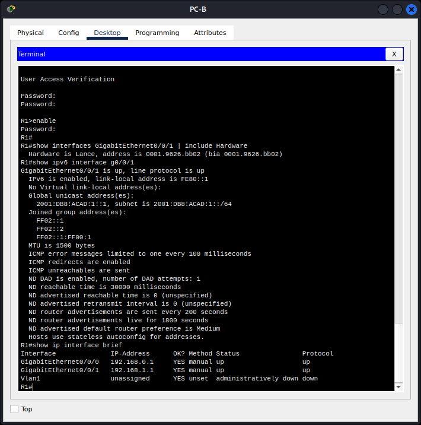{width="5.334722222222222in"
> height="5.3805555555555555in"}

b.To see the IPv6 interface information, enter the **show ipv6 interface
brief**command on R1.

> 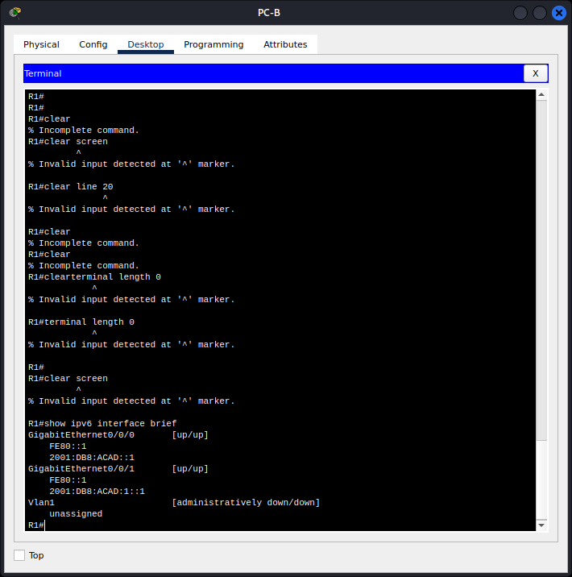{width="5.866666666666666in"
> height="5.916666666666667in"}

c.Enter the **show ip interface brief**command on the switch S1.

> 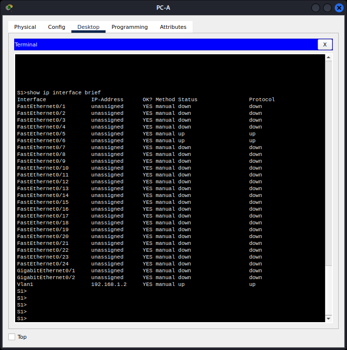{width="4.461111111111111in"
> height="4.5in"}

**[Reflection Questions]{.underline}**

1.If the G0/0/1 interface showed that it was administratively down, what
interface configuration command would you use to turn the interface up?

> **R1(config-if)# no shutdown**

2.If you incorrectly configured interface G0/0/1 on the router with an
IP address of 192.168.1.2 while PC-A is using 192.168.1.1 as its default
gateway, a connectivity issue would arise. PC-A would not be able to
successfully ping PC-B. The reason for this is that PC-B and PC-A would
be on different IP networks, requiring the router (acting as the default
gateway) to facilitate communication between them. However, since the IP
address 192.168.1.1 is not assigned to any device on the LAN, packets
from PC-A destined for the default gateway (router) would never reach
their intended destination, causing a breakdown in connectivity between
the devices.

**[Conclusion]{.underline}**

I had to redo this project almost three times just to have the best
understanding of all the requirements.

This project really enhanced my understanding of networking concepts,
configuration techniques, troubleshooting methodologies, and
collaborative work, which are valuable skills for anyone aspiring to
work in the field of network administration and engineering.
