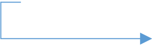

Week2: **Assignment 2:-Subnetting Exercises**

Report by: **Aisha Khalifan, cs-cns04-23014**

> **Introduction**
>
> Complete the given subnetting exercises. First, you could start by
> watching the subnetting series from practical Networking YouTube
> channel,
>
> For this Assignment I started with the last Part because that is what
> I had grasped very well
>
> 1.For each of the following IP addresses, carry out fixed length
> subnetting(FLSM) by applying the given subnet mask and utilizing
> additional masking bits borrowed from the default subnet mask.
> Determine the number of possible subnets per the given network ID
> **[but only]{.underline}** state the **first three subnets,** where
> possible. Consider the zero subnet in each of the below network IDs as
> your first possible subnet.
>
> Additionally, in every subnet, determine the; number of hosts, network
> address/ID, first and last usable IP and the broadcast address
>
> a)192.168.10.0/25\
> b)192.168.10.0/28\
> c)10.0.0.0/30\
> d)10.0.0.0/16\
> e)172.16.0.0/30\
> f)172.16.0.0/17
>
> A fixed-length subnet mask (FLSM) refers to a type of enterprise or
> provider networking where a block of IP addresses is divided into
> multiple subnets of equal length, i.e. an equal number of IP
> addresses. FLSM streamlines packet routing within the subnets of a
> proprietary network.
>
> While solving this problems- we have a subnetting cheat-sheet that
> helps us. First we need to draw the sheet in 3 simple steps:

+-----------------------------------+-----------------------------------+
| i\.                               | > Start with 1 and double until   |
|                                   | > you reach 128(right to          |
| ii\.                              | > left)-(**GROUP SIZE)** Subtract |
|                                   | > the top row from 256**-(SUBNET  |
| > **iii.**                        | > MASK)**\                        |
|                                   | > Then you write the CIDR         |
|                                   | > notation from right to          |
|                                   | > left(from /32**)-(CIDR)**       |
+===================================+===================================+
+-----------------------------------+-----------------------------------+

+-------+-------+-------+-------+-------+-------+-------+-------+-------+
| >     | > 128 | > 64  | > 32  | > 16  | > 8   | > 4   | > 2   | > 1   |
|  Step |       |       |       |       |       |       |       |       |
| > i   |       |       |       |       |       |       |       |       |
+=======+=======+=======+=======+=======+=======+=======+=======+=======+
| >     | > (   | > (   | > (   | > (   | (2    | (2    | (2    | (2    |
|  Step | 256-\ | 256-\ | 256-\ | 256-\ | 56-8) | 56-4) | 56-2) | 56-1) |
| > ii  | >     | > 64) | > 32) | > 16) |       |       |       |       |
|       |  128) |       |       |       |       |       |       |       |
+-------+-------+-------+-------+-------+-------+-------+-------+-------+
|       | > 128 | > 192 | > 224 | > 240 | > 248 | > 252 | > 254 | > 255 |
+-------+-------+-------+-------+-------+-------+-------+-------+-------+
| Step  | > /25 | > /26 | > /27 | > /28 | > /29 | > /30 | > /31 | > /32 |
| iii   |       |       |       |       |       |       |       |       |
+-------+-------+-------+-------+-------+-------+-------+-------+-------+

> The 3 rows above make up the subnetting cheat-sheet
>
> a)192.168.10.0/25\
> The /25 suffix describes how many bits are used for the network mask,
> the remaining bits are reserved for the host address.
>
> Subnet mask: /25 (which means 25 bits are allocated for the network
> portion)

1

{width="1.125in"
height="0.3611111111111111in"}{width="1.0555555555555556in"
height="0.3194444444444444in"}

We use the given CIDR/mask(25) to find the column on the cheat sheet

+-----------------------+-----------------------+-----------------------+
| > 128                 | > **Group size**      | **2\^(32-25) = 2\^7=  |
|                       |                       | 128 Subnets**         |
+=======================+=======================+=======================+
| > (256-\              | > **Subnet mask**     |                       |
| > 128)                |                       |                       |
+-----------------------+-----------------------+-----------------------+
| > 128                 |                       |                       |
+-----------------------+-----------------------+-----------------------+
| > /25                 | > **CIDR**            |                       |
+-----------------------+-----------------------+-----------------------+

**We start at ".0" in relevant octet and increase by group size until
you PASS target IP** 192.168.10.0/25\
.0\
.128

**Network ID(First IP of each subnet) is 192.168.10.0**\
**First Host Address(IP after the network ID) 192.168.10.1**\
**Next Network(Network ID of the next subnet) is 192.168.10.128**\
**Broadcast Address(Last IP address in each subnet) is 192.168.10.127
Last Host Address(IP Address before Broadcast Address) 192.168.10.126**

+-----------------------------------+-----------------------------------+
| > Network ID(first IP of each     | > **192.168.10.0**                |
| > subnet )                        |                                   |
+===================================+===================================+
| > First Host IP Address (IP       | > **192.168.10.0 +1=              |
| > Address after Network ID)       | > 192.168.10.1**                  |
+-----------------------------------+-----------------------------------+
| > Next Network                    | > **192.168.10.128**              |
+-----------------------------------+-----------------------------------+
| > Broadcast Address               | > **192.168.10.128-1=             |
|                                   | > 192.168.10.127**                |
+-----------------------------------+-----------------------------------+
| > Last Host IP Address            | > **192.168.10.127-1 =            |
|                                   | > 192.168.10.126**                |
+-----------------------------------+-----------------------------------+
| > CIDR/subnet mask                | > **255.255.255.128**             |
+-----------------------------------+-----------------------------------+
| Usable number of IP addresses     | > **(32-25)=7, (subtract 2 for    |
| **192.168.10.1 to                 | > network and broadcast           |
| 192.168.10.126**                  | > addresses) 2\^7 - 2 = 126**     |
+-----------------------------------+-----------------------------------+

> **Network range: 192.168.10.0 to 192.168.10.127**

**b)192.168.10.0/28**\
We use the given CIDR/mask(28) to find the column on the cheat sheet

+-----------------------+-----------------------+-----------------------+
| > 16                  | > **Group size**      | > **2\^(32-28) =      |
|                       |                       | > 2\^4= 16 Subnets**  |
+=======================+=======================+=======================+
| > (256-16) 240        | > **Subnet mask**     | > **255.255.255.240** |
+-----------------------+-----------------------+-----------------------+
| > /28                 | > **CIDR**            |                       |
+-----------------------+-----------------------+-----------------------+

**We start at ".0" in relevant octet and increase by group size until
you PASS target IP** 192.168.10.0/28\
.0\
.16

**Network ID (First IP of each subnet) is 192.168.10.0**\
**First Host Address (IP after the network ID) 192.168.10.1**\
**Next Network (Network ID of the next subnet) is 192.168.10.16
Broadcast address (Last IP address in each subnet) is 192.168.10.**

2

{width="1.0555555555555556in"
height="0.3194444444444444in"}

> **Last Host Address (IP Address before Broadcast Address)
> 192.168.10.14**

+-----------------------------------+-----------------------------------+
| > Network ID(first IP of each     | > **192.168.10.0**                |
| > subnet )                        |                                   |
+===================================+===================================+
| > First Host IP Address (IP       | > **192.168.10.0 +1=              |
| > Address after Network ID)       | > 192.168.10.1**                  |
+-----------------------------------+-----------------------------------+
| > Next Network                    | > **192.168.10.16**               |
+-----------------------------------+-----------------------------------+
| > Broadcast Address(Next network  | > **192.168.10.16-1=              |
| > -1)                             | > 192.168.10.15**                 |
+-----------------------------------+-----------------------------------+
| > Last Host IP Address(Broadcast  | > **192.168.10.15-1 =             |
| > -1)                             | > 192.168.10.14**                 |
+-----------------------------------+-----------------------------------+
| > CIDR/subnet mask                | > **255.255.255.240**             |
+-----------------------------------+-----------------------------------+
| Usable number of IP addresses     | > **(32-28)=4, (subtract 2 for    |
| **192.168.10.1 to 192.168.10.14** | > network and broadcast           |
|                                   | > addresses) 2\^4 - 2 = 14**      |
+-----------------------------------+-----------------------------------+

> **Network range: 192.168.10.0 to 192.168.10.15**
>
> **c)10.0.0.0/30**\
> We use the given CIDR/mask(30) to find the column on the cheat sheet

+-----------------------+-----------------------+-----------------------+
| > 4                   | > **Group size**      | > **2\^(32-30) =      |
|                       |                       | > 2\^2= 4 Subnets**   |
+=======================+=======================+=======================+
| > (256-4) 252         | > **Subnet mask**     | > **255.255.255.252** |
+-----------------------+-----------------------+-----------------------+
| > /30                 | > **CIDR**            |                       |
+-----------------------+-----------------------+-----------------------+

> **We start at ".0" in relevant octet and increase by group size until
> you PASS target IP**
>
> **10.0.0.0**/30\
> .0\
> .4
>
> **Network ID (First IP of each subnet) is 10.0.0.0**\
> **First Host Address (IP after the network ID) 10.0.0.1**\
> **Next Network (Network ID of the next subnet) is 10.0.0.4**\
> **Broadcast Address (Last IP address in each subnet) is 10.0.0.3 Last
> Host Address (IP Address before Broadcast Address) 10.0.0.2**

+-----------------------------------+-----------------------------------+
| > Network ID(first IP of each     | > **10.0.0.0**                    |
| > subnet )                        |                                   |
+===================================+===================================+
| > First Host IP Address (IP       | > **10.0.0.0+1 = 10.0.0.1**       |
| > Address after Network ID)       |                                   |
+-----------------------------------+-----------------------------------+
| > Next Network                    | > **10.0.0.4**                    |
+-----------------------------------+-----------------------------------+
| > Broadcast Address(Next network  | > **10.0.0.4-1= 10.0.0.3**        |
| > -1)                             |                                   |
+-----------------------------------+-----------------------------------+
| > Last Host IP Address(Broadcast  | > **10.0.0.3-1 = 10.0.0.2**       |
| > -1)                             |                                   |
+-----------------------------------+-----------------------------------+
| > CIDR/subnet mask                | > **255.255.255.252**             |
+-----------------------------------+-----------------------------------+
| > Usable number of IP addresses   | > **(32-30)=2, (subtract 2 for    |
| > **10.0.0.1 and 10.0.0.2**       | > network and broadcast           |
|                                   | > addresses) 2\^2 - 2 = 2**       |
+-----------------------------------+-----------------------------------+

> **Network range: 10.0.0.0 to 10.0.0.3**
>
> **2 addresses are reserved for network and broadcast, leaving 2
> addresses for hosts.**
>
> **d)10.0.0.0/16**

3

> **This one is a bit different because in our cheat sheet we don't have
> (**CIDR/mask (16) **But we can** **still solve it using another
> formula (32-16) =16**\
> **The subnet mask is a 32-bit value that consists of a series of
> contiguous \'1\'s followed by a series of** **contiguous \'0\'s. For
> the given CIDR notation /16, it means the first 16 bits of the 32-bit
> subnet** **mask are set to \'1\', indicating the network portion of
> the IP address. The remaining 16 bits are set** **to \'0\', indicating
> the host portion of the IP address.**
>
> **We represent this in binary and then convert it to dotted decimal
> notation (subnet mask):** **Binary Representation:**\
> **The first 16 bits are \'1\'s, and the remaining 16 bits are
> \'0\'s:**\
> **11111111.11111111.00000000.00000000**

+-----------------------------------+-----------------------------------+
| •                                 | > **Convert to Dotted Decimal     |
|                                   | > Notation (Subnet Mask): Convert |
|                                   | > Each Octet to Decimal:**        |
+===================================+===================================+
+-----------------------------------+-----------------------------------+

+-----------------+-----------------+-----------------+-----------------+
| > **For the     |                 |                 |                 |
| > given subnet  |                 |                 |                 |
| > mask          |                 |                 |                 |
| > 11111111.     |                 |                 |                 |
| 11111111.000000 |                 |                 |                 |
| 00.00000000:**\ |                 |                 |                 |
| > **Start from  |                 |                 |                 |
| > the left and  |                 |                 |                 |
| > convert each  |                 |                 |                 |
| > set of 8 bits |                 |                 |                 |
| > to its        |                 |                 |                 |
| > decimal       |                 |                 |                 |
| > re            |                 |                 |                 |
| presentation.** |                 |                 |                 |
+=================+=================+=================+=================+
| > **11111111**  | > **.11111111** | > **.0000000    | > **.0000000    |
|                 |                 | > 0**           | > 0**           |
+-----------------+-----------------+-----------------+-----------------+
| > **(2\^7\*1+2  | > **(2\^7\*1+2  | > **(2\^7\*0+2  | > **(2\^7\*0+2  |
| \^6\*1+2\^5\*1+ | \^6\*1+2\^5\*1+ | > \^6\*0...**   | > \^6\*0...**   |
| 2\^4\*1+2\^3\*1 | 2\^4\*1+2\^3\*1 |                 |                 |
| > +2\^2\*1+2\^  | > +2\^2\*1+2\^  |                 |                 |
| 1\*1+2\^0\*1)** | 1\*1+2\^0\*1)** |                 |                 |
+-----------------+-----------------+-----------------+-----------------+
| > **255**       | > **255**       | > **0**         | > **0**         |
+-----------------+-----------------+-----------------+-----------------+
| > **Therefore,  |                 |                 |                 |
| > the subnet    |                 |                 |                 |
| > mask          |                 |                 |                 |
| > corresponding |                 |                 |                 |
| > to CIDR       |                 |                 |                 |
| > notation /16  |                 |                 |                 |
| > is            |                 |                 |                 |
| > 255.255.0.0   |                 |                 |                 |
| > in dotted     |                 |                 |                 |
| > decimal       |                 |                 |                 |
| > notation.**   |                 |                 |                 |
+-----------------+-----------------+-----------------+-----------------+

> We use the given CIDR/mask(16) to find the column on the cheat sheet

+-----------------------+-----------------------+-----------------------+
| > **65536**           | > **Group size**      | > **2\^(32-16) =      |
|                       |                       | > 2\^16= 65536        |
|                       |                       | > Subnets**           |
+=======================+=======================+=======================+
|                       | > **Subnet mask**     | > **255.255.0.0**     |
+-----------------------+-----------------------+-----------------------+
| > /16                 | > **CIDR**            |                       |
+-----------------------+-----------------------+-----------------------+

> **[Network ID (or Subnet Address):]{.underline}**
>
> Network ID = IP Address & Subnet Mask\
> 10.0.0.0 (IP address) AND 255.255.0.0 (Subnet mask) Applying the
> bitwise AND operation:
>
> 00001010.00000000.00000000.00000000 (10.0.0.0 - IP address)
>
> 11111111.11111111.00000000.00000000 (255.255.0.0 - Subnet mask)
>
> \-\-\-\-\-\-\-\-\-\-\-\-\-\-\-\-\-\-\-\-\-\-\-\-\-\-\-\-\-\-\-\-\-\-\-\-\-\-\-\-\-\-\-\-\-\-\-\-\-\-\-\-\-\-\-\--
>
> 00001010.00000000.00000000.00000000 (Network ID)
>
> Convert the Network ID into Decimal Notation

+--------+--------+--------+--------+--------+--------+--------+--------+
| > 0    | > 0    | > 0    | > 0    | > 1    | > 0    | > 1    | > 0    |
+========+========+========+========+========+========+========+========+
+--------+--------+--------+--------+--------+--------+--------+--------+

4

+--------+--------+--------+--------+--------+--------+--------+--------+
| > (2\  | (2\^6) | (2\^5) | (2\^4) | (2\^3) | (2\^2) | (2\^1) | (2\^0) |
| ^7)\*0 | \*0    | \*0    | \*0    | \*1    | \*0    | \*1    | \*0    |
+========+========+========+========+========+========+========+========+
| > Sum  |        |        |        |        |        |        |        |
| mation |        |        |        |        |        |        |        |
| > of   |        |        |        |        |        |        |        |
| > the  |        |        |        |        |        |        |        |
| >      |        |        |        |        |        |        |        |
|  above |        |        |        |        |        |        |        |
| >      |        |        |        |        |        |        |        |
|  gives |        |        |        |        |        |        |        |
| > us:  |        |        |        |        |        |        |        |
| >      |        |        |        |        |        |        |        |
| 8+2=10 |        |        |        |        |        |        |        |
+--------+--------+--------+--------+--------+--------+--------+--------+

> Network ID= 10.0.0.0
>
> **[Broadcast address]{.underline}**\
> Broadcast address is the highest address in the subnet.
>
> Broadcast address = Network ID OR (NOT Subnet Mask)\
> Applying the bitwise NOT operation to the subnet mask(Inverse of the
> subnet) 11111111.11111111.00000000.00000000=255.255.0.0\
> In a bitwise NOT operation, each \'1\' becomes \'0\', and each \'0\'
> becomes \'1\'.
>
> NOT 255.255.0.0 = 00000000.00000000.11111111.11111111 Network ID
> (10.0.0.0)\
> OR\
> 00000000.00000000.11111111.11111111 (Bitwise OR)\
> 10.0.255.255 (Broadcast Address)
>
> **Network ID (First IP of each subnet) is 10.0.0.0**\
> **First Host Address (IP after the network ID) 10.0.0.1**\
> **Broadcast Address (Last IP address in each subnet) is 10.0.255.255
> Last Host Address (IP Address before Broadcast Address) 10.0.255.254**
>
> **[Next Network (Network ID of the next subnet) after
> 10.0.0.0/16]{.underline}**\
> **We Convert the Network IP to Binary (10.0.0.0) - (already did it
> earlier, but repeating for clarity): 10.0.0.0 In binary =
> 00001010.00000000.00000000.00000000**\
> **Identify the 17th Bit:**\
> **The 17th bit (from left to right) is the first bit of the host
> portion since the first 16 bits are for the network.**
>
> **Flip the 17th Bit:**\
> **Change the 17th bit to its opposite value.**
>
> **Flipping the 17th bit:**\
> **00001010.00000000.00000000.00000000**\
> **↓**\
> **00001010.00000001.00000000.00000000**\
> **Convert Back to Decimal:**\
> **Convert the binary back to decimal.**

5

{width="1.0555555555555556in"
height="0.3055555555555556in"}

> **00001010.00000001.00000000.00000000 in decimal = 10.1.0.0**
>
> **Therefore, the Network ID of the next subnet after 10.0.0.0/16 is
> 10.1.0.0/16.**

+-----------------------------------+-----------------------------------+
| > Network ID(first IP of each     | > **10.0.0.0**                    |
| > subnet )                        |                                   |
+===================================+===================================+
| > First Host IP Address (IP       | > **10.0.0.0+1 = 10.0.0.1**       |
| > Address after Network ID)       |                                   |
+-----------------------------------+-----------------------------------+
| > Next Network                    | > **10.1.0.0**                    |
+-----------------------------------+-----------------------------------+
| > Broadcast Address(Next network  | > **10.1.0.0-1=** 10.0.255.255    |
| > -1)                             |                                   |
+-----------------------------------+-----------------------------------+
| > Last Host IP Address(Broadcast  | > **10.0. 255.255-1 =             |
| > -1)                             | > 10.0.255.254**                  |
+-----------------------------------+-----------------------------------+
| > CIDR/subnet mask                | > **255.255.0.0**                 |
+-----------------------------------+-----------------------------------+
| > Usable number of IP addresses   | > **(32-16)=16, (subtract 2 for   |
| > **10.0.0.1 and 10.0.255.254**   | > network and broadcast           |
|                                   | > addresses) 2\^16 - 2 =65536-2 = |
|                                   | > 65534**                         |
+-----------------------------------+-----------------------------------+

> **2 addresses are reserved for network and broadcast**
>
> **e)172.16.0.0/30**\
> We use the given CIDR/mask(30) to find the column on the cheat sheet

+-----------------------+-----------------------+-----------------------+
| > 4                   | > **Group size**      | > **2\^(32-30) =      |
|                       |                       | > 2\^2= 4 Subnets**   |
+=======================+=======================+=======================+
| > (256-4) 252         | > **Subnet mask**     | > **255.255.255.252** |
+-----------------------+-----------------------+-----------------------+
| > /30                 | > **CIDR**            |                       |
+-----------------------+-----------------------+-----------------------+

> **We start at ".0" in relevant octet and increase by group size until
> you PASS target IP**
>
> **172.16.0.0**/30\
> .0\
> .4
>
> **Network ID (First IP of each subnet) is 172.16.0.0**\
> **First Host Address (IP after the network ID) 172.16.0.1**\
> **Next Network (Network ID of the next subnet) is 172.16.0.4**\
> **Broadcast Address (Last IP address in each subnet) is 172.16.0.3
> Last Host Address (IP Address before Broadcast Address) 172.16.0.2**

+-----------------------------------+-----------------------------------+
| > Network ID(first IP of each     | > **172.16.0.0**                  |
| > subnet )                        |                                   |
+===================================+===================================+
| > First Host IP Address (IP       | > **172.16.0.0+1 = 172.16.0.1**   |
| > Address after Network ID)       |                                   |
+-----------------------------------+-----------------------------------+
| > Next Network(IP address after   | > **172.16.0.4**                  |
| > our target IP)                  |                                   |
+-----------------------------------+-----------------------------------+
| > Broadcast Address(Next network  | > **172.16.0.4-1= 172.16.0.3**    |
| > -1)                             |                                   |
+-----------------------------------+-----------------------------------+
| > Last Host IP Address(Broadcast  | > **172.16.0.3-1 = 172.16.0.2**   |
| > -1)                             |                                   |
+-----------------------------------+-----------------------------------+
| > CIDR/subnet mask                | > **255.255.255.252**             |
+-----------------------------------+-----------------------------------+
| > Usable number of IP addresses   | > **(32-30)=2, (subtract 2 for    |
| > **172.16.1.1 and 172.16.0.2**   | > network and broadcast           |
|                                   | > addresses) 2\^2 - 2 = 2**       |
+-----------------------------------+-----------------------------------+

> **Network range: 172.16.0.0 to 172.16.0.3**

6

> **Two addresses are reserved for network and broadcast, leaving two
> addresses for hosts.**
>
> **f)172.16.0.0/17**\
> **The subnet mask is a 32-bit value that consists of a series of
> contiguous \'1\'s followed by a series of**

**contiguous \'0\'s. For the given CIDR notation /17, it means the first
17 bits of the 32-bit subnet**

> **mask are set to \'1\', indicating the network portion of the IP
> address. The remaining 15 bits are set**
>
> **to \'0\', indicating the host portion of the IP address.**
>
> **We represent this in binary and then convert it to dotted decimal
> notation (subnet mask):** **Binary Representation:**
>
> **The first 17 bits are \'1\'s, and the remaining 15 bits are
> \'0\'s:**
>
> **11111111.11111111.10000000.00000000**

+-----------------------------------+-----------------------------------+
| •                                 | > **Convert to Dotted Decimal     |
|                                   | > Notation (Subnet Mask): Convert |
|                                   | > Each Octet to Decimal:**        |
+===================================+===================================+
+-----------------------------------+-----------------------------------+

+-----------------+-----------------+-----------------+-----------------+
| > **For the     |                 |                 |                 |
| > given subnet  |                 |                 |                 |
| > mask          |                 |                 |                 |
| > 11111111.     |                 |                 |                 |
| 11111111.100000 |                 |                 |                 |
| 00.00000000:**\ |                 |                 |                 |
| > **Start from  |                 |                 |                 |
| > the left and  |                 |                 |                 |
| > convert each  |                 |                 |                 |
| > set of 8 bits |                 |                 |                 |
| > to its        |                 |                 |                 |
| > decimal       |                 |                 |                 |
| > re            |                 |                 |                 |
| presentation.** |                 |                 |                 |
+=================+=================+=================+=================+
| > **11111111**  | > **.11111111** | > **.1000000    | > **.0000000    |
|                 |                 | > 0**           | > 0**           |
+-----------------+-----------------+-----------------+-----------------+
| > **(2\^7\*1+2  | > **(2\^7\*1+2  | > **(2\^7\*1+2  | > **(2\^7\*0+2  |
| \^6\*1+2\^5\*1+ | \^6\*1+2\^5\*1+ | > \^6\*0...**   | > \^6\*0...**   |
| 2\^4\*1+2\^3\*1 | 2\^4\*1+2\^3\*1 |                 |                 |
| > +2\^2\*1+2\^  | > +2\^2\*1+2\^  |                 |                 |
| 1\*1+2\^0\*1)** | 1\*1+2\^0\*1)** |                 |                 |
+-----------------+-----------------+-----------------+-----------------+
| > **255**       | > **255**       | > **128**       | > **0**         |
+-----------------+-----------------+-----------------+-----------------+
| > **Therefore,  |                 |                 |                 |
| > the subnet    |                 |                 |                 |
| > mask          |                 |                 |                 |
| > corresponding |                 |                 |                 |
| > to CIDR       |                 |                 |                 |
| > notation /17  |                 |                 |                 |
| > is            |                 |                 |                 |
| > 255.255.128.0 |                 |                 |                 |
| > in dotted     |                 |                 |                 |
| > decimal       |                 |                 |                 |
| > notation.**   |                 |                 |                 |
+-----------------+-----------------+-----------------+-----------------+

> We use the given CIDR/mask(16) to find the column on the cheat sheet

+-----------------------+-----------------------+-----------------------+
| > **32768**           | > **Group size**      | > **2\^(32-17) =      |
|                       |                       | > 2\^15=32768         |
|                       |                       | > Subnets**           |
+=======================+=======================+=======================+
|                       | > **Subnet mask**     | > **255.255.128.0**   |
+-----------------------+-----------------------+-----------------------+
| > /17                 | > **CIDR**            |                       |
+-----------------------+-----------------------+-----------------------+

> **172.16.0.0 to Binary**

+-----------------+-----------------+-----------------+-----------------+
| > 172           | > (decimal) =   | > 10101100      | > (binary)      |
+=================+=================+=================+=================+
| > 16            | > (decimal) =   | > 00010000      | > (binary)      |
+-----------------+-----------------+-----------------+-----------------+
| > 0             | > (decimal) =   | > 00000000      | > (binary)      |
+-----------------+-----------------+-----------------+-----------------+
| > 0             | > (decimal) =   | > 00000000      | > (binary)      |
+-----------------+-----------------+-----------------+-----------------+

> **[Network ID (or Subnet Address):]{.underline}**
>
> Network ID = IP Address & Subnet Mask\
> **172.16.0.0** (IP address) AND **255.255.128.0 (**Subnet mask)
> Applying the bitwise AND operation:
>
> 10101100.00010000.00000000.00000000 (**172.16.0.0**- IP address)

7

> 11111111.11111111.10000000.00000000 (**255.255.128.0** - Subnet mask)
>
> \-\-\-\-\-\-\-\-\-\-\-\-\-\-\-\-\-\-\-\-\-\-\-\-\-\-\-\-\-\-\-\-\-\-\-\-\-\-\-\-\-\-\-\-\-\-\-\-\-\-\-\-\-\-\-\--
>
> 10101100.00010000.00000000.00000000 (Network ID)
>
> Convert the Network ID into Decimal Notation

+--------+--------+--------+--------+--------+--------+--------+--------+
| > 1    | > 0    | > 1    | > 0    | > 1    | > 1    | > 0    | > 0    |
+========+========+========+========+========+========+========+========+
| > (2\  | (2\^6) | >      | (2\^4) | (2\^3) | >      | >      | >      |
| ^7)\*1 | \*0    | (2\^5) | \*0    | \*1    | (2\^2) | (2\^1) | (2\^0) |
|        |        | > \*1  |        |        | > \*1  | > \*0  | > \*0  |
+--------+--------+--------+--------+--------+--------+--------+--------+
| > 0    | > 0    | > 0    | > 1    | > 0    | > 0    | > 0    | > 0    |
+--------+--------+--------+--------+--------+--------+--------+--------+
| > (2   | (2\^6) | >      | (2\^4) | (2\^3) | >      | >      | >      |
| \^7)\* | \*0    | (2\^5) | \*0    | \*1    | (2\^2) | (2\^1) | (2\^0) |
|        |        | > \*1  |        |        | > \*1  | > \*0  | > \*0  |
+--------+--------+--------+--------+--------+--------+--------+--------+
| > Sum  |        |        |        |        |        |        |        |
| mation |        |        |        |        |        |        |        |
| > of   |        |        |        |        |        |        |        |
| > the  |        |        |        |        |        |        |        |
| >      |        |        |        |        |        |        |        |
|  above |        |        |        |        |        |        |        |
| >      |        |        |        |        |        |        |        |
|  gives |        |        |        |        |        |        |        |
| > us:  |        |        |        |        |        |        |        |
| > 172. |        |        |        |        |        |        |        |
| 16.0.0 |        |        |        |        |        |        |        |
+--------+--------+--------+--------+--------+--------+--------+--------+

> Network ID= **172.16.0.0**
>
> **[Broadcast address]{.underline}**
>
> Broadcast address is the highest address in the subnet.
>
> Broadcast address = Network ID OR (NOT Subnet Mask)\
> Applying the bitwise NOT operation to the subnet mask(Inverse of the
> subnet)\\ 11111111.11111111.10000000.00000000 (**255.255.128.0** -
> Subnet mask Inverse of the above will be:\
> 00000000.00000000.01111111.11111111
>
> Perform Bitwise OR Operation with the Network ID:\
> Network ID (172.16.0.0) in Binary:
> 10101100.00010000.00000000.00000000Inverted Subnet Mask in Binary:
> 00000000.00000000.01111111.11111111
> \-\-\-\-\-\-\-\-\-\-\-\-\-\-\-\-\-\-\-\-\-\-\-\-\-\-\-\-\-\-\-\-\-\-\-\-\-\-\-\-\-\-\-\-\-\-\-\-\-\-\-\-\-\-\-\-\-\-\--
> 10101100.00010000.01111111.11111111 Convert the Result to Decimal:

+-----------------------+-----------------------+-----------------------+
| > 10101100            | > (2\^7)\*1           | > 172                 |
|                       | > +(2\^6)             |                       |
|                       | \*0+(2\^5)\*1+(2\^4)\ |                       |
|                       | *0+(2\^3)\*1+(2\^2)\* |                       |
|                       | 1+(2\^1)\*0+(2\^0)\*0 |                       |
+=======================+=======================+=======================+
| > 00010000            | > (2\^7)\*0           | > 16                  |
|                       | > +(2\^6)             |                       |
|                       | \*0+(2\^5)\*1+(2\^4)\ |                       |
|                       | *0+(2\^3)\*0+(2\^2)\* |                       |
|                       | 0+(2\^1)\*0+(2\^0)\*0 |                       |
+-----------------------+-----------------------+-----------------------+
| > 01111111            | > (2\^7)\*0           | > 127                 |
|                       | > +(2\^6)             |                       |
|                       | \*1+(2\^5)\*1+(2\^4)\ |                       |
|                       | *1+(2\^3)\*1+(2\^2)\* |                       |
|                       | 1+(2\^1)\*1+(2\^0)\*1 |                       |
+-----------------------+-----------------------+-----------------------+
| 11111111              | > (2\^7)\*1           | > 255                 |
|                       | > +(2\^6)             |                       |
|                       | \*1+(2\^5)\*1+(2\^4)\ |                       |
|                       | *1+(2\^3)\*1+(2\^2)\* |                       |
|                       | 1+(2\^1)\*1+(2\^0)\*1 |                       |
+-----------------------+-----------------------+-----------------------+

> Broadcast Address: 172.16.127.255\
> Therefore, the broadcast address for the network 172.16.0.0/17 with
> subnet mask 255.255.128.0 is 172.16.127.255. This confirms the correct
> broadcast address using the given formula. Thank you for your
> patience.
>
> **Network ID (First IP of each subnet) is 172.16.0.0**\
> **First Host Address (IP after the network ID) 172.16.0.1**\
> **Broadcast Address (Last IP address in each subnet) is**
> 172.16.127.255 **Last Host Address (IP Address before Broadcast
> Address)** 172.16.127.254
>
> **[Next Network (Network ID of the next subnet) after
> 172.16.0.0/17]{.underline}**
>
> **We Convert the Network IP to Binary([172.16.0.0]{.underline})-
> (already did it earlier, but repeating for clarity):**

8

> Network ID (172.16.0.0) in Binary=
> 10101100.00010000.00000000.00000000\
> **Identify the 17th Bit:**\
> 10101100.00010000.00000000.00000000 (**172.16.0.0**- IP address)\
> **The 17th bit (from left to right) is the first bit of the host
> portion since the first 16 bits are for the** **network.**
>
> **Flip the 17th Bit: Change the 17th bit to its opposite value.**
>
> **10101100.00010000.00000000.00000000**
>
> **↓**
>
> **10101100.00010000.10000000.00000000**
>
> **Convert Back to Decimal:**
>
> **10101100.00010000.10000000.00000000 in decimal = 172.16.128.0**
>
> **Therefore, the Network ID of the next subnet after 10.0.0.0/16 is
> 172.16.128.0**

+-----------------------------------+-----------------------------------+
| > Network ID(first IP of each     | > **172.16.0.0**                  |
| > subnet )                        |                                   |
+===================================+===================================+
| > First Host IP Address (IP       | > **172.16.0.0+1 = 172.16.0.1**   |
| > Address after Network ID)       |                                   |
+-----------------------------------+-----------------------------------+
| > Next Network                    | > **172.16.128.0**                |
+-----------------------------------+-----------------------------------+
| > Broadcast Address(Next network  | > 172.16.127.255                  |
| > -1)                             |                                   |
+-----------------------------------+-----------------------------------+
| > Last Host IP Address(Broadcast  | > 172.16.127.254                  |
| > -1)                             |                                   |
+-----------------------------------+-----------------------------------+
| > CIDR/subnet mask                | > **255.255.128.0**               |
+-----------------------------------+-----------------------------------+
| > Usable number of IP addresses   | > **(32-17)=15 (subtract 2 for    |
|                                   | > network and broadcast           |
|                                   | > addresses) 2\^(32-17) =         |
|                                   | > 2\^15=32768 Subnets**           |
+-----------------------------------+-----------------------------------+

> **2 addresses are reserved for network and broadcast**
>
> **2.**A company has been allocated a Class C network
> **192.168.5.0/24.** The physical network should be divided into 5
> subnets, which will be interconnected by routers as shown in the
> figure below. Class C custom subnets need to be designed. Derive the
> subnets that would meet the requirements shown outlining the:\
> • Network Address(network ID)\
> • First and last usable IP addresses\
> • Broadcast address(broadcast ID)\
> • Hosts per subnet

9

> {width="2.9583333333333335in"
> height="1.5902777777777777in"}

In the above Class C network **192.168.5.0/24 :**\
**Step 1: Determine the number of bits to borrow from the host portion
of the IP address.**

To create 5 subnets with different numbers of hosts, we need to borrow a
different number of bits from the host portion of the IP address for
each subnet. We can use the following table to determine the number of
bits to borrow for each subnet**: Number of bits borrowed = log2(number
of hosts)**

+-----------------------+-----------------------+-----------------------+
| > subnet              | > Number of hosts     | > Number of bits to   |
|                       |                       | > borrow              |
+=======================+=======================+=======================+
| > A                   | > 14                  | > 4                   |
+-----------------------+-----------------------+-----------------------+
| > B                   | > 28                  | > 3                   |
+-----------------------+-----------------------+-----------------------+
| > C                   | > 2                   | > 6                   |
+-----------------------+-----------------------+-----------------------+
| > D                   | > 7                   | > 5                   |
+-----------------------+-----------------------+-----------------------+
| > E                   | > 28                  | > 3                   |
+-----------------------+-----------------------+-----------------------+

**Step 2: Calculate the subnet masks.**

To calculate the subnet mask for each subnet, we can use the following
formula: Subnet mask = 255 - (number of bits borrowed)\
The following table shows the subnet masks for each subnet:

+-----------------------+-----------------------+-----------------------+
| > subnet              | > Number of bits to   | > Subnet Mask         |
|                       | > borrow              |                       |
+=======================+=======================+=======================+
| > netA                | > 4                   | > 255.255.255.240     |
+-----------------------+-----------------------+-----------------------+
| > netB                | > 3                   | > 255.255.255.224     |
+-----------------------+-----------------------+-----------------------+
| > netC                | > 6                   | > 255.255.255. 192    |
+-----------------------+-----------------------+-----------------------+
| > netD                | > 5                   | > 255.255.255. 248    |
+-----------------------+-----------------------+-----------------------+
| > netE                | > 3                   | > 255.255.255.224     |
+-----------------------+-----------------------+-----------------------+

**Step 3: Calculate the network addresses.**

To calculate the network address for each subnet, we can simply OR the
subnet mask with the first IP address in the network range. The
following table shows the network addresses for each subnet:

+-----------------------+-----------------------+-----------------------+
| > Subnet              | > Subnet Mask         | > Network address     |
+=======================+=======================+=======================+
| > netA                | > 255.255.255.240     | > 192.168.5.0         |
+-----------------------+-----------------------+-----------------------+
| > netB                | > 255.255.255.224     | > 192.168.5.32        |
+-----------------------+-----------------------+-----------------------+
| > netC                | > 255.255.255. 192    | > 192.168.5.64        |
+-----------------------+-----------------------+-----------------------+
| > netD                | > 255.255.255. 248    | > 192.168.5.96        |
+-----------------------+-----------------------+-----------------------+
| > netE                | > 255.255.255.224     | > 192.168.5.128       |
+-----------------------+-----------------------+-----------------------+

10

**[netA (4 bits borrowed):]{.underline}**

> Subnet Mask: 255.255.255.240\
> Subnet Mask (Binary): 11111111.11111111.11111111.11110000 Number of
> subnets = 2\^4 = 16\
> Subnet size = 2\^(32 - 28) = 16 addresses per subnet\
> Network Addresses:\
> netA1: 192.168.5.0 (First Subnet)\
> netA2: 192.168.5.16\
> netA3: 192.168.5.32

**[netB (3 bits borrowed):]{.underline}**

> Subnet Mask: 255.255.255.224\
> Subnet Mask (Binary): 11111111.11111111.11111111.11100000 Number of
> subnets = 2\^3 = 8\
> Subnet size = 2\^(32 - 25) = 32 addresses per subnet\
> Network Addresses:\
> netB1: 192.168.5.0 (First Subnet)\
> netB2: 192.168.5.32\
> netB3: 192.168.5.64

**[netC (6 bits borrowed):]{.underline}**

> Subnet Mask: 255.255.255.192\
> Subnet Mask (Binary): 11111111.11111111.11111111.11000000 Number of
> subnets = 2\^6 = 64\
> Subnet size = 2\^(32 - 26) = 64 addresses per subnet\
> Network Addresses:\
> netC1: 192.168.5.0 (First Subnet)\
> netC2: 192.168.5.64\
> netC3: 192.168.5.128

**[netD (5 bits borrowed):]{.underline}**

> Subnet Mask: 255.255.255.248\
> Subnet Mask (Binary): 11111111.11111111.11111111.11111000 Number of
> subnets = 2\^5 = 32\
> Subnet size = 2\^(32 - 27) = 32 addresses per subnet\
> Network Addresses:\
> netD1: 192.168.5.0 (First Subnet)\
> netD2: 192.168.5.32\
> netD3: 192.168.5.64

**[netE (3 bits borrowed):]{.underline}**

> Subnet Mask: 255.255.255.224

11

Subnet Mask (Binary): 11111111.11111111.11111111.11100000\
Number of subnets = 2\^3 = 8\
Subnet size = 2\^(32 - 29) = 8 addresses per subnet\
Network Addresses:\
netE1: 192.168.5.0 (First Subnet)\
netE2: 192.168.5.8\
netE3: 192.168.5.16\
The network addresses for each subnet are calculated based on the number
of bits borrowed and the respective subnet masks. These network
addresses will be the starting addresses for each subnet.

**[Calculate the first and last usable IP addresses.]{.underline}**

To calculate the first and last usable IP addresses for a subnet, we can
simply subtract and add 1 to the network address, respectively. The
following table shows the first and last usable IP addresses for each
subnet:

+-----------------+-----------------+-----------------+-----------------+
| > Subnet        | > First usable  |                 | > Last usable   |
|                 | > IP address    |                 | > IP address    |
+=================+=================+=================+=================+
| > netA          | > 192.168.5.1   |                 | > 192.168.5.14  |
+-----------------+-----------------+-----------------+-----------------+
| > netB          | > 192.168.5.33  |                 | > 192.168.5.60  |
+-----------------+-----------------+-----------------+-----------------+
| > netC          | > 192.168.5.65  |                 | > 192.168.5.66  |
+-----------------+-----------------+-----------------+-----------------+
| > netD          | > 192.168.5.97  |                 | > 192.168.5.103 |
+-----------------+-----------------+-----------------+-----------------+
| > netE          | > 192.168.5.129 |                 | > 192.168.5.156 |
+-----------------+-----------------+-----------------+-----------------+

**[Calculate the broadcast addresses.]{.underline}**

To calculate the broadcast address for a subnet, we can simply OR the
subnet mask with the last IP address in the network range. The following
table shows the broadcast addresses for each subnet:

+-----------------------------------+-----------------------------------+
| > Subnet                          | > Broadcast address               |
+===================================+===================================+
| > netA                            | > 192.168.5.15                    |
+-----------------------------------+-----------------------------------+
| > netB                            | > 192.168.5.61                    |
+-----------------------------------+-----------------------------------+
| > netC                            | > 192.168.5.67                    |
+-----------------------------------+-----------------------------------+
| > netD                            | > 192.168.5.104                   |
+-----------------------------------+-----------------------------------+
| > netE                            | > 192.168.5.157                   |
+-----------------------------------+-----------------------------------+

12
