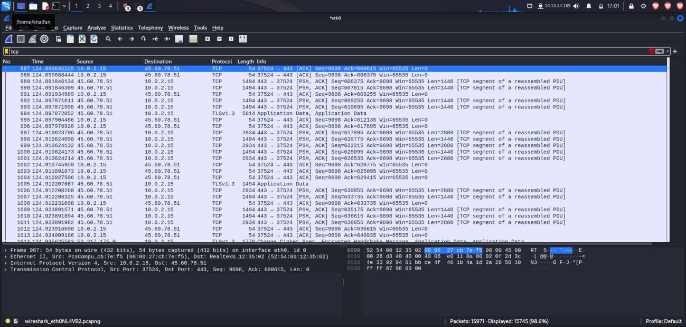
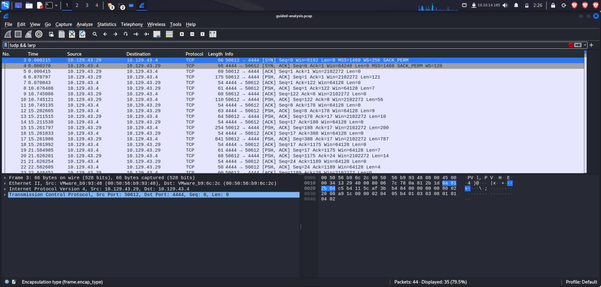

Week2: **Assignment 3:-HTB Academy: Introduction to Network Traffic
Analysis**

Report by: **Aisha Khalifan, cs-cns04-23014**

> **Introduction**
>
> Lo\
> on
>
> In **use the following link:** This module will explore principles of
> nee of traffic analysis tools such as Wireshark and tcpdump.
>
> Network Traffic Analysis (NTA) is the process of examining network
> traffic to better understand how your network is used and to identify
> potential threats. NTA can help security specialists to:

+-----------------------------------+-----------------------------------+
| •                                 | > Identify common ports and       |
|                                   | > protocols: NTA can help you to  |
| •                                 | > identify the ports and          |
|                                   | > protocols that are most         |
| •                                 | > commonly used in your network.  |
|                                   | > This information can be used to |
| •                                 | > establish a baseline for normal |
|                                   | > network behavior and to detect  |
|                                   | > anomalies that may indicate a   |
|                                   | > security threat.                |
|                                   |                                   |
|                                   | Establish a baseline: NTA can be  |
|                                   | used to establish a baseline for  |
|                                   | normal network traffic.           |
|                                   |                                   |
|                                   | > This baseline can then be used  |
|                                   | > to detect anomalies that may    |
|                                   | > indicate a security threat.     |
|                                   | > Detect and respond to threats:  |
|                                   | > NTA can be used to detect a     |
|                                   | > wide range of security threats, |
|                                   | > including malware, botnets, and |
|                                   | > denial-of-service attacks. Once |
|                                   | > a threat has been detected, NTA |
|                                   | > can be used to investigate the  |
|                                   | > threat and to take steps to     |
|                                   | > mitigate it. Gain visibility:   |
|                                   | > NTA can provide security        |
|                                   | > specialists with visibility     |
|                                   | > into all of the traffic on      |
|                                   | > their network. This visibility  |
|                                   | > can be used to identify         |
|                                   | > potential threats and to\       |
|                                   | > troubleshoot network problems.  |
+===================================+===================================+
+-----------------------------------+-----------------------------------+

> NTA is an important tool for security specialists because it can help
> them to protect their networks from a wide range of threats.
>
> To add to the above, NTA is particularly useful for detecting and
> responding to attacks that leverage legitimate credentials and tools.
> This is because NTA can monitor all of the traffic on the network,
> including traffic that is generated by legitimate users and
> applications. By monitoring all of the traffic, NTA can identify
> anomalies that may indicate a malicious attack, even if the attacker
> is using legitimate credentials and tools.
>
> Overall, NTA is a powerful tool that can help security specialists to
> protect their networks from a wide range of threats, both old and new.

**Answers to questions**

**Introduction**

Used the following reference to answer my part A and part B

{width="5.688888888888889in"
height="3.386111111111111in"}

**A.Networking Primer - Layers 1-4**

> a.How many layers does the OSI model have? **7**
>
> {width="5.822222222222222in"
> height="1.9958333333333333in"}
>
> b.How many layers are there in the TCP/IP model?
>
> **4**\
> c.True or False: Routers operate at layer 2 of the OSI model?
>
> **False, they operate at layer 3**\
> d.What addressing mechanism is used at the Link Layer of the TCP/IP
> model?
>
> **MAC-address**
>
> {width="6.361111111111111in"
> height="3.5777766841644794in"}
>
> e.At what layer of the OSI model is a PDU encapsulated into a packet?
> ( the number ) **3**\
> f.What addressing mechanism utilizes a 32-bit address?
>
> **IPv4**\
> g.What Transport layer protocol is connection oriented?
>
> **TCP**
>
> {width="6.5in"
> height="3.6555544619422573in"}
>
> h.What Transport Layer protocol is considered unreliable? **UDP**
>
> i.TCP\'s three-way handshake consists of 3 packets: 1.Syn, 2.Syn &
> ACK, 3. \_? What is the final packet of the handshake?
>
> **ACK**
>
> {width="6.5in"
> height="3.6555555555555554in"}

**B.Networking Primer - Layers 5-7**\
It takes many different applications and services to maintain a network
connection and ensure that data can be transferred between hosts.

> a.What is the default operational mode method used by FTP?
>
> **active**\
> b.FTP utilizes what two ports for command and data transfer? (separate
> the two numbers with a space)\
> **20 and 21**\
> c.Does SMB utilize TCP or UDP as its transport layer protocol?
>
> **TCP**
>
> {width="6.5in"
> height="3.6555555555555554in"}
>
> d.SMB has moved to using what TCP port?
>
> **445**\
> e.Hypertext Transfer Protocol uses what well known TCP port number?
>
> **80**\
> f.What HTTP method is used to request information and content from the
> webserver?
>
> **GET**
>
> {width="6.5in"
> height="3.6555555555555554in"}
>
> g.What web based protocol uses TLS as a security measure? **HTTPS**
>
> h.True or False: when utilizing HTTPS, all data sent across the
> session will appear as TLS Application data? **True**
>
> {width="6.5in"
> height="3.6555555555555554in"}

**C.The Analysis Process**

Network Traffic Analysis is a vital and dynamic process, adaptable based
on available tools, organizational permissions, and network visibility.
Its objective is to establish a repeatable analysis process. This
involves dissecting network data, identifying irregularities that could
indicate malicious activity, and understanding traffic trends against a
baseline.

Traffic analysis offers essential insights for both proactive defense
and daily operations troubleshooting. It can be performed actively or
passively, depending on permissions and tools available, with key
dependencies including permissions, capture tools, in-line placement,
network tap or multiple NICs, and adequate storage and processing power.

Understanding daily traffic patterns through a baseline is crucial for
efficient analysis and anomaly detection. This analysis is pivotal in
swiftly identifying and mitigating potential network breaches

**Traffic Capture Dependencies**\
[They can be of two types: **Passi**]{.underline}**ve and active as
shown in the table below:**

+-----------------------+-----------------------+-----------------------+
| **Dependencies**      | > **Type**            | > **Description**     |
+=======================+=======================+=======================+
| > **Permission**      | > **Passive/ Active** | > **Always ask for    |
|                       |                       | > written permission  |
|                       |                       | > from the right      |
|                       |                       | > authority before    |
|                       |                       | > capturing data, as  |
|                       |                       | > it could be against |
|                       |                       | > the rules or laws   |
|                       |                       | > in some             |
|                       |                       | > organizations,      |
|                       |                       | > especially in       |
|                       |                       | > sensitive sectors   |
|                       |                       | > like healthcare or  |
|                       |                       | > banking. Stay legal |
|                       |                       | > and ethical, even   |
|                       |                       | > if you consider     |
|                       |                       | > yourself a          |
|                       |                       | > hacker.**           |
+-----------------------+-----------------------+-----------------------+
| **Mirrored Port**     | > **Passive**         | > **To capture data   |
|                       |                       | > effectively,        |
|                       |                       | > configure a switch  |
|                       |                       | > or router interface |
|                       |                       | > to copy data to a   |
|                       |                       | > specific port while |
|                       |                       | > enabling            |
|                       |                       | > promiscuous mode on |
|                       |                       | > your NIC. This      |
|                       |                       | > allows inspection   |
|                       |                       | > of traffic not      |
|                       |                       | > usually visible on  |
|                       |                       | > other links.**      |
+-----------------------+-----------------------+-----------------------+

+-----------------------+-----------------------+-----------------------+
| **Capture Tool**      | > **Passive/ Active** | > **To process        |
|                       |                       | > traffic, use tools  |
|                       |                       | > like Wireshark on a |
|                       |                       | > capable computer.   |
|                       |                       | > Be cautious as      |
|                       |                       | > filtering large     |
|                       |                       | > PCAP files can      |
|                       |                       | > strain system       |
|                       |                       | > resources. Ensure   |
|                       |                       | > the host has        |
|                       |                       | > sufficient power.** |
+=======================+=======================+=======================+
| > **In-line**\        | > **Active**          | > **Placing a Tap     |
| > **Placement**       |                       | > in-line requires a  |
|                       |                       | > topology change for |
|                       |                       | > the network you are |
|                       |                       | > working in. The     |
|                       |                       | > source and          |
|                       |                       | > destination hosts   |
|                       |                       | > will not notice a   |
|                       |                       | > difference in the   |
|                       |                       | > traffic, but for    |
|                       |                       | > the sake of routing |
|                       |                       | > and switching, it   |
|                       |                       | > will be an          |
|                       |                       | > invisible next hop  |
|                       |                       | > the traffic passes  |
|                       |                       | > through on its way  |
|                       |                       | > to the              |
|                       |                       | > destination.**      |
+-----------------------+-----------------------+-----------------------+
| > **Network Tap or    | > **Active**          | > **A computer with   |
| > Host With Multiple  |                       | > two NIC\'s, or a    |
| > NIC\'s**            |                       | > device such as a    |
|                       |                       | > Network Tap is      |
|                       |                       | > required to allow   |
|                       |                       | > the data we are     |
|                       |                       | > inspecting to flow  |
|                       |                       | > still**             |
+-----------------------+-----------------------+-----------------------+
| > **Storage** **and** | > **Passive/ Active** | > **You will need     |
| >                     |                       | > plenty of storage   |
| > **Processing**      |                       | > space and           |
| >                     |                       | > processing power    |
| > **Power**           |                       | > for traffic capture |
|                       |                       | > off a tap.**        |
+-----------------------+-----------------------+-----------------------+

**D.Analysis in Practice**\
In this section we go through the components of a network analysis

> **Workflow for Traffic Analysis**:\
> **a.Descriptive Analysis:**\
> **1.**Issue identification and scope definition.
>
> **b.Diagnostic Analysis:**\
> 2.Capture network traffic and filter components. 3.Understanding
> captured network traffic.
>
> **c.Predictive Analysis:**\
> 4.Note-taking and mind mapping of results. 5.Summary of analysis for
> decision-making.
>
> **d.Prescriptive Analysis:**\
> 6.Actions and solutions based on the workflow.
>
> **Key Components of Effective Analysis:**\
> i. Know your environment: Asset inventory and network maps. ii.
> Placement is key: Ideal tool placement for capturing traffic. iii.
> Persistence: Continuous drive to identify and solve issues.
>
> **Analysis Approach:**\
> Start with standard protocols and progress to specific ones.
>
> Look for patterns and unusual events in network traffic.
>
> Don\'t hesitate to seek assistance for thorough analysis.

**E.Tcpdump Fundamentals**

+-----------------------------------+-----------------------------------+
| > {width="6.5in" |                                   |
| > height="3.6555555555555554in"}  |                                   |
+===================================+===================================+
| i\.                               | > Utilizing the output shown in   |
|                                   | > question-1.png, who is the      |
|                                   | > server in this communication?   |
|                                   | > (IP Address) unzip              |
|                                   | > question-1.zip open             |
|                                   | > question-1.PNG\                 |
|                                   | > They used this command: tcpdump |
|                                   | > --nnr HTTP.cap\                 |
|                                   | > **174.143.213.184**\            |
|                                   | > **It is the destination IP      |
|                                   | > address**                       |
+-----------------------------------+-----------------------------------+
| ii\.                              | > {width="6.5in" |
|                                   | > height="2.716665573053368in"}   |
|                                   | >                                 |
|                                   | > Were **absolute** or            |
|                                   | > **relative** sequence numbers   |
|                                   | > used during the capture? (see   |
|                                   | > question-1.zip to answer) --\   |
|                                   | > **relative**                    |
+-----------------------------------+-----------------------------------+

> {width="6.5in"
> height="2.7152777777777777in"}

+-----------------------------------+-----------------------------------+
| > iii\.                           | > If I wish to start a capture    |
|                                   | > without **hostname**            |
|                                   | > resolution, **verbose** output, |
|                                   | > showing contents in **ASCII and |
|                                   | > hex**, and **grab the first 100 |
|                                   | > packets**; what are the         |
|                                   | > switches used? please answer in |
|                                   | > the order the switches are      |
|                                   | > asked for in the question.      |
+===================================+===================================+
+-----------------------------------+-----------------------------------+

> **-nvXc 100**

+-----------------------------------+-----------------------------------+
| > iv\.                            | > Given the **capture file at     |
|                                   | > /tmp/capture.pcap**, what       |
|                                   | > **tcpdump command** will enable |
|                                   | > you to **read** from the        |
|                                   | > capture and show the output     |
|                                   | > contents in **Hex and ASCII?**  |
|                                   | > (Please use best practices when |
|                                   | > using switches)                 |
+===================================+===================================+
+-----------------------------------+-----------------------------------+

> sudo tcpdump -Xr /tmp/capture.pcap
>
> {width="6.5in"
> height="3.6555555555555554in"}

+-----------------------------------+-----------------------------------+
| v\.                               | > What TCPDump switch will        |
|                                   | > increase the **verbosity** of   |
| vi\.                              | > our output? ( Include the ---   |
|                                   | > with the proper switch )        |
| > vii\.                           | >                                 |
|                                   | > **-v**                          |
|                                   | >                                 |
|                                   | > What built in terminal **help** |
|                                   | > reference can tell us more      |
|                                   | > about TCPDump? man              |
|                                   | >                                 |
|                                   | > What TCPDump switch will let me |
|                                   | > **write** my output to a file?  |
|                                   | >                                 |
|                                   | > --w                             |
+===================================+===================================+
+-----------------------------------+-----------------------------------+

> {width="6.5in"
> height="3.6569444444444446in"}

**F.Capturing with Tcpdump(Fundamentals Labs)**\
**Tasks**\
**Task #1:Validate Tcpdump is installed on our machine.**

> {width="6.5625in"
> height="3.691666666666667in"}
>
> **Task #2:Start a capture**

{width="6.5in"
height="3.6569444444444446in"}

{width="6.5in"
height="3.6555555555555554in"}

> **Task #3:Utilize Basic Capture Filters**\
> **sudo tcpdump --i eth0 --vx**
>
> {width="6.5in"
> height="3.6555544619422573in"}
>
> **Task #4:Save a Capture to a .PCAP file.**\
> **sudo tcpdump --i eth0 --nvw aisha.pcap**
>
> {width="6.087498906386702in"
> height="3.423611111111111in"}
>
> **Task #5:Read the Capture from a .PCAP file.**\
> **tcpdump --nnSXr aisha.pcap**
>
> {width="6.5in"
> height="3.6555555555555554in"}

+-----------------------------------+-----------------------------------+
| i\.                               | > What TCPDump switch will allow  |
|                                   | > us to **pipe the contents** of  |
| ii\.                              | > a pcap file out to another      |
|                                   | > function such as 'grep'?        |
| > iii\.                           | > **-l**\                         |
|                                   | > True or False: The filter       |
|                                   | > "port" looks at source and      |
|                                   | > destination traffic. **True**\  |
|                                   | > If i wished to **filter out     |
|                                   | > ICMP traffic** from out         |
|                                   | > capture, what filter could we   |
|                                   | > use? ( word only, not symbol    |
|                                   | > please.) **not icmp**           |
+===================================+===================================+
+-----------------------------------+-----------------------------------+

> {width="6.5in"
> height="3.6555555555555554in"}

+-----------------------------------+-----------------------------------+
| iv.\                              | > What command will show you      |
| v.                                | > **where / if TCPDump is         |
|                                   | > installed**? **which tcpdump**  |
| > vi\.                            | > How do you start a capture with |
|                                   | > TCPDump to **capture on eth0**? |
|                                   | > **tcpdump -i eth0** What switch |
|                                   | > will provide **more verbosity** |
|                                   | > in your output? **--v**         |
+===================================+===================================+
+-----------------------------------+-----------------------------------+

> {width="6.5in"
> height="3.656943350831146in"}

+-----------------------------------+-----------------------------------+
| > vii\.                           | > What switch will **write** your |
| >                                 | > capture output to a .pcap file? |
| > viii\. ix.                      | > **-w**\                         |
|                                   | > What switch will **read** a     |
|                                   | > capture from a .pcap file?      |
|                                   | > **-r**\                         |
|                                   | > What switch will show the       |
|                                   | > contents of a capture in **Hex  |
|                                   | > and ASCII**? --X                |
+===================================+===================================+
+-----------------------------------+-----------------------------------+

> {width="6.5in"
> height="3.6555555555555554in"}

**G.Tcpdump Packet Filtering**

+-----------------------------------+-----------------------------------+
| i\.                               | > What filter will allow me to    |
|                                   | > see traffic coming from or      |
|                                   | > **destined to the host** with   |
|                                   | > an **ip of**                    |
+===================================+===================================+
+-----------------------------------+-----------------------------------+

> **10.10.20.**1?
>
> **host 10.10.20.1**

+-----------------------------------+-----------------------------------+
| ii\.                              | > What filter will allow me to    |
|                                   | > capture based on either of two  |
|                                   | > options?                        |
+===================================+===================================+
+-----------------------------------+-----------------------------------+

> **or**

+-----------------------------------+-----------------------------------+
| > iii\.                           | > True or False: TCPDump will     |
|                                   | > resolve IPs to hostnames by     |
|                                   | > default                         |
+===================================+===================================+
+-----------------------------------+-----------------------------------+

> **True**
>
> {width="6.5in"
> height="3.6555555555555554in"}
>
> **H.Interrogating Network Traffic with Capture and Display Filters**\
> **Tasks**\
> Utilizing TCPDump-lab-2.zip in the optional resources, perform the lab
> to the best of your ability.
>
> Finding everything on the first shot is not the goal.
>
> **Task1:Read a capture from a file without filters implemented tcpdump
> --r TCPDump-lab-2.pcap**
>
> {width="6.5in"
> height="3.1083333333333334in"}
>
> **Task2:Identify the type of traffic seen.**
>
> **Common protocols: TCP and UDP protocols. HTTP, HTTPS,DNS**
>
> **11:33:58.310209 IP 172.16.146.2.54940 \>
> server-13-35-106-128.mia3.r.cloudfront.net.https: Flags \[.\], ack
> 2816075430, win 501, options \[nop,nop,TS val 3512036734 ecr
> 1767785373\], length 0**
>
> ♦**The .https in the above packet means its port 443** ♦**The source
> port is 54940 (IP 172.16.146.2, port 54940).**
>
> ♦**The destination port is https, which typically refers to port 443
> for HTTPS (HTTP over** **SSL/TLS).**
>
> **The following is a snippet of my output above**

+-----------------------+-----------------------+-----------------------+
| > **PROTOCOLS USED**  | **PORTS**             | > **WHERE USED**      |
+=======================+=======================+=======================+
| > **TCP**             | > **54940**           | > **Used in           |
|                       |                       | > communication       |
|                       |                       | > between IP          |
|                       |                       | > \`172.16.146.2 and  |
|                       |                       | >                     |
|                       |                       | server-13-35-106-128. |
|                       |                       | mia3.r.cloudfront.net |
|                       |                       | > for**\              |
|                       |                       | > **HTTPS.**          |
+-----------------------+-----------------------+-----------------------+
| > **TCP**             | > **36918**           | > **Used in           |
|                       |                       | > communication       |
|                       |                       | > between IP          |
|                       |                       | > 172.16.146.2 and    |
|                       |                       | > 72.21.91.29 for     |
|                       |                       | > HTTP.**             |
+-----------------------+-----------------------+-----------------------+
| > **UDP**             | > **1337**            | > **Used in           |
|                       |                       | > communication       |
|                       |                       | > between IP          |
|                       |                       | > 172.16.146.2 and    |
|                       |                       | > 23.106.60.92 with   |
|                       |                       | > UDP.**              |
+-----------------------+-----------------------+-----------------------+
| > **TCP**             | > **43804**           | > **Used in           |
|                       |                       | > communication       |
|                       |                       | > between IP          |
|                       |                       | > 172.16.146.2 and    |
|                       |                       | >                     |
|                       |                       | static.30.26.216.95.c |
|                       |                       | lients.your-server.de |
|                       |                       | > for HTTP.**         |
+-----------------------+-----------------------+-----------------------+
| > **TCP**             | > **43806**           | > **Used in           |
|                       |                       | > communication       |
|                       |                       | > between IP          |
|                       |                       | > 172.16.146.2 and    |
|                       |                       | >                     |
|                       |                       | static.30.26.216.95.c |
|                       |                       | lients.your-server.de |
|                       |                       | > for HTTP.**         |
+-----------------------+-----------------------+-----------------------+
| > **TCP**             | > **52520**           | > **Used in           |
|                       |                       | > communication       |
|                       |                       | > between IP          |
|                       |                       | > 172.16.146.2 and    |
|                       |                       | > 207.244.88.140 for  |
|                       |                       | > HTTPS.**            |
+-----------------------+-----------------------+-----------------------+
| > **TCP**             | > **50587**           | > **Used in           |
|                       |                       | > communication       |
|                       |                       | > between IP          |
|                       |                       | > 172.16.146.2 and    |
|                       |                       | > 172.16.146.1 for    |
|                       |                       | > DNS.**              |
+-----------------------+-----------------------+-----------------------+

> **[Task3:Ide]{.underline}ntify conversations.**

+-------------+-------------+-------------+-------------+-------------+
| > **CONVE   | > **SOURCE  | > **PORT**  | > **DE      | > **PORT**  |
| > RSATIO    | > IP/PORT** |             | STINATION** |             |
| > N**       |             |             |             |             |
+=============+=============+=============+=============+=============+
| > **1**     | > **172     | > **54940** | >           | **4         |
|             | .16.146.2** |             | **server-13 | 43(HTTPS)** |
|             |             |             | -35-106-**\ |             |
|             |             |             | > **128.m   |             |
|             |             |             | ia3.r.cloud |             |
|             |             |             | front.net** |             |
+-------------+-------------+-------------+-------------+-------------+
| > **2**     | >           | > **443**\  | > **172     | > **54940** |
|             | **server-13 | >           | .16.146.2** |             |
|             | -35-106-**\ | **(HTTPS)** |             |             |
|             | >           |             |             |             |
|             | **128.mia3. |             |             |             |
|             | r.cloudfron |             |             |             |
|             | > t.net**   |             |             |             |
+-------------+-------------+-------------+-------------+-------------+

+-------------+-------------+-------------+-------------+-------------+
| > **3**     | > **172     | > **36918** | > **72      | > **80      |
|             | .16.146.2** |             | .21.91.29** | > (HTTP)**  |
+=============+=============+=============+=============+=============+
| > **4**     | > **72      | *           | > **172     | > **36918** |
|             | .21.91.29** | *80(HTTP)** | .16.146.2** |             |
+-------------+-------------+-------------+-------------+-------------+
| > **5**     | > **172     | > **55877** | > **23.     | > **        |
|             | .16.146.2** |             | 106.60.92** | 1337(UDP)** |
+-------------+-------------+-------------+-------------+-------------+
| > **6**     | > **172     | > **57752** | > **172     | > **53      |
|             | .16.146.2** |             | .16.146.1** | > (DNS)**   |
+-------------+-------------+-------------+-------------+-------------+
| > **7**     | > **172     | > **53      | > **172     | > **57752** |
|             | .16.146.1** | > (DNS)**   | .16.146.2** |             |
+-------------+-------------+-------------+-------------+-------------+
| > **8**     | > **172     | > **43804** | >           | > *         |
|             | .16.146.2** |             | **static.30 | *80(HTTP)** |
|             |             |             | .26.216.95. |             |
|             |             |             | clients.you |             |
|             |             |             | > r-        |             |
|             |             |             | server.de** |             |
+-------------+-------------+-------------+-------------+-------------+
| > **9**     | > **s       | *           | > **172     | > **43804** |
|             | tatic.30.26 | *80(HTTP)** | .16.146.2** |             |
|             | .216.95.cli |             |             |             |
|             | >           |             |             |             |
|             |  ents.your- |             |             |             |
|             | server.de** |             |             |             |
+-------------+-------------+-------------+-------------+-------------+

> **The above is just part of my network capture**\
> **Task4:Interpret the capture in depth.**
>
> {width="6.5in"
> height="3.1069444444444443in"}
>
> **What is the timestamp of the first established conversation in the
> pcap file? 11.33.58 What is the IP address/s of apache.org from the
> DNS server responses?**
>
> **11:34:01.236420 IP 172.16.146.2.57752 \> 172.16.146.1.domain: 41819+
> A? apache.org. (28) 1:34:01.236420 - DNS query (A record) from IP
> 172.16.146.2 to DNS server for \"apache.org\".**
>
> **11:34:01.236610 - DNS query (AAAA record) from IP 172.16.146.2 to
> DNS server for \"apache.org\".**
>
> **What protocol is being utilized in that first conversation?
> (name/#)**
>
> **11:33:58.310209 IP 172.16.146.2.54940 \>
> server-13-35-106-128.mia3.r.cloudfront.net.https: Flags \[.\], ack
> 2816075430, win 501, options \[nop,nop,TS val 3512036734 ecr
> 1767785373\], length 0**
>
> **In this conversation the packet is sent from IP 172.16.146.2 on port
> 54940 to \"server-13-35-106-128.mia3.r.cloudfront.net\" on port 443
> (HTTPS), is utilizing the TCP (Transmission Control Protocol)
> protocol. This is evident from the presence of TCP flags in the
> packet, specifically the \"\[.\]\" which indicates an acknowledgment
> (ACK) in TCP.**
>
> **Task5:Filter out traffic.**
>
> **For this task I have filtered in the previous tasks.**
>
> **Task6:Filter for TCP traffic.**
>
> **tcpdump -r TCPDump-lab-2.pcap tcp**

{width="6.5in"
height="3.1083333333333334in"}

> ♦**Lines starting with \"11:33:58.310209\" and similar are individual
> packets captured at specific** **timestamps.**
>
> ♦**Each line shows details about a TCP packet, including source and
> destination IP addresses,** **ports, TCP flags, and additional
> options.**
>
> ♦**For example, the first line:**
>
> **11:33:58.310209 IP 172.16.146.2.54940 \>
> server-13-35-106-128.mia3.r.cloudfront.net.https: Flags \[.\], ack
> 2816075430, win 501, options \[nop,nop,TS val 3512036734 ecr
> 1767785373\], length 0**
>
> **indicates a TCP packet sent from IP 172.16.146.2 on port 54940 to
> the server \"server-13-35-106-128.mia3.r.cloudfront.net\" on port 443
> (HTTPS). The packet is an acknowledgment (ack) with certain TCP flags
> and options.**
>
> **The tcp filter ensures that only TCP traffic is displayed.**
>
> **Task7:What can you determine about the server in the first
> conversation.**
>
> In the first conversation, the client (source) at IP address
> 172.16.146.2 is communicating with the server at the address
> \"server-13-35-106-128.mia3.r.cloudfront.net\" over HTTPS (port 443).
> The communication involves TCP flags and options.
>
> Source IP: 172.16.146.2 and Source Port: 54940
>
> Destination IP: server-13-35-106-128.mia3.r.cloudfront.net and
> Destination Port: 443 (HTTPS)
>
> The client is sending an acknowledgment (ACK) to the server,
> indicating successful receipt of data or a previous message from the
> server. The server is responding with an acknowledgment (ACK) as well.
>
> **Questions**

{width="6.5in"
height="3.656943350831146in"}

> i\. What are the **client** and **server port** numbers used in first
> full TCP three-way handshake? (low number first then high number)\
> Instead of using wireshark, I used my terminal by checking it like
> this:\
> tshark -r TCPDump-lab-2.pcap -Y \"tcp\"\
> FILTER: tcp.port == 80
>
> {width="7.291666666666667in"
> height="0.158332239720035in"}
>
> **80 43806**

{width="6.5in"
height="3.1069444444444443in"}

+-----------------------------------+-----------------------------------+
| ii\.                              | > Based on the traffic seen in    |
|                                   | > the pcap file, who is the       |
|                                   | > **DNS** server in this network  |
|                                   | > segment? (ip                    |
+===================================+===================================+
+-----------------------------------+-----------------------------------+

> address) Download: zeek -C -r TCPDump-lab-2.pcap then cat dns.log
> **172.16.146.2**

+-----------------------------------------------------------------------+
| **I.Analysis with Wireshark**\                                        |
| i. True or False: Wireshark can run on both Windows and Linux.        |
|                                                                       |
| > **True**                                                            |
| >                                                                     |
| > {width="6.5in" |
| > height="3.108332239720035in"}                                       |
+=======================================================================+
+-----------------------------------------------------------------------+

+-----------------------------------+-----------------------------------+
| ii\.                              | > Which Pane allows a user to see |
|                                   | > a summary of each packet        |
| iii\.                             | > grabbed during the capture?     |
|                                   | > **Packet List**                 |
| iv\.                              | >                                 |
|                                   | > {width="6.5in" |
| vi\.                              | > height="3.1069444444444443in"}  |
|                                   | >                                 |
|                                   | > Which pane provides you insight |
|                                   | > into the traffic you captured   |
|                                   | > and displays it in both ASCII   |
|                                   | > and Hex?                        |
|                                   | >                                 |
|                                   | > **Packet Bytes**                |
|                                   | >                                 |
|                                   | > What switch is used with TShark |
|                                   | > to list possible interfaces to  |
|                                   | > capture on?                     |
|                                   | >                                 |
|                                   | > **-D**\                         |
|                                   | > What switch allows us to apply  |
|                                   | > filters in TShark?              |
|                                   | >                                 |
|                                   | > **-f**\                         |
|                                   | > Is a capture filter applied     |
|                                   | > before the capture starts or    |
|                                   | > after? (answer before or after) |
|                                   | > **before**                      |
+===================================+===================================+
+-----------------------------------+-----------------------------------+

**J.Familiarity With Wireshark**\
**Tasks**\
**Task #1**\
**Validate Wireshark is installed, then open Wireshark and familiarize
yourself with the GUI windows and toolbars.**

> {width="6.497221128608924in"
> height="0.7527777777777778in"}
>
> **Task #2**\
> **Select an interface to run a capture on and create a capture filter
> to show only traffic to and from your host IP.**
>
> {width="6.5in"
> height="3.1083333333333334in"}
>
> **Task #3**\
> **Create a capture filter.**
>
> {width="6.5in"
> height="3.1083333333333334in"}
>
> **Task #4**\
> **Navigate to a webpage to generate some traffic.**

{width="6.5in"
height="3.1083333333333334in"}

> **Task #5**\
> **Use the capture results to answer the following questions. What
> application-level protocols are displayed in the results?**
>
> **Can we discern anything in clear text? What was it?**

**K.Wireshark Advanced Usage**

> {width="6.5in"
> height="3.656943350831146in"}

+-----------------------------------+-----------------------------------+
| i\.                               | > Which plugin tab can provide us |
|                                   | > with a way to view conversation |
|                                   | > metadata and even protocol      |
|                                   | > breakdowns for the entire PCAP  |
|                                   | > file?                           |
+===================================+===================================+
+-----------------------------------+-----------------------------------+

+-----------------------------------+-----------------------------------+
| ii\.                              | > **Statistics**\                 |
|                                   | > What plugin tab will allow me   |
| > iii\.                           | > to accomplish tasks such as     |
| >                                 | > applying filters, following     |
| > iv\.                            | > streams, and viewing expert     |
|                                   | > info?                           |
| v\.                               | >                                 |
|                                   | > **Analyze**                     |
|                                   | >                                 |
|                                   | > {width="6.5in" |
|                                   | > height="3.656943350831146in"}   |
|                                   | >                                 |
|                                   | > What stream oriented Transport  |
|                                   | > protocol enables us to follow   |
|                                   | > and rebuild conversations and   |
|                                   | > the included data?              |
|                                   | >                                 |
|                                   | > **tcp**\                        |
|                                   | > True or False: Wireshark can    |
|                                   | > extract files from HTTP         |
|                                   | > traffic.                        |
|                                   | >                                 |
|                                   | > **True**\                       |
|                                   | > True or False: The ftp-data     |
|                                   | > filter will show us any data    |
|                                   | > sent over TCP port 21.          |
|                                   | >                                 |
|                                   | > **False**                       |
+===================================+===================================+
+-----------------------------------+-----------------------------------+

**L.Packet Inception, Dissecting Network Traffic With Wireshark**

> unzip Wireshark-lab-2.zip
>
> {width="6.5in"
> height="3.1083333333333334in"}
>
> {width="6.5in"
> height="3.1069444444444443in"}

+-----------------------------------+-----------------------------------+
| i\.                               | > What was the filename of the    |
|                                   | > image that contained a certain  |
| ii\.                              | > Transformer Leader?             |
|                                   | > (name.filetype)                 |
|                                   | > **Rise-Up.jpg**\                |
|                                   | > Which employee is suspected of  |
|                                   | > performing potentially          |
|                                   | > malicious actions in the live   |
|                                   | > environment?                    |
|                                   | >                                 |
|                                   | > **Bob**                         |
+===================================+===================================+
+-----------------------------------+-----------------------------------+

> {width="6.5in"
> height="3.1083333333333334in"}

**M.Guided Lab: Traffic Analysis Workflow**\
**Tasks**\
**Task 1: Connect to the live host for capture.**

> {width="5.751388888888889in"
> height="2.749998906386702in"}
>
> **Conversations**
>
> {width="6.5in"
> height="3.1083333333333334in"}
>
> **Protocol Statistics**
>
> {width="6.5in"
> height="3.1083333333333334in"}
>
> **Udp**
>
> {width="6.5in"
> height="3.1083333333333334in"}
>
> **Tcp**
>
> {width="6.5in"
> height="3.1083333333333334in"}
>
> **Follow tcp stream**
>
> {width="6.5in"
> height="3.1083333333333334in"}
>
> **Someone made the account hacker and assigned it to the
> administrators group on this host**
>
> {width="6.156943350831146in"
> height="2.9444444444444446in"}
>
> **i.** What was the name of the new user created on Mr. Ben's host?
> **Hacker**

+-----------------------------------+-----------------------------------+
| ii\.                              | > {width="6.5in" |
|                                   | > height="3.1083333333333334in"}  |
|                                   | >                                 |
|                                   | > How many total packets were     |
|                                   | > there in the Guided-analysis    |
|                                   | > PCAP?                           |
|                                   | >                                 |
|                                   | > {width="6.5in" |
|                                   | > height="3.1083333333333334in"}  |
|                                   | >                                 |
|                                   | > 44 located at the lower right   |
|                                   | > side of the screen\             |
|                                   | > What was the suspicious port    |
|                                   | > that was being used?            |
|                                   | >                                 |
|                                   | > **4444**                        |
+===================================+===================================+
+-----------------------------------+-----------------------------------+

> {width="6.5in"
> height="3.1083333333333334in"}
>
> {width="6.5in"
> height="3.656943350831146in"}

**N.Descripting RDP connections**\
Task #1 Open the rdp.pcapng file in Wireshark.

Unzip the zip file included in the optional resources and open it in
Wireshark.

> {width="6.418055555555555in"
> height="1.3736100174978128in"}

{width="6.5in"
height="3.1083333333333334in"}

**Task #2**\
**Analyze the traffic included.**

Take a minute to look at the traffic. Notice there is a lot of
information here. We know our focus is on RDP, so let\'s take a second
to filter on rdp and see what it returns.

**RDP Filter**

{width="6.5in"
height="3.108332239720035in"}

**utilize the display filter tcp.port == 3389.**\
**Filter For TCP Port 3389**

{width="6.5in"
height="3.1083333333333334in"}

**Task #3**\
**Provide the RDP-key to Wireshark so it can decrypt the traffic.**

**Steps**\
♦Click the + to add a new key\
♦Type in the IP address of the RDP server 10.129.43.29 ♦Type in the port
used 3389\
♦Protocol filed equals tpkt or blank.

> ♦Browse to the server.key file and add it in the key file section.
>
> ♦Save and refresh your pcap file.

{width="6.5in"
height="3.1069444444444443in"}

When filtering once again on RDP, we should see some traffic in the
display.

**RDP In The Clear**

{width="6.5in"
height="3.1083333333333334in"}

**Perform Analysis of the Unencrypted Traffic**\
Now that we have broken RDP out of the TLS tunnel, what can we find?
Perform the analysis steps packet \# 8 of the three-way handshake, we
can see the host who initiated the connection is 10.129.43.27

{width="6.5in"
height="3.1083333333333334in"}

> i\. What user account was used to initiate the RDP connection?
> **Bucky**
>
> {width="6.5in"
> height="3.1083333333333334in"}

{width="6.5in"
height="3.108332239720035in"}

**Provide a shareable link :**

**Conclusion**

This lab really impacted on my understanding of the network analysis and
interpretation of network packets. Having repeated the lab like three
teams helped in identifying all small details I had missed in the first
round.

{width="6.498611111111111in"
height="3.5861111111111112in"}
