**Week3:** Assignment 1**:- TryHackMe: DNS In Detail**

Report by: **Aisha Khalifan, cs-cns04-23014**

> **Introduction**
>
> This room walks us through an introduction to DNS (Domain Name
> Service). DNS is like a guide that helps us communicate with devices
> on the internet without needing to remember complicated numerical
> addresses.
>
> Similar to how every house has a distinct address for mail, each
> computer on the internet has its own special address called an IP
> address, like 104.26.10.229, made up of four sets of numbers ranging
> from 0 to 255, separated by periods. Remembering these numbers can be
> inconvenient, especially when visiting websites. This is where DNS
> comes in handy. Instead of recalling long IP addresses like
> 104.26.10.229, we can simply remember easy-to-use names like
> [tryhackme.com]{.underline}. DNS makes internet navigation much
> simpler.
>
> 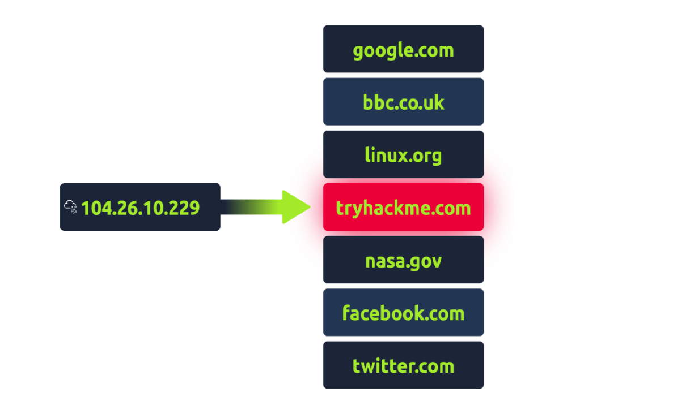{width="4.720833333333333in"
> height="2.7805555555555554in"}
>
> **Link:**
>
> 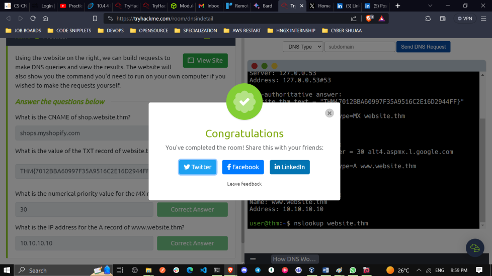{width="4.891666666666667in"
> height="2.751388888888889in"}

In this assignment, we were required to solve some five tasks and this
is how our solutions looked like: **[Task 1 What is DNS?]{.underline}**

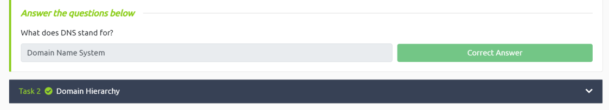{width="5.616666666666666in"
height="1.0291655730533684in"}

**[Task 2 Domain Hierarchy]{.underline}**

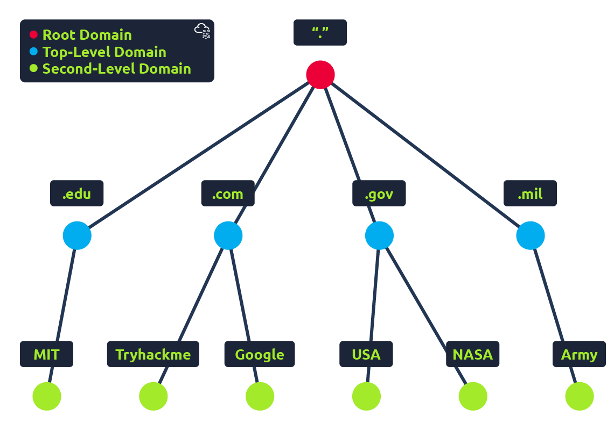{width="6.498611111111111in"
height="4.5625in"}

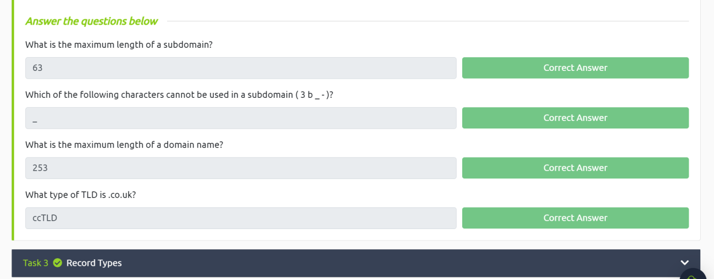{width="6.5in"
height="2.5444444444444443in"}

> **Task 3 Record Types**
>
> DNS isn\'t just for websites though, and multiple types of DNS record
> exist. We\'ll go over some of the most common ones that you\'re likely
> to come across.
>
> **A Record**
>
> These records resolve to IPv4 addresses, for example 104.26.10.229
>
> **AAAA Record**
>
> These records resolve to IPv6 addresses, for example
> 2606:4700:20::681a:be5
>
> **CNAME Record**
>
> These records resolve to another domain name, for example,
> TryHackMe\'s online shop has the subdomain name store.tryhackme.com
> which returns a CNAME record shops.shopify.com. Another DNS request
> would then be made to shops.shopify.com to work out the IP address.
>
> **MX Record**
>
> These records resolve to the address of the servers that handle the
> email for the domain you are querying, for example an MX record
> response for tryhackme.com would look something\
> like alt1.aspmx.l.google.com. These records also come with a priority
> flag. This tells the client in which order to try the servers, this is
> perfect for if the main server goes down and email needs to be sent to
> a backup server.
>
> **TXT Record**

TXT records are free text fields where any text-based data can be
stored. TXT records have multiple uses,

> but some common ones can be to list servers that have the authority to
> send an email on behalf of the

domain (this can help in the battle against spam and spoofed email).
They can also be used to verify ownership of the domain name when
signing up for third party services.

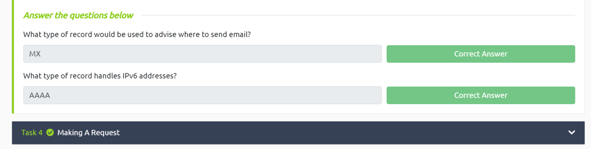{width="6.5in"
height="1.65in"}

**Task 4 Making A Request**

When you type a domain name into your web browser, your computer needs
to know the IP address of that domain in order to connect to it. It does
this by making a DNS request to a series of servers, starting with the
local DNS cache and ending with the authoritative DNS servers for the
domain name. Once the computer has the IP address, it can connect to the
domain name and load the website

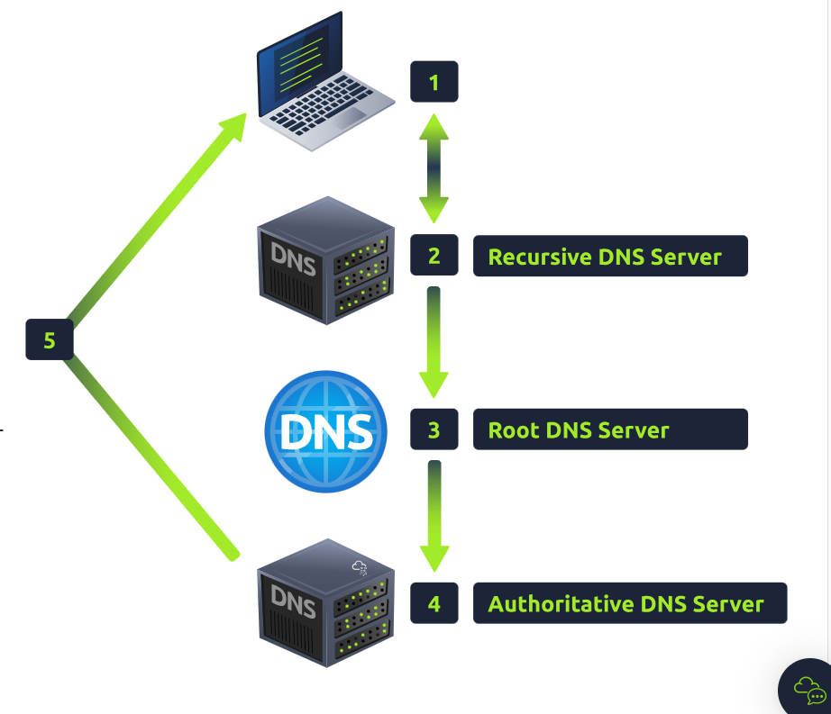{width="4.777777777777778in"
height="4.109721128608924in"}

**When you make a DNS request:**

+-----------------------------------+-----------------------------------+
| •\                                | > Your computer checks its local  |
| •\                                | > cache for the IP address of the |
| •                                 | > domain name you requested.      |
|                                   | >                                 |
| •\                                | > If the IP address is not in the |
| •                                 | > cache, your computer sends a    |
|                                   | > request to a recursive DNS      |
| •\                                | > server.                         |
| •\                                | >                                 |
| •                                 | > The recursive DNS server checks |
|                                   | > its own cache and, if the IP    |
|                                   | > address is not there, queries   |
|                                   | > the root DNS servers.           |
|                                   | >                                 |
|                                   | > The root DNS servers redirect   |
|                                   | > the recursive DNS server to the |
|                                   | > top-level domain (TLD) DNS      |
|                                   | > servers.                        |
|                                   | >                                 |
|                                   | > The TLD DNS servers redirect    |
|                                   | > the recursive DNS server to the |
|                                   | > authoritative DNS servers for   |
|                                   | > the domain name.                |
|                                   | >                                 |
|                                   | > The authoritative DNS servers   |
|                                   | > send the IP address of the      |
|                                   | > domain name to the recursive    |
|                                   | > DNS server. The recursive DNS   |
|                                   | > server caches the IP address    |
|                                   | > and sends it to your computer.  |
|                                   | >                                 |
|                                   | > Your computer caches the IP     |
|                                   | > address and uses it to connect  |
|                                   | > to the domain name.             |
+===================================+===================================+
+-----------------------------------+-----------------------------------+

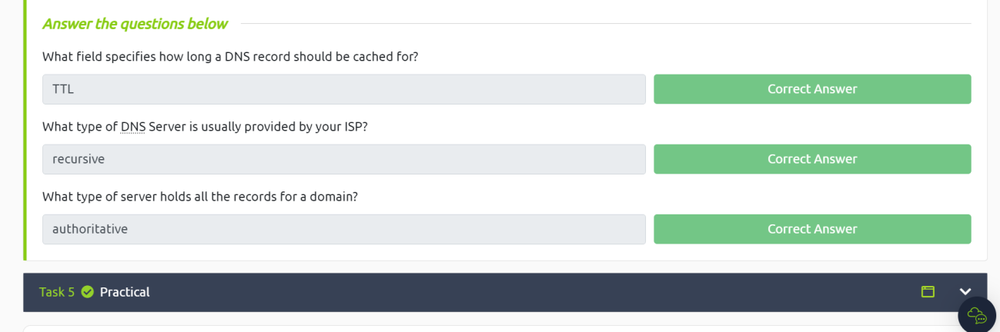{width="6.5in"
height="2.1638888888888888in"}

**Task 5 Practical**

Using the website on the right, we can build requests to make DNS
queries and view the results. The website will also show you the command
you\'d need to run on your own computer if you wished to make the
requests yourself.

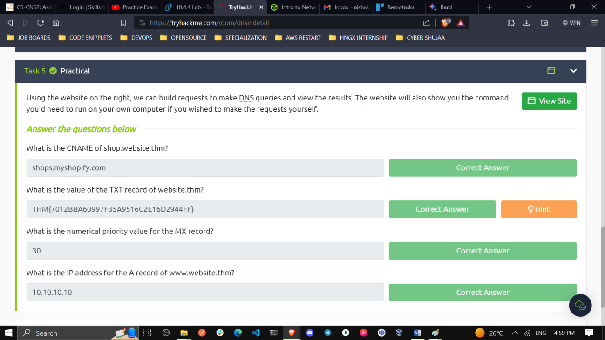{width="6.5in"
height="3.6569444444444446in"}

> **i.** **What is the CNAME of shop.website.thm?**

**This is the code we run to check the CNAME: nslookup --type=CNAME
shop.website.thm**

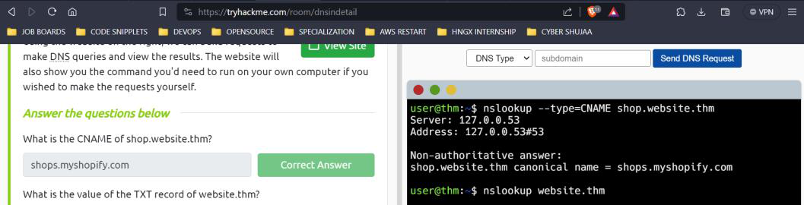{width="5.2875in"
height="1.3513877952755906in"}

+-----------------------------------+-----------------------------------+
| **ii.**                           | > **What is the value of the TXT  |
|                                   | > record of website.thm?**        |
| > **iii.**                        | >                                 |
| >                                 | > **To get the TXT record of      |
| > **iv.**                         | > website.thm this is the command |
|                                   | > that we run: nslookup           |
|                                   | > --type=TXT website.thm**        |
|                                   | >                                 |
|                                   | > {width="6.5in" |
|                                   | > height="2.6305555555555555in"}  |
|                                   | >                                 |
|                                   | > **What is the numerical         |
|                                   | > priority value for the MX       |
|                                   | > record?**                       |
|                                   | >                                 |
|                                   | > **To get the numerical priority |
|                                   | > value for the MX record we run  |
|                                   | > the following command: nslookup |
|                                   | > --type=MX website.thm**\        |
|                                   | > **30**                          |
|                                   | >                                 |
|                                   | > {width="6.5in" |
|                                   | > height="2.6319444444444446in"}  |
|                                   | >                                 |
|                                   | > **What is the IP address for    |
|                                   | > the A record o ?**              |
|                                   | >                                 |
|                                   | > **To get the IP address for the |
|                                   | > A record of e use the following |
|                                   | > command: nslookup --type=A      |
|                                   | > website.thm**\                  |
|                                   | > **10.10.10.10**                 |
+===================================+===================================+
+-----------------------------------+-----------------------------------+

> 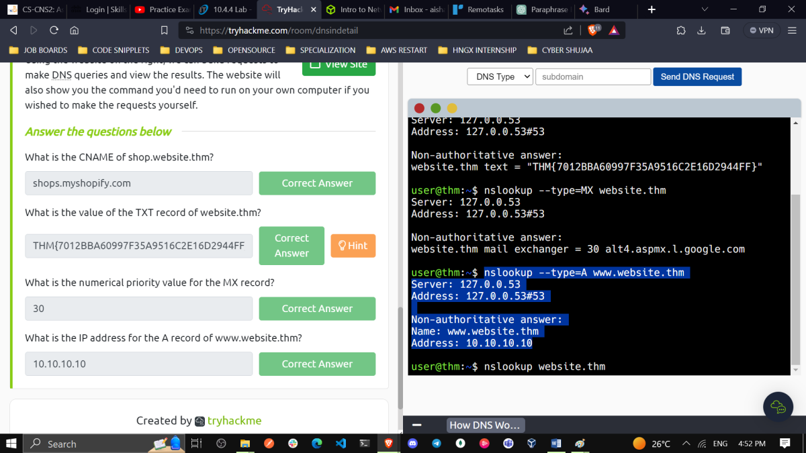{width="6.002777777777778in"
> height="3.376388888888889in"}
>
> **[Conclusion]{.underline}**
>
> DNS is used to map domain names to IP addresses, which are the
> numerical addresses that computers use to communicate with each other
> on the Internet. When you type a domain name into your web browser,
> your computer sends a DNS query to a DNS server to find the IP address
> of the website you want to visit. Once the DNS server has found the IP
> address, it sends it back to your computer, which can then connect to
> the website.
>
> There are many different types of DNS records, but some of the most
> common ones are: **A records**: These records map domain names to IPv4
> addresses.
>
> **AAAA records:** These records map domain names to IPv6 addresses.
>
> **CNAME records:** These records map domain names to other domain
> names.
>
> **MX records**: These records map domain names to mail servers.
>
> **TXT records:** These records can be used to store any type of text
> data.
>
> DNS is a critical part of the Internet infrastructure, and it is
> essential for the smooth operation of the web. Without DNS, it would
> be impossible to visit websites or send emails.
>
> **nslookup** is widely used by system administrators, network
> engineers, and developers to perform DNS-related tasks and gain
> insights into DNS resolution processes and find out more about the DNS
> records. It provides a quick and easy way to query DNS and obtain
> critical information necessary for troubleshooting and network
> management. However, newer tools like **dig** (domain information
> groper) and **host** are becoming more popular due to their enhanced
> features and functionalities.
