> Week3: **Assignment 3:-HTB Academy -- Web Requests**

Report by: **Aisha Khalifan, cs-cns04-23014**

> **Introduction**
>
> This is a room about Network protocols. In today\'s digital era,
> virtually every app we use connects with the internet through HTTP.
> HyperText Transfer Protocol (HTTP) is the fundamental language that
> allows us to access content on the web. It follows a client-server
> model: clients request resources, and servers process and deliver
> them.
>
> A URL (Uniform Resource Locator) is our entryway to content via HTTP.
> It\'s like a structured address: starting with a scheme (like http://)
> and including components such as host, port, path, query string, and
> fragments.
>
> Understanding HTTP is crucial for anyone involved in web applications
> and security. In this report module, we will deal with HTTP methods,
> how requests and responses are structured, and important tools like
> cURL for efficient interaction with web services.
>
> **Methodology**
>
> **[HTTP Fundamentals]{.underline}**

**i.** **HyperText Transfer Protocol (HTTP)**

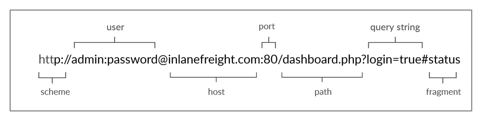{width="6.497221128608924in"
height="1.6083333333333334in"}

> ♦Resources over HTTP are accessed via URL(Uniform Resource Locator)
> which which offers many more specifications than simply specifying a
> website we want to visit.
>
> 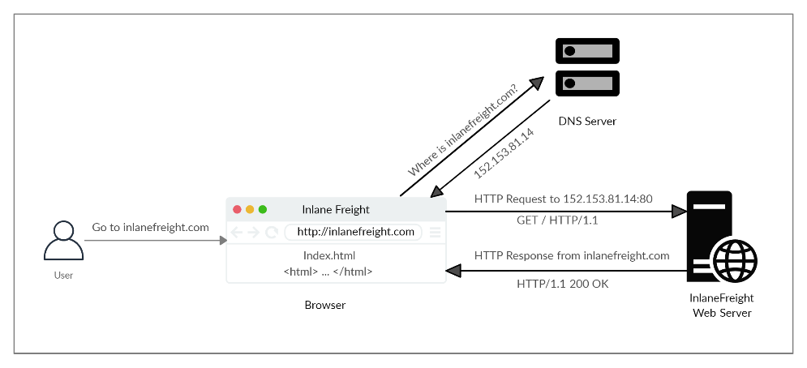{width="4.512498906386702in"
> height="2.0611100174978128in"}

♦The diagram above presents the anatomy of an HTTP request at a very
high level.

♦The first time a user enters the URL (inlanefreight.com) into the
browser, it sends a request to a DNS (Domain Name Resolution) server to
resolve the domain and get its IP.

♦The DNS server looks up the IP address for inlanefreight.com and
returns it. All domain names need to be resolved this way, as a server
can\'t communicate without an IP address.

**cURL**\
♦cURL (client URL) is a command-line tool and library that supports HTTP
along with many other protocols.

♦This makes it a good candidate for scripts as well as automation,
making it essential for sending various types of web requests from the
command line, which is necessary for many types of web penetration
tests.

> 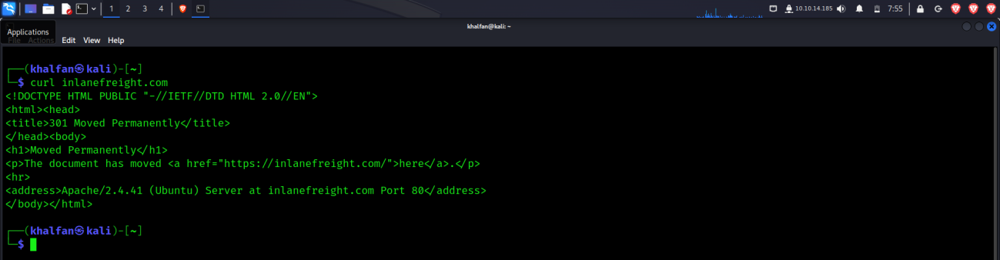{width="6.5in"
> height="1.694443350831146in"}

♦We may also use cURL to download a page or a file and output the
content into a file using the -O flag. If we want to specify the output
file name, we can use the -o flag and specify the name.

> Otherwise, we can use -O and cURL will use the remote file name, as
> follows:
>
> 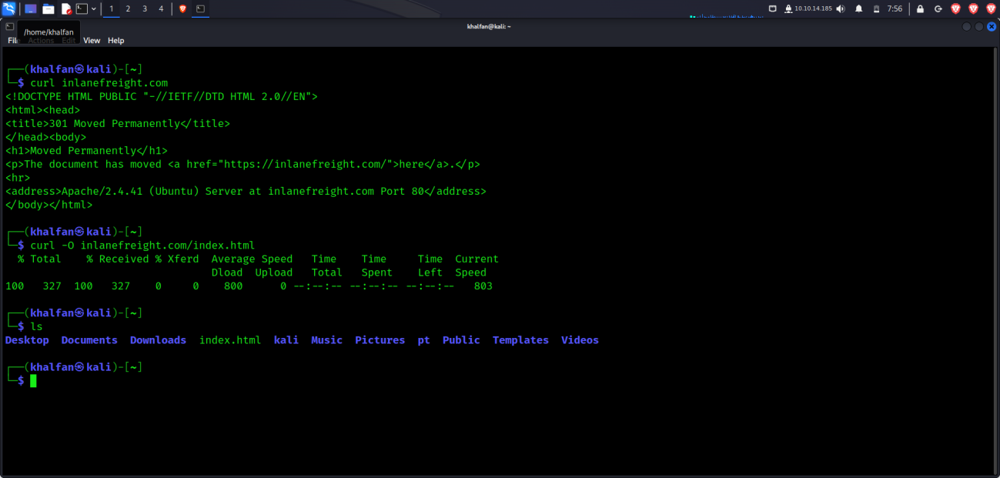{width="6.5in"
> height="3.108332239720035in"}

**Questions**

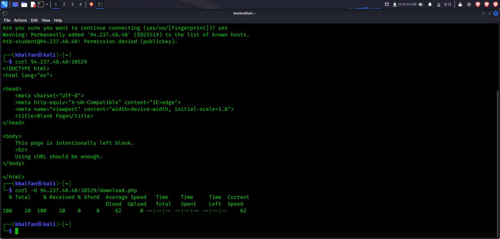{width="6.5in"
height="3.1083333333333334in"}

♦**I curl 94.237.48.48:38529**\
♦**Then to download that file /download.php**\
♦**curl --o 94.237.48.48:38529/download.php**\
♦**then cat to display the contents of download.php**

♦
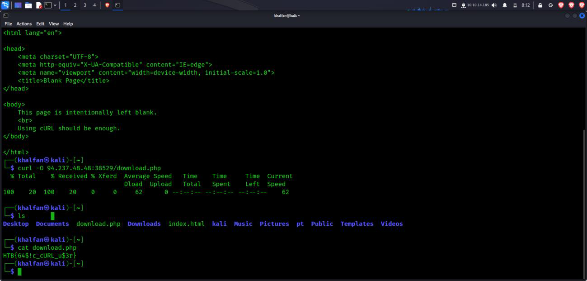{width="6.5in"
height="3.108332239720035in"}

♦**From the above I get the answers to my question.**

> 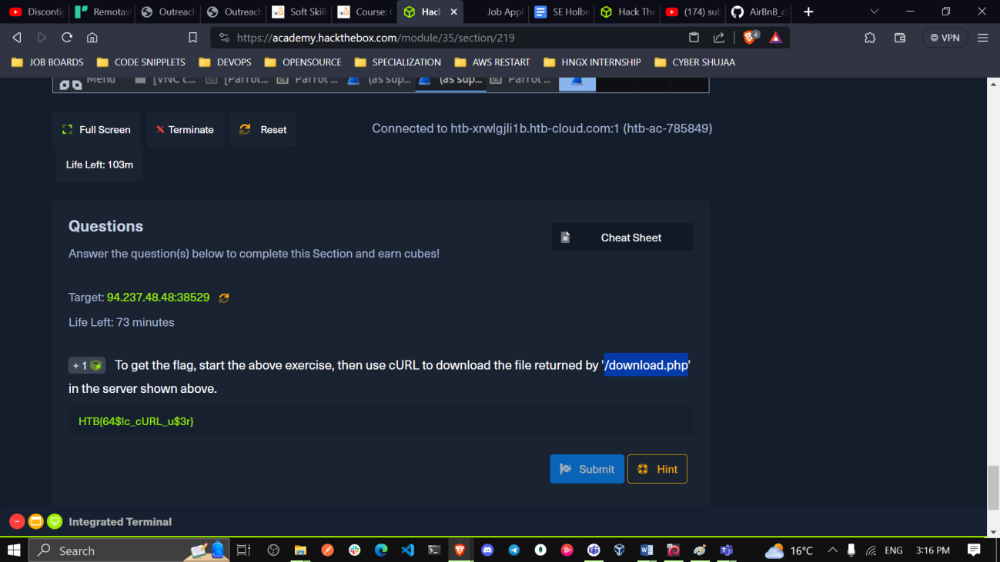{width="6.5in"
> height="3.6555555555555554in"}

**ii.** **HyperText Transfer Protocol Secure (HTTPS)**\
**iii.** **HTTP Requests and Responses**\
♦An HTTP request is made by the client (e.g. cURL/browser), and is
processed by the server (e.g. web server).

♦The requests contain all of the details we require from the server,
including the resource (e.g.

> URL, path, parameters), any request data, headers or options we
> specify, and many other options we will discuss throughout this
> module.
>
> ♦Once the server receives the HTTP request, it processes it and
> responds by sending the HTTP response, which contains the response
> code, as discussed in a later section, and may contain the resource
> data if the requester has access to it.
>
> **Example of a request**
>
> 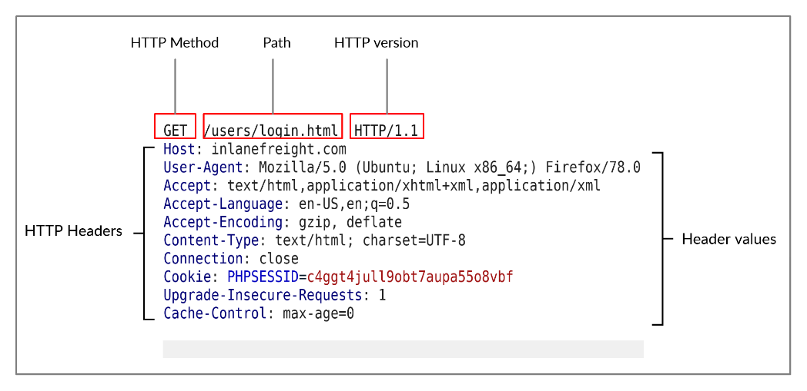{width="4.747222222222222in"
> height="2.3041666666666667in"}

+-----------------------+-----------------------+-----------------------+
| > **Field**           | > **Example**         | > **description**     |
+=======================+=======================+=======================+
| > Method              | > GET                 | > **The HTTP method   |
|                       |                       | > or verb, which      |
|                       |                       | > specifies the type  |
|                       |                       | > of action to        |
|                       |                       | > perform.**          |
+-----------------------+-----------------------+-----------------------+

+-----------------------+-----------------------+-----------------------+
| > **Path**            | /users/login.html     | > **The path to the   |
|                       |                       | > resource being      |
|                       |                       | > accessed. This      |
|                       |                       | > field can also be   |
|                       |                       | > suffixed with a     |
|                       |                       | > query string        |
|                       |                       | > (e.g.**\            |
|                       |                       | >                     |
|                       |                       |  **?username=user).** |
+=======================+=======================+=======================+
| > Version             | > HTTP/1.1            | > The third and final |
|                       |                       | > field is used to    |
|                       |                       | > denote the HTTP     |
|                       |                       | > version.            |
+-----------------------+-----------------------+-----------------------+

> **Example of HTTP Response**
>
> 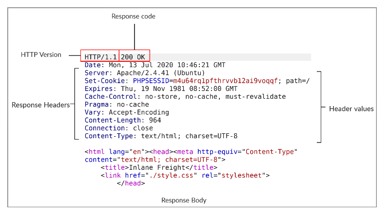{width="3.5972222222222223in"
> height="2.0069444444444446in"}
>
> **To send a GET request to the specified target (94.237.48.48:38529)
> and read the response headers to**
>
> **find the Apache version, you can use the curl command in the
> terminal. Here\'s how you can do it:**
>
> **curl -I**
>
> 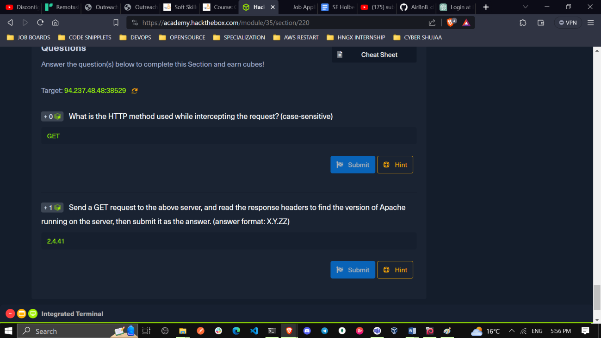{width="6.5in"
> height="3.656943350831146in"}

**iv.** **HTTP Headers**

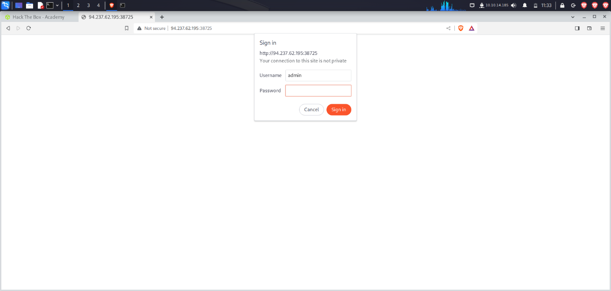{width="6.283333333333333in"
height="3.004166666666667in"}

> 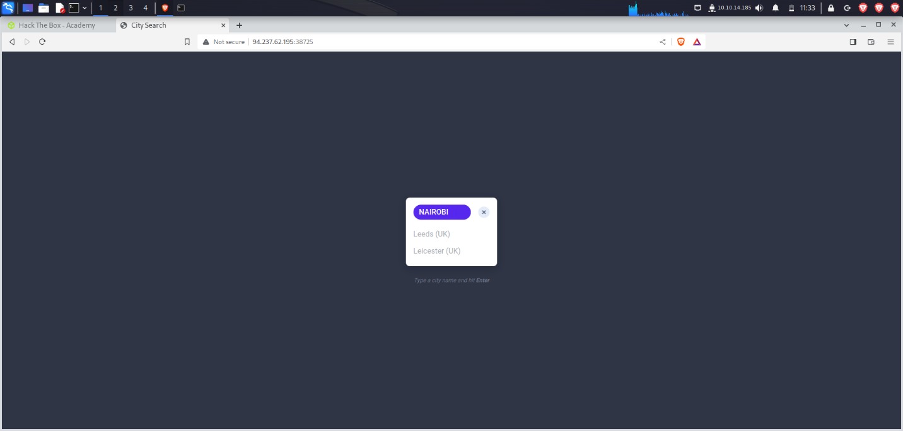{width="6.5in"
> height="3.1083333333333334in"}
>
> 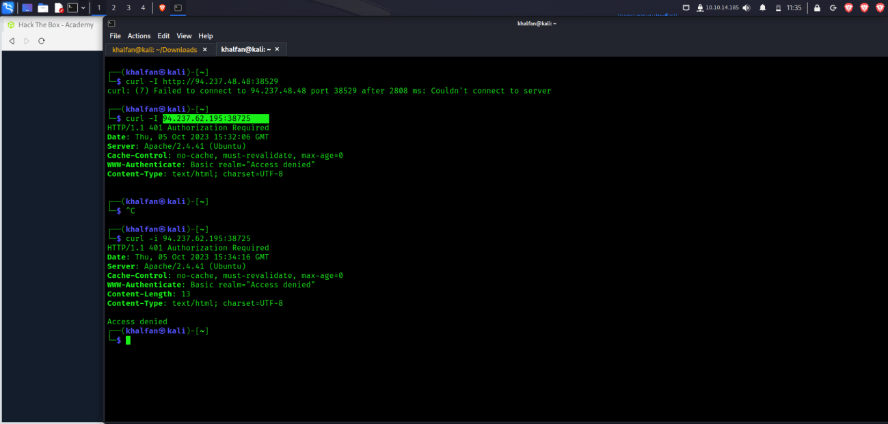{width="6.5in"
> height="3.1083333333333334in"}
>
> 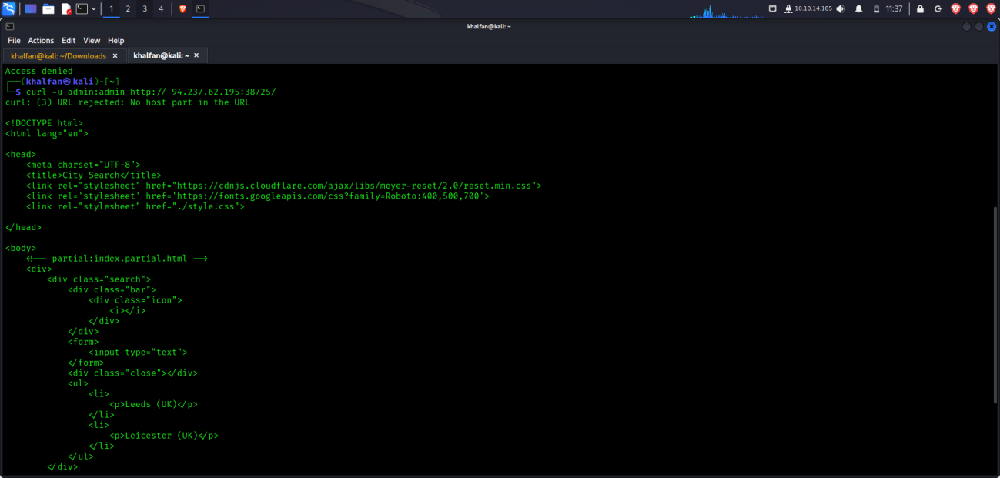{width="6.5in"
> height="3.1083333333333334in"}
>
> 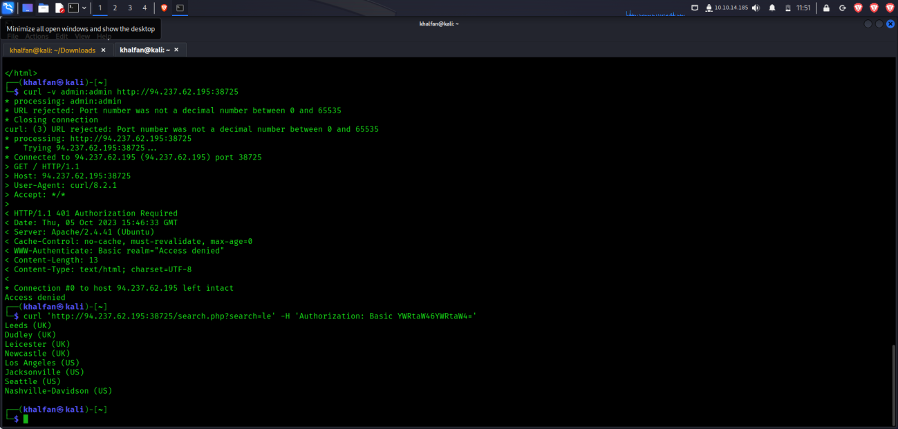{width="6.5in"
> height="3.1083333333333334in"}
>
> 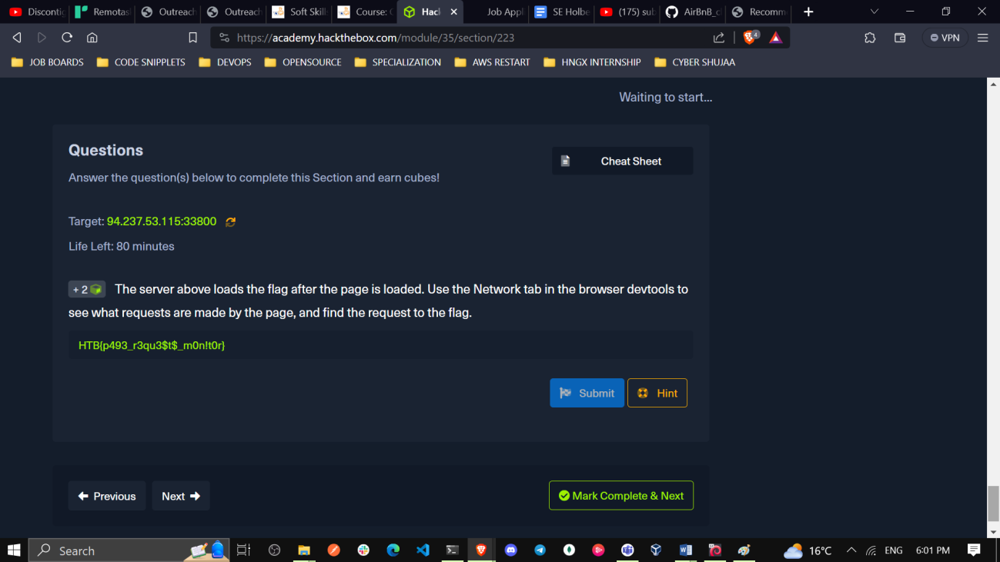{width="6.5in"
> height="3.6555555555555554in"}
>
> **[HTTP Methods]{.underline}**
>
> **i.** **HTTP Methods and Codes**

**ii.** **GET**

> 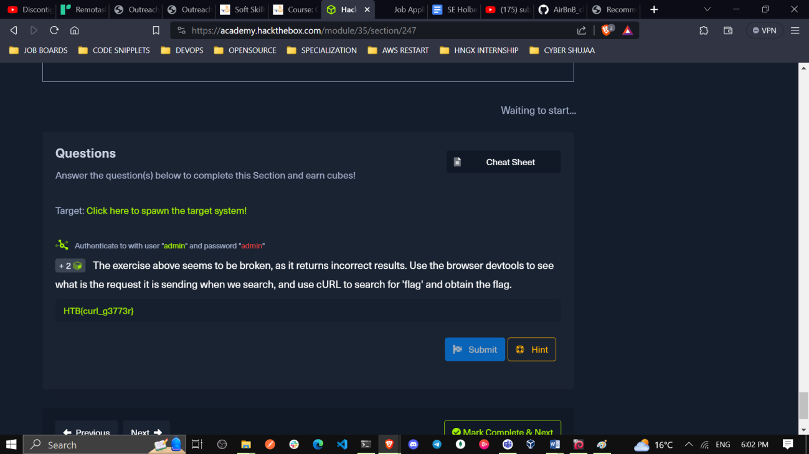{width="6.5in"
> height="3.6555555555555554in"}

**iii.** **POST**

> 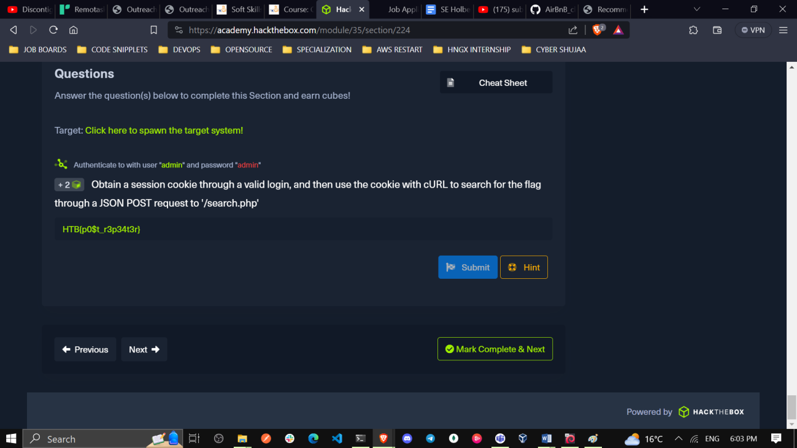{width="6.5in"
> height="3.656943350831146in"}
>
> **iv.** **CRUD API**
>
> **Read London**
>
> 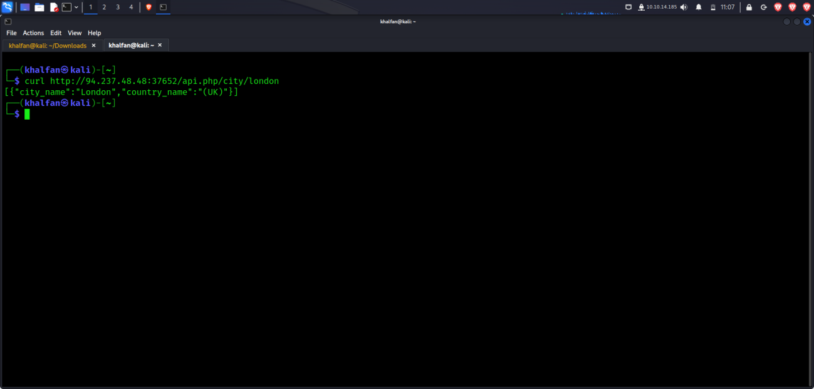{width="6.5in"
> height="3.1083333333333334in"}

Read London in a json way

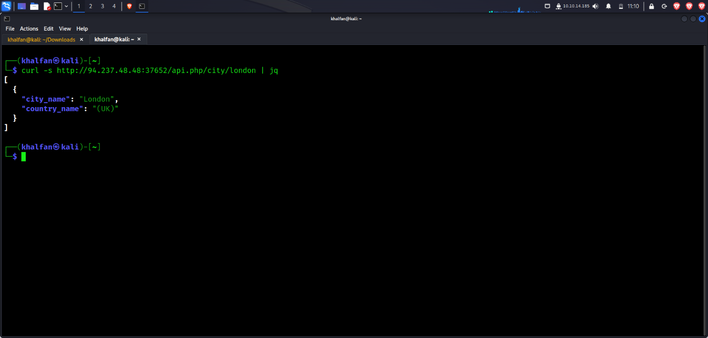{width="6.5in"
height="3.1069444444444443in"}

search a term and get all matching results:

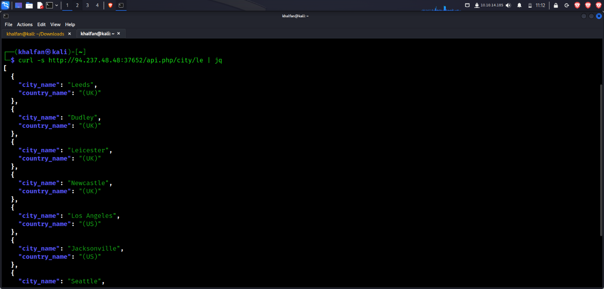{width="6.5in"
height="3.1083333333333334in"}

We create a city HTB

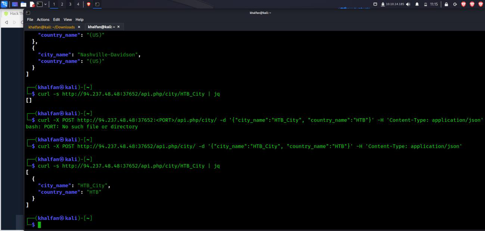{width="6.5in"
height="3.1069444444444443in"}

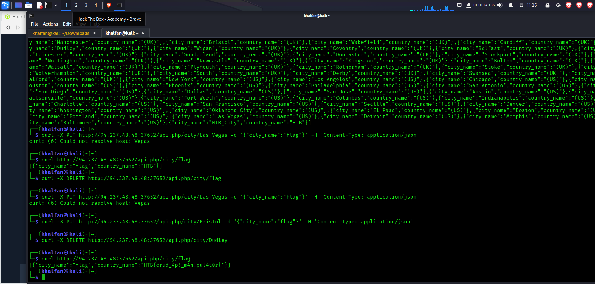{width="7.2in"
height="3.4430544619422574in"}

First, update any city\'s name to be \'flag\'. Then, delete any city.
Once done, search for a city named \'flag\' to get the flag.

**HTB{crud_4p!\_m4n!pul4t0r}**

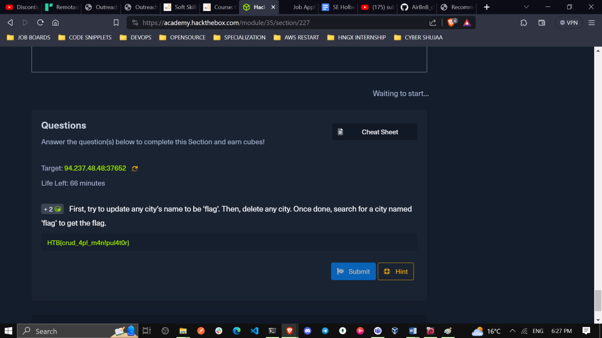{width="6.5in"
height="3.6555555555555554in"}

The following is the link to my module:

{width="6.5in"
height="3.6555555555555554in"}

**Conclusion**

This module has effectively shown the essential elements of web
application interactions. We covered the fundamentals of HTTP and HTTPS,
grasped requests and responses, understood the significance of headers,
methods, and response codes, and honed the ability to utilize common
HTTP methods for seamless data handling. The module\'s emphasis on API
interaction has broadened my perspective, showcasing the potential of
integrating external services into our projects. By mastering these
concepts, I am better equipped to create efficient, interactive, and
data-driven web applications. The knowledge gained here forms a solid
foundation, empowering me to navigate the complexities of web
development with proficiency and enabling me to build impactful digital
experiences for users
