> Week4: **Assignment 1:-VLANs and Secure Switch Configuration** Report
> by: **Aisha Khalifan, cs-cns04-23014**\
> **Introduction**

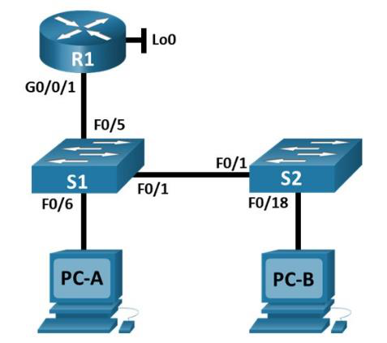{width="2.1374989063867016in"
height="1.894443350831146in"}

> **Addressing Table**

+-----------------+-----------------+-----------------+-----------------+
| > Device        | > Interface /   | > IP Address    | > Subnet Mask   |
|                 | > VLAN          |                 |                 |
+=================+=================+=================+=================+
| > R1            | > G0/0/1        | > 192.168.10.1  | > 255.255.255.0 |
+-----------------+-----------------+-----------------+-----------------+
|                 | > Loopback 0    | > 10.10.1.1     | > 255.255.255.0 |
+-----------------+-----------------+-----------------+-----------------+
| > S1            | > VLAN 10       | >               | > 255.255.255.0 |
|                 |                 |  192.168.10.201 |                 |
+-----------------+-----------------+-----------------+-----------------+
| > S2            | > VLAN 10       | >               | > 255.255.255.0 |
|                 |                 |  192.168.10.202 |                 |
+-----------------+-----------------+-----------------+-----------------+
| > PC - A        | > NIC           | > DHCP          | > 255.255.255.0 |
+-----------------+-----------------+-----------------+-----------------+
| > PC - B        | > NIC           | > DHCP          | > 255.255.255.0 |
+-----------------+-----------------+-----------------+-----------------+

> **Objectives**

+-----------------------------------------------------------------------+
| > **Part 1: Configure the Network Devices.**                          |
| >                                                                     |
| > • Cable the network.                                                |
| >                                                                     |
| > • Configure R1.                                                     |
| >                                                                     |
| > • Configure and verify basic switch settings.                       |
| >                                                                     |
| > **Part 2: Configure VLANs on Switches.**                            |
| >                                                                     |
| > • Configure VLAN 10.                                                |
| >                                                                     |
| > • Configure the SVI for VLAN 10.                                    |
| >                                                                     |
| > • Configure VLAN 333 with the name Native on S1 and S2.             |
| >                                                                     |
| > • Configure VLAN 999 with the name ParkingLot on S1 and S2.         |
| >                                                                     |
| > **Part 3: Configure Switch Security.**                              |
| >                                                                     |
| > • Implement 802.1Q trunking.                                        |
| >                                                                     |
| > • Configure access ports.                                           |
| >                                                                     |
| > • Secure and disable unused switchports.                            |
| >                                                                     |
| > • Document and implement port security features.                    |
| >                                                                     |
| > • Implement DHCP snooping security.                                 |
| >                                                                     |
| > • Implement PortFast and BPDU guard.                                |
| >                                                                     |
| > • Verify end-to-end-connectivity.                                   |
+=======================================================================+
+-----------------------------------------------------------------------+

> **Background**\
> This is a comprehensive lab to review previously covered Layer 2
> security features.

Note: The routers used with CCNA hands-on labs are Cisco 4221 with Cisco
IOS XE Release 16.9.3

(universalk9 image). The switches used in the labs are Cisco Catalyst
2960s with Cisco IOS Release

15.0(2) (lanbasek9 image). Other routers, switches, and Cisco IOS
versions can be used. Depending on

the model and Cisco IOS version, the commands available and the output
produced might vary from

what is shown in the labs. Refer to the Router Interface Summary Table
at the end of the lab for the

correct interface identifiers.

**Note: Make sure that the switches have been erased and have no startup
configurations.**

**Required Resources**

> 1 Router (Cisco 4221 with Cisco IOS XE Release 16.9.3 universal image
> or comparable) 2 Switches (Cisco 2960 with Cisco IOS Release 15.0(2)
> lanbasek9 image or comparable) 2 PCs (Windows with a terminal
> emulation program, such as Tera Term)\
> Console cables to configure the Cisco IOS devices via the console
> ports\
> Ethernet cables as shown in the topology

**Part 1: Configure the Network Devices.**

**Step 1: Cable the network.**

> 1.Cable the network as shown in the topology.\
> 2.Initialize the devices**.**
>
> 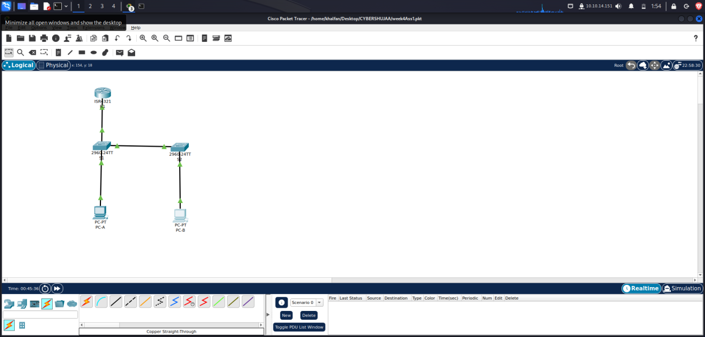{width="6.5in"
> height="3.106943350831146in"}

**Step 2: Configure R1.**

> 1.Load the following configuration script on R1.
>
> ***enable***
>
> ***configure terminal***
>
> ***hostname R1***\
> ***no ip domain lookup***\
> ***ip dhcp excluded-address 192.168.10.1 192.168.10.9 ip dhcp
> excluded-address 192.168.10.201 192.168.10.202 !***
>
> ***ip dhcp pool Students***\
> ***network 192.168.10.0 255.255.255.0***\
> ***default-router 192.168.10.1***\
> ***domain-name secure.com***\
> ***!***
>
> ***interface Loopback0***\
> ***ip address 10.10.1.1 255.255.255.0***\
> ***!***
>
> ***interface GigabitEthernet0/0/1***\
> ***description Link to S1 Port 5***\
> ***ip dhcp relay information trusted***
>
> ***ip address 192.168.10.1 255.255.255.0***\
> ***no shutdown***\
> ***!***
>
> ***line con 0***\
> ***logging synchronous***\
> ***exec-timeout 0 0***\
> 2.Verify the running-configuration on R1 using the following command:
> R1#**show ip interface brief**

+-----------------------+-----------------------+-----------------------+
| > **Interface**       | > **OK? Method Status | > **Protocol down**\  |
| > **IP-Address**      | > YES unset down**\   | > **up**\             |
| >                     | > **YES manual up**\  | > **up**              |
| > **GigabitEthe       | > **YES manual up**   |                       |
| rnet0/0/0unassigned** |                       |                       |
| >                     |                       |                       |
| > **GigabitEthern     |                       |                       |
| et0/0/1192.168.10.1** |                       |                       |
| >                     |                       |                       |
| > **Loopback0**       |                       |                       |
| > **10.10.1.1**       |                       |                       |
+=======================+=======================+=======================+
+-----------------------+-----------------------+-----------------------+

> 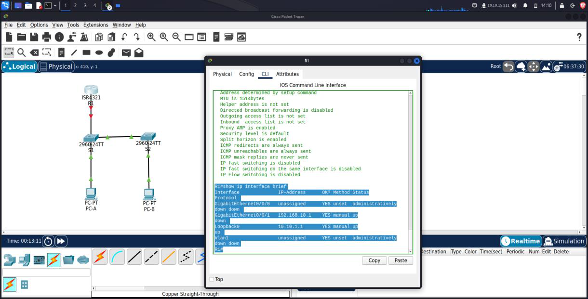{width="6.104166666666667in"
> height="3.1083333333333334in"}
>
> 3.Verify IP addressing and interfaces are in an up / up state
> (troubleshoot as necessary).

**Step 3: Configure and verify basic switch settings.**

> **1.**Configure the hostname for switches S1 and S2**.**\
> *Open configuration window*
>
> ***Switch# config t***\
> ***Switch(config)# hostname S1***\
> *Open configuration window*\
> ***Switch# config t***\
> ***Switch(config)# hostname S2***
>
> 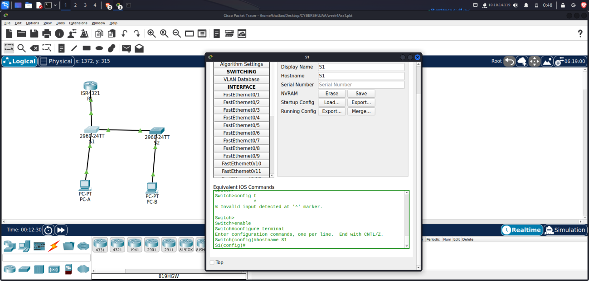{width="6.5in"
> height="3.1069444444444443in"}
>
> 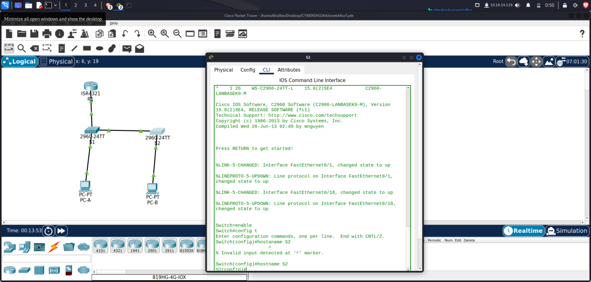{width="6.5in"
> height="3.1083333333333334in"}
>
> **2.Prevent unwanted DNS lookups on both switches.** *S1(config)# no
> ip domain-lookup*
>
> 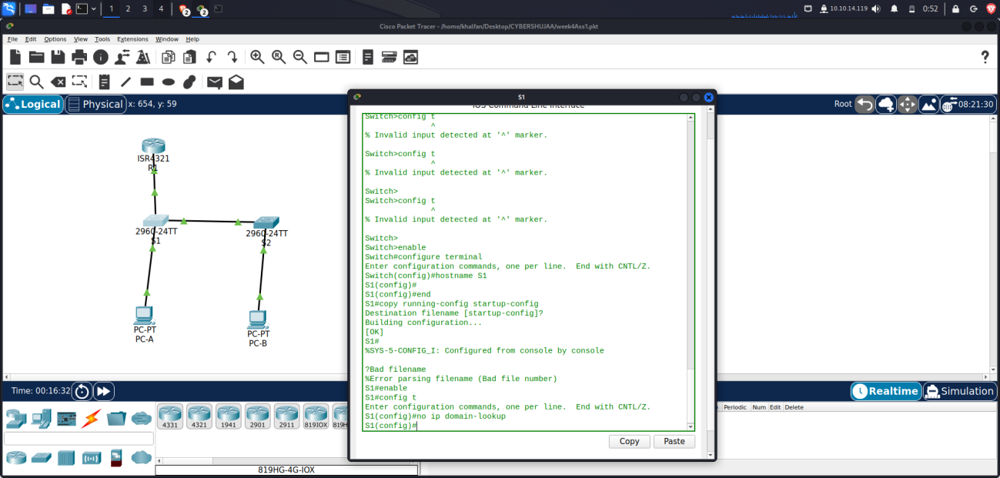{width="6.5in"
> height="3.1083333333333334in"}
>
> *S2(config)# no ip domain-lookup*
>
> 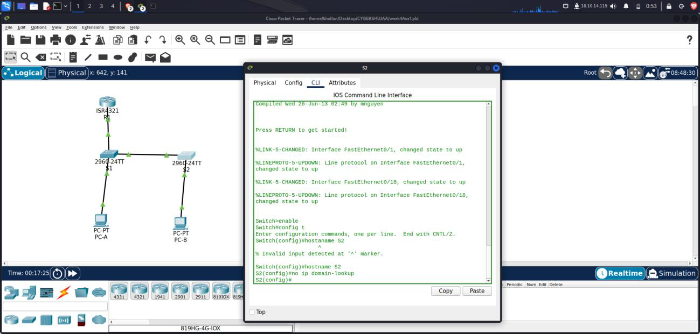{width="6.5in"
> height="3.1083333333333334in"}
>
> **3.Configure interface descriptions for the ports that are in use in
> S1 and S2.**
>
> *S1(config)# interface f0/1*\
> *S1(config-if)# description Link to S2*\
> *S1(config--if)# interface f0/5*\
> *S1(config-if)# description Link to R1*\
> *S1(config--if)# interface f0/6*\
> *S1(config-if)# description Link to PC-A*
>
> 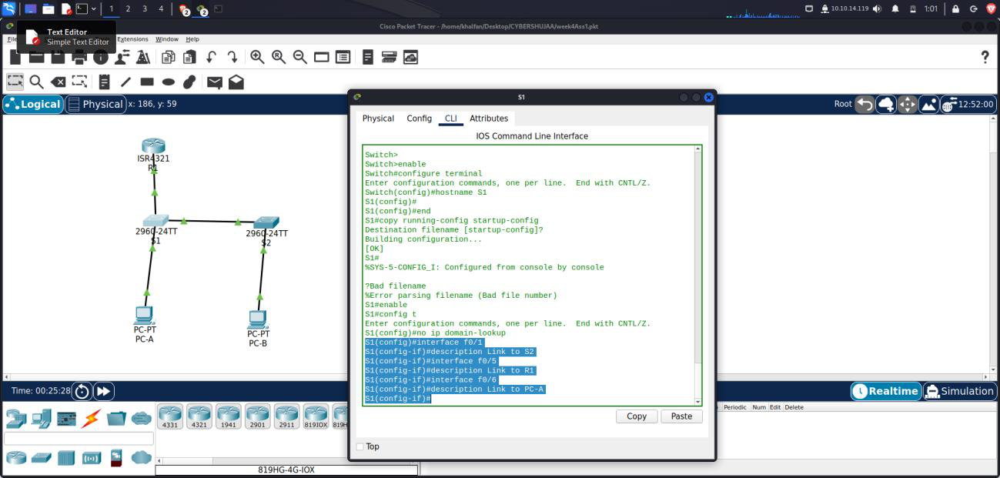{width="6.5in"
> height="3.1069444444444443in"}
>
> *S2(config)# interface f0/1*\
> *S2(config-if)# description Link to S1*\
> *S2(config--if)# interface f0/18*\
> *S2(config-if)# description Link to PC-B*
>
> 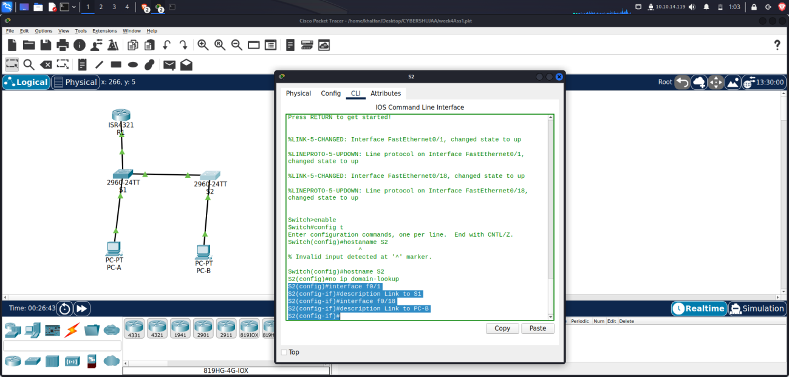{width="6.5in"
> height="3.1083333333333334in"}
>
> **4.Set the default-gateway for the Management VLAN to 192.168.10.1 on
> both switches.** *S1(config)# ip default-gateway 192.168.10.1*
>
> {width="6.5in"
> height="3.1083333333333334in"}
>
> *S2(config)# ip default-gateway 192.168.10.1*
>
> 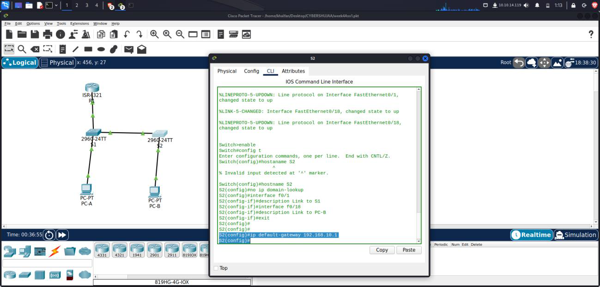{width="6.5in"
> height="3.1083333333333334in"}

**Part 2: Configure VLANs on Switches.**

**Step 1: Configure VLAN 10.**

> **1.Add VLAN 10 to S1 and S2 and name the VLAN Management.**
>
> *S1(config)# vlan 10*\
> *S1(config-vlan)# name Management*
>
> 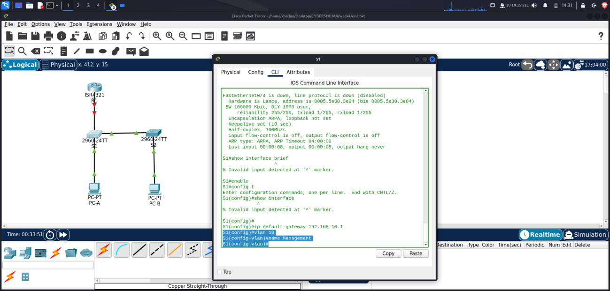{width="6.5in"
> height="3.108332239720035in"}
>
> *S2(config)# vlan 10*\
> *S2(config-vlan)# name Management*
>
> 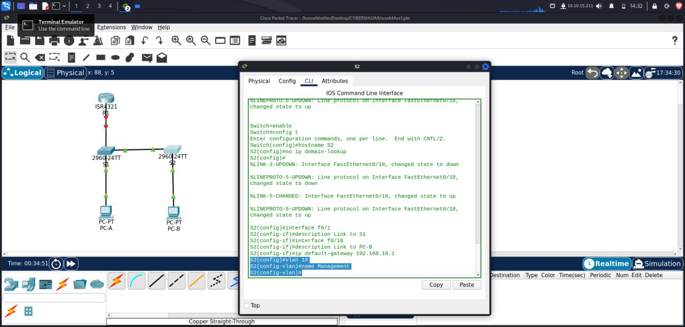{width="6.5in"
> height="3.1083333333333334in"}

**Step 2: Configure the SVI for VLAN 10.**

> **2.Configure the IP address according to the Addressing Table for SVI
> for VLAN 10 on S1** **and S2. Enable the SVI interfaces and provide a
> description for the interface**.
>
> *S1(config)# interface vlan 10*\
> *S1(config-if)# ip address 192.168.10.201 255.255.255.0*\
> *S1(config-if)# description Management SVI*\
> *S1(config-if)# no shutdown*
>
> 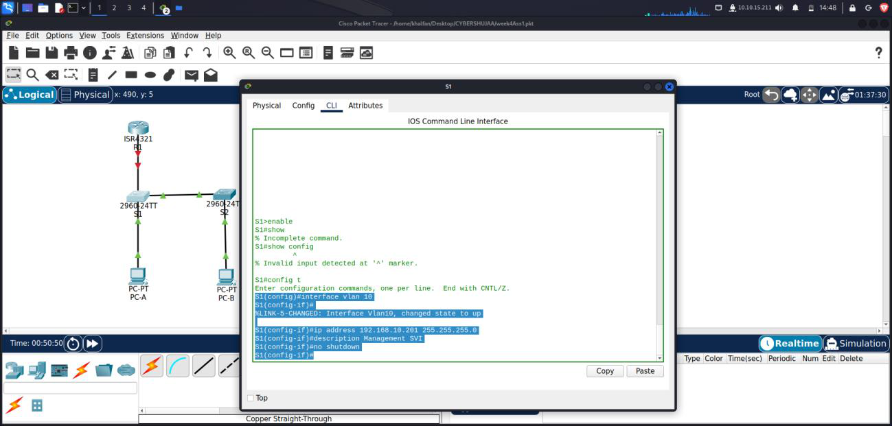{width="6.5in"
> height="3.1069444444444443in"}
>
> *S2(config)# interface vlan 10*\
> *S2(config-if)# ip address 192.168.10.202 255.255.255.0*\
> *2S1(config-if)# description Management SVI*\
> *S2(config-if)# no shutdown*
>
> 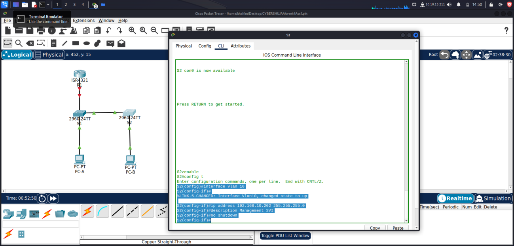{width="6.5in"
> height="3.1083333333333334in"}

**Step 3: Configure VLAN 333 with the name Native on S1 and S2.**

> *S1(config)# vlan 333*\
> *S1(config-vlan)# name Native*
>
> 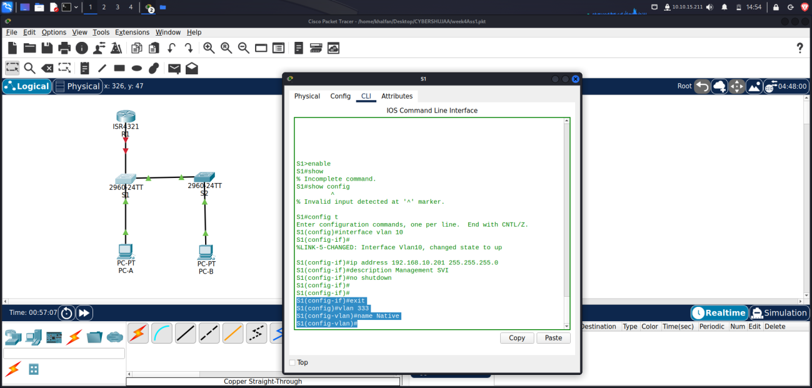{width="6.5in"
> height="3.1083333333333334in"}
>
> *S2(config)# vlan 333*\
> *S2(config-vlan)# name Native*
>
> 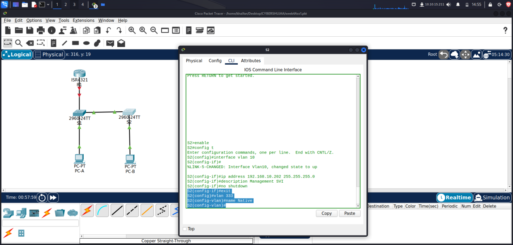{width="6.5in"
> height="3.1083333333333334in"}

**Step 4: Configure VLAN 999 with the name ParkingLot on S1 and S2.**

> *S1(config-vlan)# vlan 999*\
> *S1(config-vlan)# name ParkingLot*
>
> {width="6.5in"
> height="3.1083333333333334in"}
>
> *S2(config-vlan)# vlan 999*\
> *S2(config-vlan)# name ParkingLot*
>
> 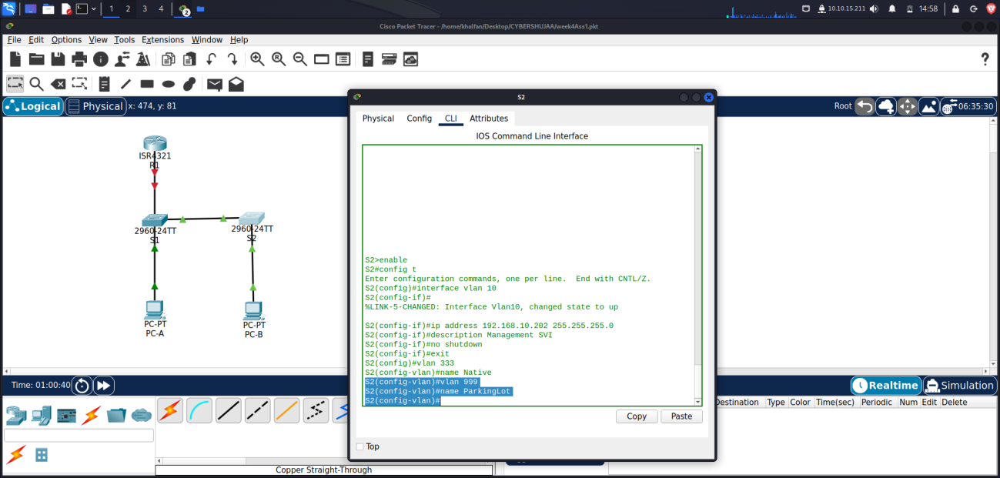{width="6.5in"
> height="3.1083333333333334in"}

**Part 3: Configure Switch Security.**

**Step 1: Implement 802.1Q trunking.**

> **1.On both switches, configure trunking on F0/1 to use VLAN 333 as
> the native VLAN.**
>
> *S1(config)# interface f0/1*\
> *S1(config-if)# switchport mode trunk*\
> *S1(config-if)# switchport trunk native vlan 333*
>
> 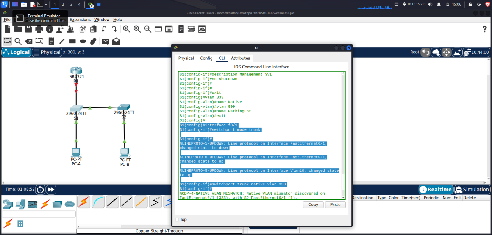{width="6.5in"
> height="3.1069444444444443in"}
>
> *S2(config)# interface f0/1*\
> *S2(config-if)# switchport mode trunk*\
> *S2(config-if)# switchport trunk native vlan 333*
>
> 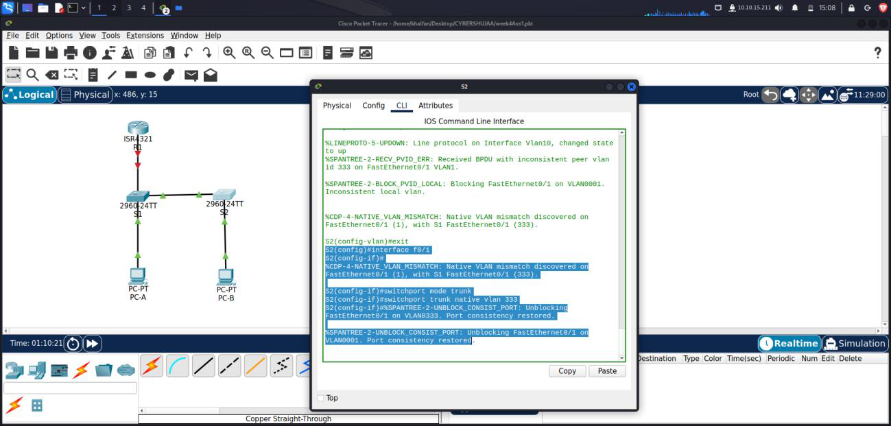{width="6.5in"
> height="3.1083333333333334in"}
>
> **2.Verify that trunking is configured on both switches.**
>
> ***[S1# show interface]{.underline} trunk***

+-------------+-------------+-------------+-------------+-------------+
| >           | >           | > ***Encap  | > *         | > ***Native |
|  ***Port*** |  ***Mode*** | sulation*** | **Status*** | > vlan***   |
+=============+=============+=============+=============+=============+
| >           | > ***on***  | > *         | > ***       | > ***333*** |
| ***Fa0/1*** |             | **802.1q*** | trunking*** |             |
+-------------+-------------+-------------+-------------+-------------+

> *Port Vlans allowed on trunk*\
> *Fa0/1 1-4094*\
> *Port Vlans allowed and active in management domain*\
> *Fa0/1 1,10,333,999*
>
> *Port Vlans in spanning tree forwarding state and not pruned Fa0/1
> 1,10,333,999*
>
> 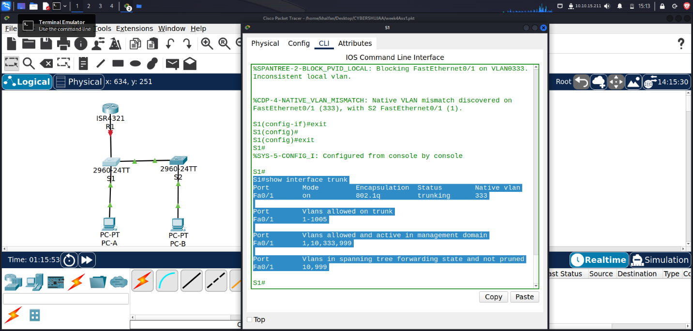{width="6.5in"
> height="3.108332239720035in"}
>
> *S2# **show interface trunk ***
>
> 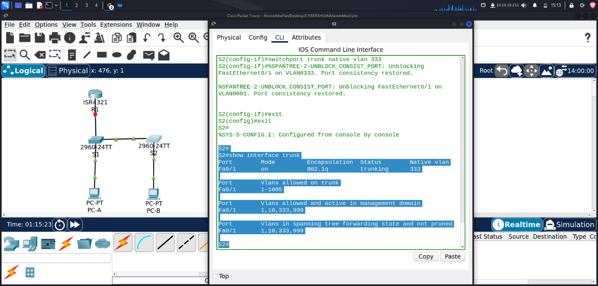{width="6.5in"
> height="3.1083333333333334in"}
>
> **3.Disable DTP negotiation on F0/1 on S1 and S2.**
>
> *S1(config)# interface f0/1*\
> *S1(config-if)# switchport nonegotiate*
>
> 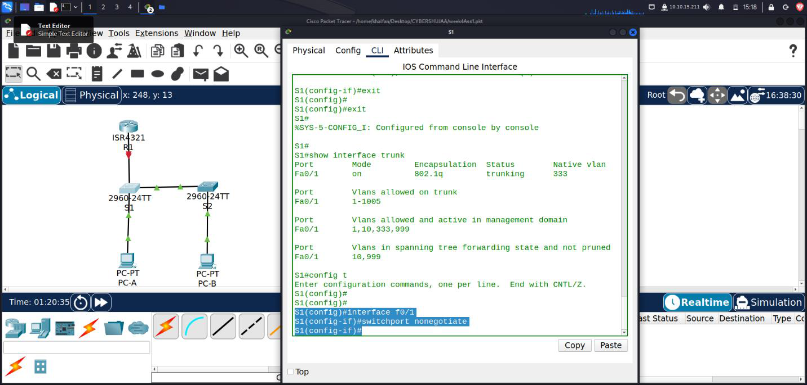{width="6.5in"
> height="3.1083333333333334in"}
>
> *S2(config)# interface f0/1*\
> *S2(config-if)# switchport nonegotiate*
>
> 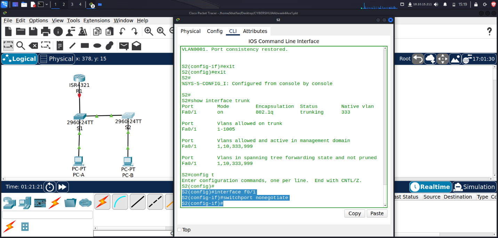{width="6.5in"
> height="3.1083333333333334in"}
>
> **4.Verify with the show interfaces command.**
>
> *S1# **show interfaces f0/1 switchport \| include Negotiation ***
>
> *Negotiation of Trunking: Off*
>
> 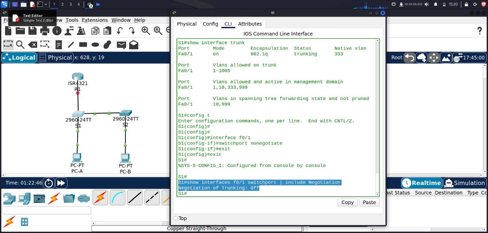{width="6.5in"
> height="3.1083333333333334in"}
>
> *S2# **show interfaces f0/1 switchport \| include Negotiation***
>
> *Negotiation of Trunking: Off*
>
> 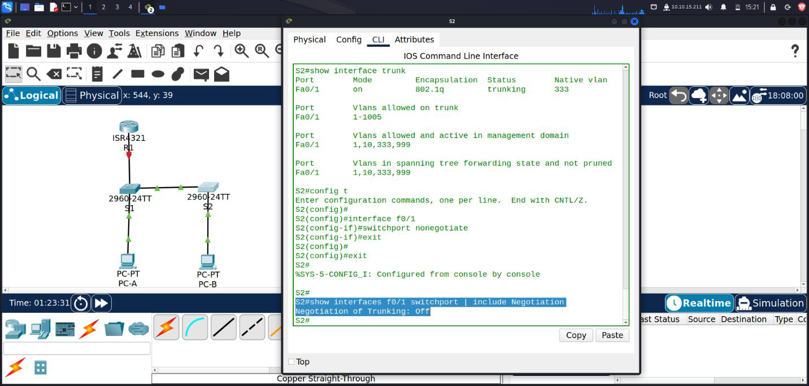{width="6.5in"
> height="3.1083333333333334in"}

**Step 2: Configure access ports.**

**1.On S1, configure F0/5 and F0/6 as access ports that are associated
with VLAN 10.**

> *S1(config)# interface range f0/5 -- 6*\
> *S1(config-if)# switchport mode access*\
> *S1(config-if)# switchport access vlan 10*

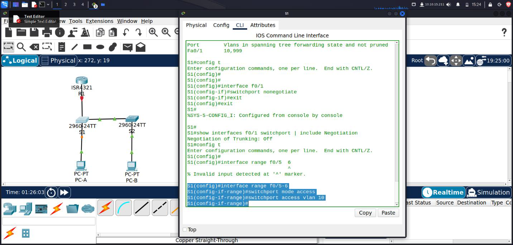{width="6.5in"
height="3.1069444444444443in"}

**2.On S2, configure F0/18 as an access port that is associated with
VLAN 10.**

> *S2(config)# interface f0/18*\
> *S2(config-if)# switchport mode access*\
> *S2(config-if)# switchport access vlan 10*
>
> 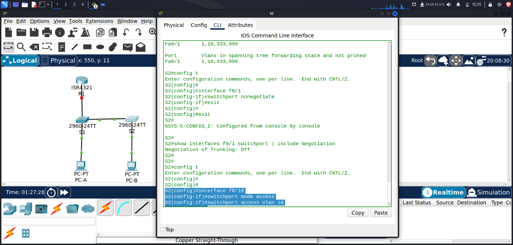{width="6.5in"
> height="3.1083333333333334in"}

**Step 3: Secure and disable unused switchports.**

**1.On S1 and S2, move the unused ports from VLAN 1 to VLAN 999 and
disable the unused ports.**

> *S1(config)# interface range f0/2-4 , f0/7-24, g0/1-2*\
> *S1(config-if-range)# switchport mode access*\
> *S1(config-if-range)# switchport access vlan 999*\
> *S1(config-if-range)# shutdown*
>
> 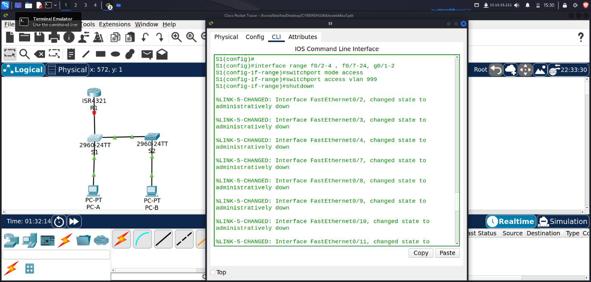{width="6.5in"
> height="3.1069444444444443in"}
>
> *S2(config)# interface range f0/2-17 , f0/19-24, g0/1-2*\
> *S2(config-if-range)# switchport mode access*\
> *S2(config-if-range)# switchport access vlan 999*\
> *S2(config-if-range)# shutdown*

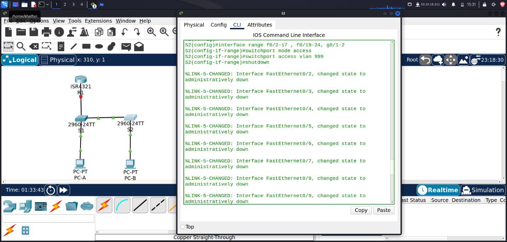{width="6.5in"
height="3.1083333333333334in"}

**2.Verify that unused ports are disabled and associated with VLAN 999
by issuing the show** **command.**

> *S1# **show interfaces status ***
>
> 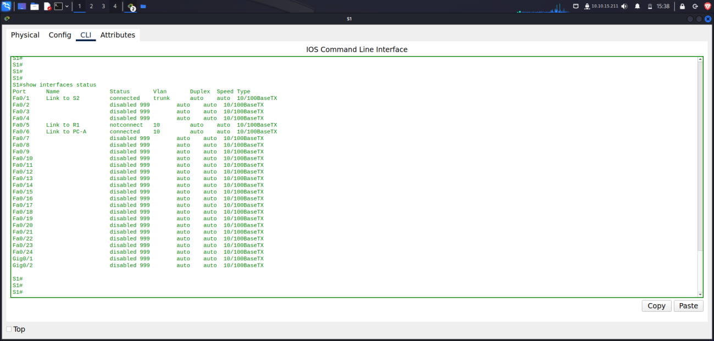{width="6.5in"
> height="3.1083333333333334in"}

S1#show interfaces status\
Port Name Status Vlan Duplex Speed Type\
Fa0/1 Link to S2 connected trunk auto auto 10/100BaseTX Fa0/2 disabled
999 auto auto 10/100BaseTX\
Fa0/3 disabled 999 auto auto 10/100BaseTX\
Fa0/4 disabled 999 auto auto 10/100BaseTX\
Fa0/5 Link to R1 notconnect 10 auto auto 10/100BaseTX Fa0/6 Link to PC-A
connected 10 auto auto 10/100BaseTX Fa0/7 disabled 999 auto auto
10/100BaseTX

Fa0/8 disabled 999 auto auto 10/100BaseTX\
Fa0/9 disabled 999 auto auto 10/100BaseTX\
Fa0/10 disabled 999 auto auto 10/100BaseTX\
Fa0/11 disabled 999 auto auto 10/100BaseTX\
Fa0/12 disabled 999 auto auto 10/100BaseTX\
Fa0/13 disabled 999 auto auto 10/100BaseTX\
Fa0/14 disabled 999 auto auto 10/100BaseTX\
Fa0/15 disabled 999 auto auto 10/100BaseTX\
Fa0/16 disabled 999 auto auto 10/100BaseTX\
Fa0/17 disabled 999 auto auto 10/100BaseTX\
Fa0/18 disabled 999 auto auto 10/100BaseTX\
Fa0/19 disabled 999 auto auto 10/100BaseTX\
Fa0/20 disabled 999 auto auto 10/100BaseTX\
Fa0/21 disabled 999 auto auto 10/100BaseTX\
Fa0/22 disabled 999 auto auto 10/100BaseTX\
Fa0/23 disabled 999 auto auto 10/100BaseTX\
Fa0/24 disabled 999 auto auto 10/100BaseTX\
Gig0/1 disabled 999 auto auto 10/100BaseTX\
Gig0/2 disabled 999 auto auto 10/100BaseTX

*S2# show interfaces status*

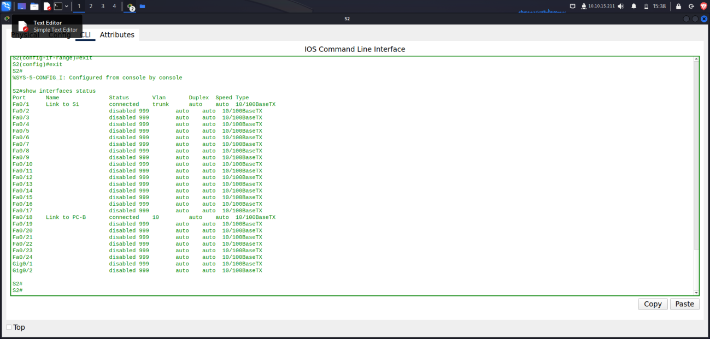{width="6.5in"
height="3.1069444444444443in"}

S2#show interfaces status\
Port Name Status Vlan Duplex Speed Type\
Fa0/1 Link to S1 connected trunk auto auto 10/100BaseTX Fa0/2 disabled
999 auto auto 10/100BaseTX\
Fa0/3 disabled 999 auto auto 10/100BaseTX\
Fa0/4 disabled 999 auto auto 10/100BaseTX\
Fa0/5 disabled 999 auto auto 10/100BaseTX

Fa0/6 disabled 999 auto auto 10/100BaseTX\
Fa0/7 disabled 999 auto auto 10/100BaseTX\
Fa0/8 disabled 999 auto auto 10/100BaseTX\
Fa0/9 disabled 999 auto auto 10/100BaseTX\
Fa0/10 disabled 999 auto auto 10/100BaseTX\
Fa0/11 disabled 999 auto auto 10/100BaseTX\
Fa0/12 disabled 999 auto auto 10/100BaseTX\
Fa0/13 disabled 999 auto auto 10/100BaseTX\
Fa0/14 disabled 999 auto auto 10/100BaseTX\
Fa0/15 disabled 999 auto auto 10/100BaseTX\
Fa0/16 disabled 999 auto auto 10/100BaseTX\
Fa0/17 disabled 999 auto auto 10/100BaseTX\
Fa0/18 Link to PC-B connected 10 auto auto 10/100BaseTX Fa0/19 disabled
999 auto auto 10/100BaseTX\
Fa0/20 disabled 999 auto auto 10/100BaseTX\
Fa0/21 disabled 999 auto auto 10/100BaseTX\
Fa0/22 disabled 999 auto auto 10/100BaseTX\
Fa0/23 disabled 999 auto auto 10/100BaseTX\
Fa0/24 disabled 999 auto auto 10/100BaseTX\
Gig0/1 disabled 999 auto auto 10/100BaseTX\
Gig0/2 disabled 999 auto auto 10/100BaseTX

**Step 4: Document and implement port security features.**

The interfaces F0/6 on S1 and F0/18 on S2 are configured as access
ports. In this step, you will also

configure port security on these two access ports.

**1.On S1, issue the show port-security interface f0/6 command to
display the default port security**

**settings for interface F0/6. Record your answers in the table below.**

*S1# **show port-security interface f0/6 ***

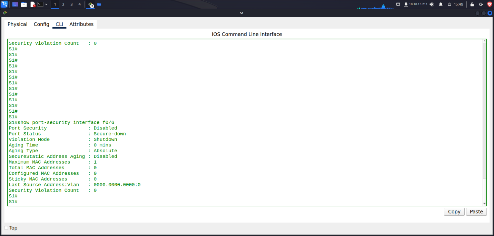{width="6.5in"
height="3.1083333333333334in"}

S1#show port-security interface f0/6\
Port Security : Disabled\
Port Status : Secure-down\
Violation Mode : Shutdown\
Aging Time : 0 mins\
Aging Type : Absolute\
SecureStatic Address Aging : Disabled\
Maximum MAC Addresses : 1\
Total MAC Addresses : 0\
Configured MAC Addresses : 0\
Sticky MAC Addresses : 0\
Last Source Address:Vlan : 0000.0000.0000:0\
Security Violation Count : 0

+-----------------------------------+-----------------------------------+
| **Default Port Security           |                                   |
| Configuration**                   |                                   |
+===================================+===================================+
| > Feature                         | > Default Setting                 |
+-----------------------------------+-----------------------------------+
| > Port Security                   | > Disabled                        |
+-----------------------------------+-----------------------------------+
| > Maximum number of MAC addresses | > 1                               |
+-----------------------------------+-----------------------------------+
| > Violation Mode                  | > Shutdown                        |
+-----------------------------------+-----------------------------------+
| > Aging Time                      | > 0 mins                          |
+-----------------------------------+-----------------------------------+
| > Aging Type                      | > Absolute                        |
+-----------------------------------+-----------------------------------+
| > Secure Static Address Aging     | > Disabled                        |
+-----------------------------------+-----------------------------------+
| > Sticky MAC Address              | > 0                               |
+-----------------------------------+-----------------------------------+

**2. On S1, enable port security on F0/6 with the following settings:**
• Maximum number of MAC addresses: 3

• Violation type: restrict

• Aging time: 60 min

• Aging type: inactivity

***S1(config)# interface f0/6***\
***S1(config-if)# switchport port-security***\
***S1(config-if)# switchport port-security maximum 3***\
***S1(config-if)# switchport port-security violation restrict
S1(config-if)# switchport port-security aging time 60***\
***S1(config-if)# switchport port-security aging type inactivity***

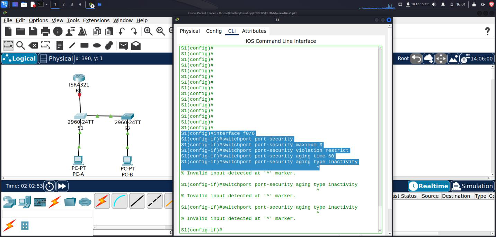{width="6.5in"
height="3.1069444444444443in"}

**3.Verify port security on S1 F0/6.**\
S1# show port-security interface f0/6

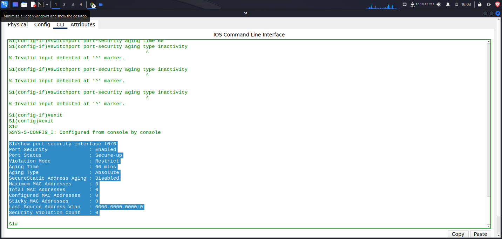{width="6.5in"
height="3.1069444444444443in"}

S1# show port-security address

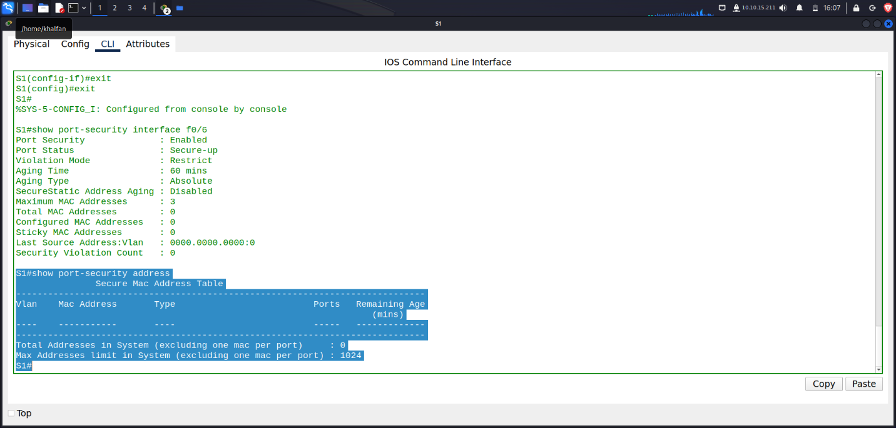{width="6.5in"
height="3.1083333333333334in"}

**4.Enable port security for F0/18 on S2. Configure the port to add MAC
addresses learned on the** **port automatically to the running
configuration.**

*S2(config)# interface f0/18*

*S2(config-if)# switchport port-security*

*S2(config-if)# switchport port-security mac-address sticky*

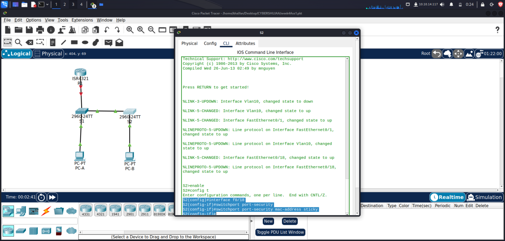{width="6.5in"
height="3.108332239720035in"}

**5.Configure the following port security settings on S2 F/18:** •
Maximum number of MAC addresses: 2\
• Violation type: Protect\
• Aging time: 60 min

***S2(config)# interface f0/18***\
***S2(config-if)# switchport port-security aging time 60 S2(config-if)#
switchport port-security maximum 2 S2(config-if)# switchport
port-security violation protect***

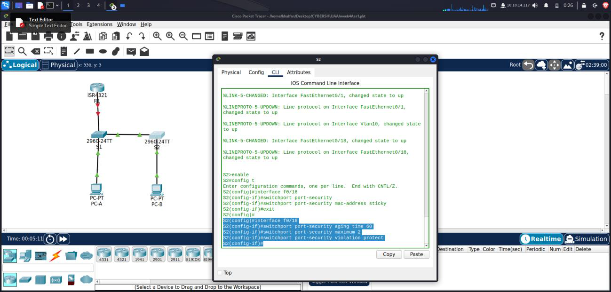{width="6.5in"
height="3.1083333333333334in"}

**6.Verify port security on S2 F0/18.**\
***S2# show port-security interface f0/18***

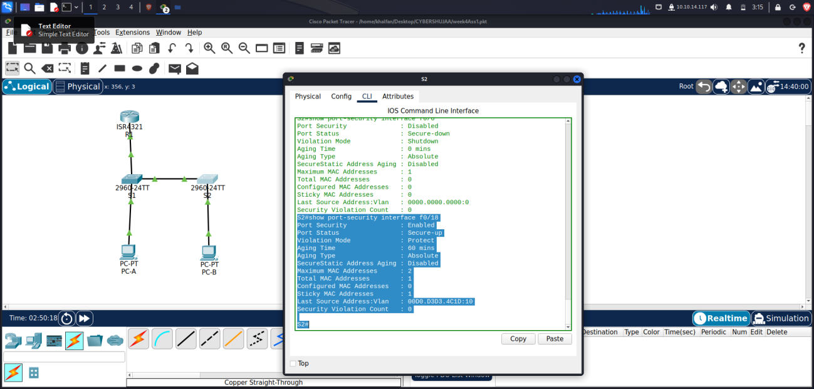{width="6.5in"
height="3.108332239720035in"}

Port Security : Enabled\
Port Status : Secure-up\
Violation Mode : Protect\
Aging Time : 60 mins\
Aging Type : Absolute\
SecureStatic Address Aging : Disabled\
Maximum MAC Addresses : 2\
Total MAC Addresses : 1\
Configured MAC Addresses : 0\
Sticky MAC Addresses : 0\
Last Source Address:Vlan : 0022.5646.3413:10\
Security Violation Count : 0

**S2# show port-security address**

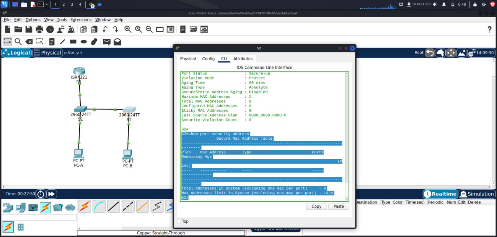{width="6.5in"
height="3.1083333333333334in"}

S2#show port-security address

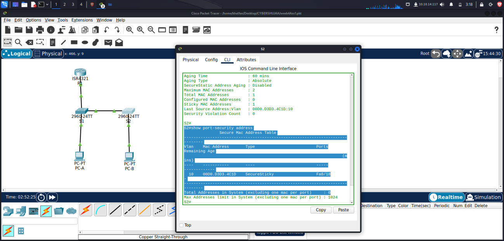{width="6.5in"
height="3.1083333333333334in"}

Secure Mac Address Table\
\-\-\-\-\-\-\-\-\-\-\-\-\-\-\-\-\-\-\-\-\-\-\-\-\-\-\-\-\-\-\-\-\-\-\-\-\-\-\-\-\-\-\-\-\-\-\-\-\-\-\-\-\-\-\-\-\-\-\-\-\-\-\-\-\-\-\-\-\-\-\-\-\-\-\-\--
Vlan Mac Address Type Ports Remaining Age\
(mins)\
\-\-\-- \-\-\-\-\-\-\-\-\-\-- \-\-\-- \-\-\-\--
\-\-\-\-\-\-\-\-\-\-\-\--\
\-\-\-\-\-\-\-\-\-\-\-\-\-\-\-\-\-\-\-\-\-\-\-\-\-\-\-\-\-\-\-\-\-\-\-\-\-\-\-\-\-\-\-\-\-\-\-\-\-\-\-\-\-\-\-\-\-\-\-\-\-\-\-\-\-\-\-\-\-\-\-\-\-\-\-\--
Total Addresses in System (excluding one mac per port) : 0\
Max Addresses limit in System (excluding one mac per port) : 1024 S2#

**Step 5: Implement DHCP snooping security.**

1.**On S2, enable DHCP snooping and configure DHCP snooping on VLAN
10**.

*S2(config)# ip dhcp snooping*\
*S2(config)# ip dhcp snooping vlan 10*

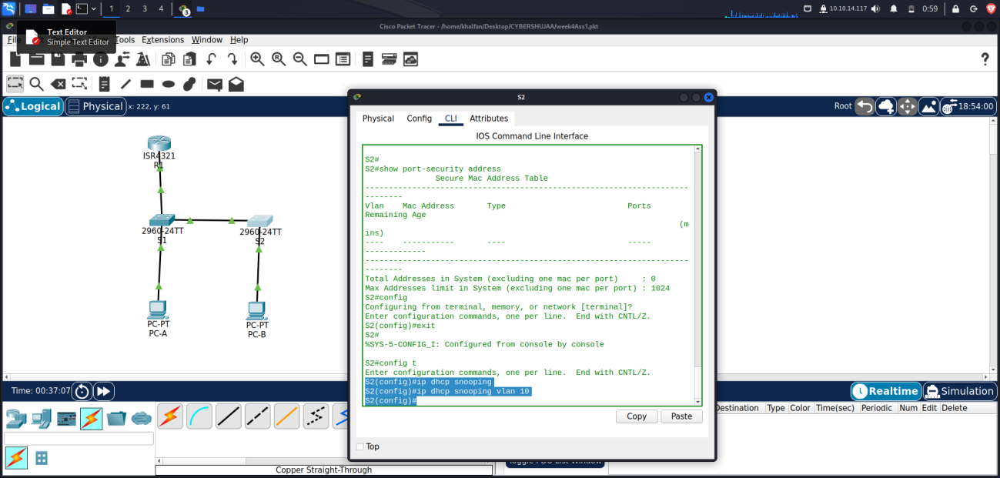{width="6.5in"
height="3.1069444444444443in"}

**2.Configure the trunk port on S2 as a trusted port.**

*S2(config)# interface f0/1*\
*S2(config-if)# ip dhcp snooping trust*

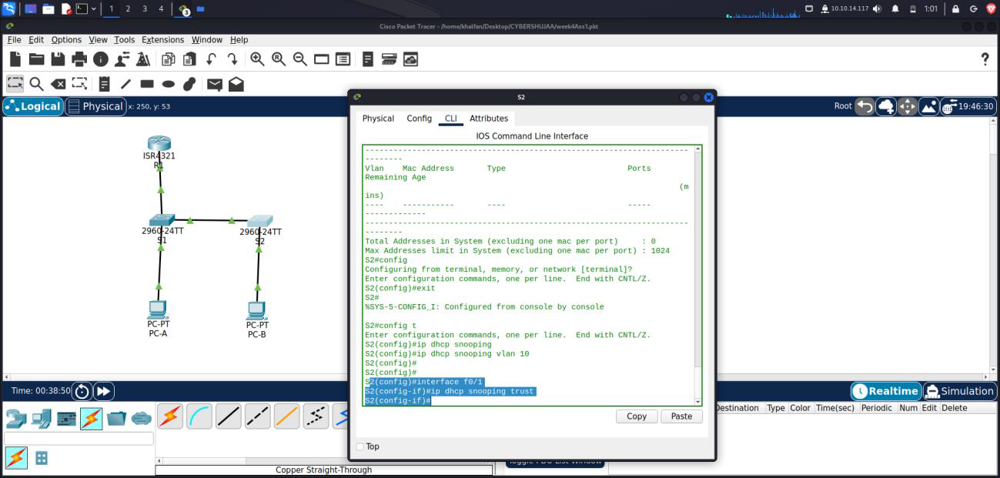{width="6.5in"
height="3.1069444444444443in"}

**3.Limit the untrusted port, F18 on S2, to five DHCP packets per
second.**

*S2(config)# interface f0/18*\
*S2(config-if)# ip dhcp snooping limit rate 5*

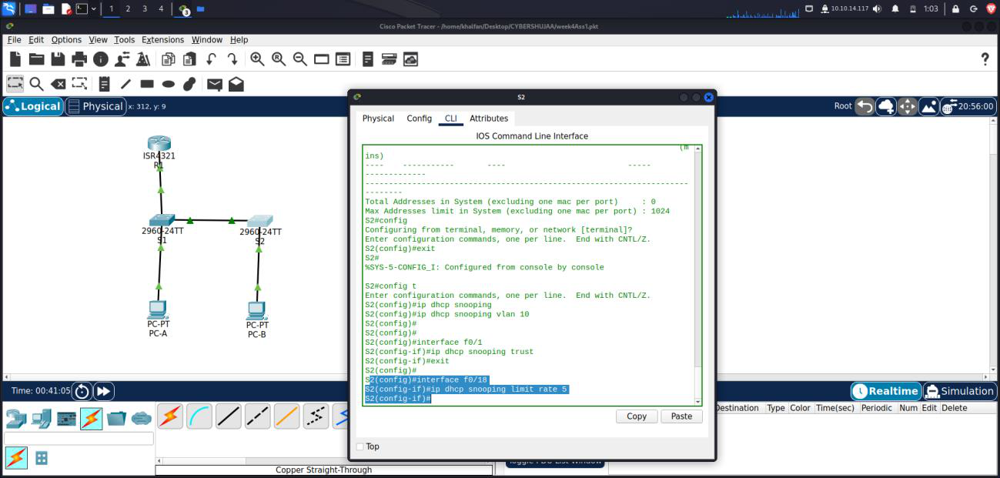{width="6.5in"
height="3.1083333333333334in"}

**4.Verify DHCP Snooping on S2.**\
*S2# show ip dhcp snooping*

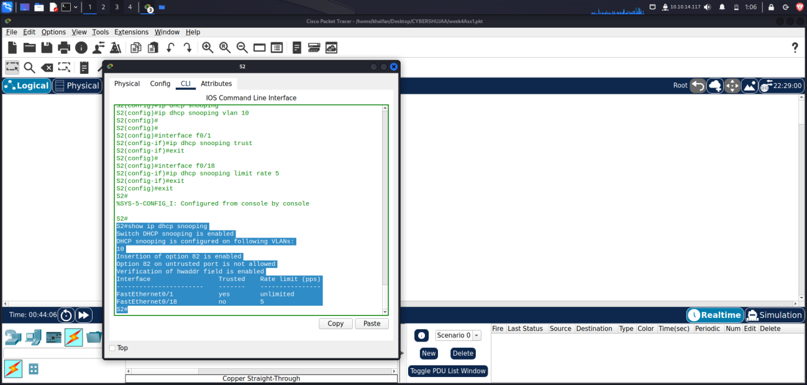{width="6.5in"
height="3.108332239720035in"}

*Switch DHCP snooping is enabled*\
*DHCP snooping is configured on following VLANs:*\
*10*\
*DHCP snooping is operational on following VLANs:*\
*10*\
*DHCP snooping is configured on the following L3 Interfaces: Insertion
of option 82 is enabled*\
*circuit-id default format: vlan-mod-port*\
*remote-id: 0cd9.96d2.3f80 (MAC)*\
*Option 82 on untrusted port is not allowed*\
*Verification of hwaddr field is enabled*\
*Verification of giaddr field is enabled*

*DHCP snooping trust/rate is configured on the following Interfaces:*\
*Interface Trusted Allow option Rate limit (pps)*\
*------------------------- ------- ------------ ----------------*\
*FastEthernet0/1 yes yes unlimited*\
*Custom circuit-ids:*\
*FastEthernet0/18 no no 5*\
*Custom circuit-ids:*\
**5.From the command prompt on PC-B, release and then renew the IP
address.**

*C:\\Users\\Student\> ipconfig /release*\
*C:\\Users\\Student\> ipconfig /renew*

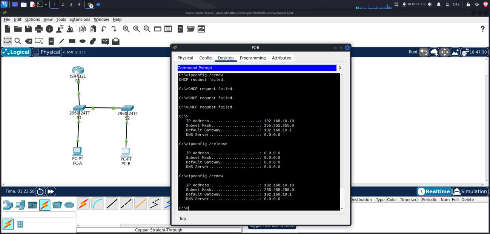{width="6.5in"
height="3.1069444444444443in"}

**6.Verify the DHCP snooping binding using the show ip dhcp snooping
binding command.**

*S2# show ip dhcp snooping binding*\
*MacAddress IpAddress Lease(sec) Type VLAN Interface ------------------
--------------- ---------- ------------- ---- --------------------*

*00:50:56:90:D0:8E 192.168.10.11 86213 dhcp-*\
*snooping 10 FastEthernet0/18*\
*USER*\
*Total number of bindings: 1*

**Step 6: Implement PortFast and BPDU guard.**

**1.Configure PortFast on all the access ports that are in use on both
switches.**

> *S1(config)# interface range f0/5 -- 6*\
> *S1(config-if)# spanning-tree portfast*
>
> 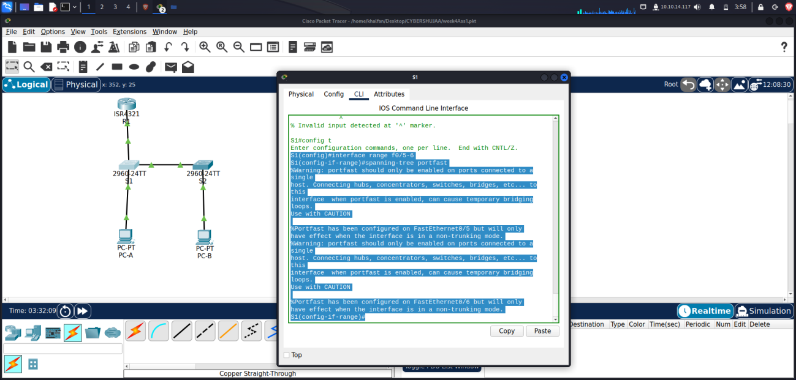{width="6.5in"
> height="3.1083333333333334in"}
>
> *S2(config)# interface f0/18*\
> *S2(config-if)# spanning-tree portfast*
>
> 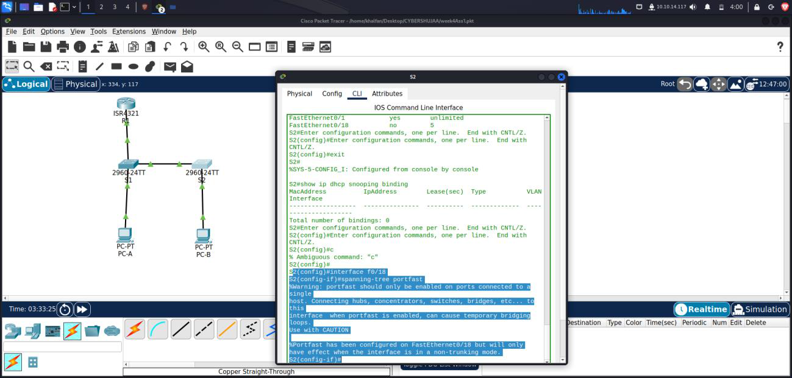{width="6.5in"
> height="3.108332239720035in"}

**2.Enable BPDU guard on S1 and S2 VLAN 10 access ports connected to
PC-A and PC-B.**

> *S1(config)# interface f0/6*\
> *S1(config-if)# spanning-tree bpduguard enable*
>
> 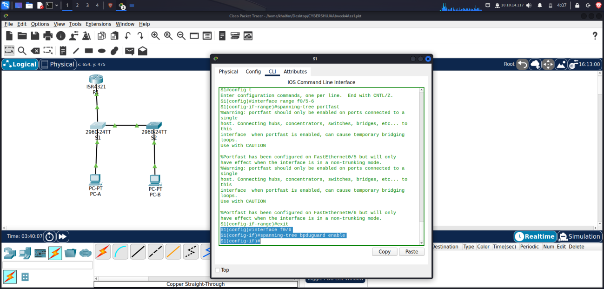{width="6.5in"
> height="3.1083333333333334in"}
>
> *S2(config)# interface f0/18*\
> *S2(config-if)# spanning-tree bpduguard enable*
>
> {width="6.5in"
> height="3.108332239720035in"}

**3.Verify that BPDU guard and PortFast are enabled on the appropriate
ports.**

***S1# show spanning-tree interface f0/6 detail***

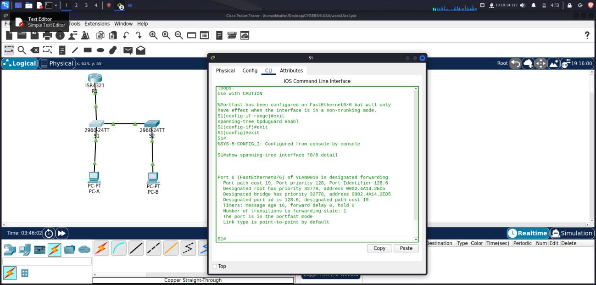{width="6.5in"
height="3.1083333333333334in"}

Port 6 (FastEthernet0/6) of VLAN0010 is designated forwarding Port path
cost 19, Port priority 128, Port Identifier 128.6\
Designated root has priority 32778, address 0002.4A14.2ED5 Designated
bridge has priority 32778, address 0002.4A14.2ED5 Designated port id is
128.6, designated path cost 19\
Timers: message age 16, forward delay 0, hold 0\
Number of transitions to forwarding state: 1\
The port is in the portfast mode\
Link type is point-to-point by default

**Step 7: Verify end-to-end connectivity.**

Verify PING connectivity between all devices in the IP Addressing Table.
If the pings fail, you may need

to disable the firewall on the PC hosts.

Close configuration window

Questions to answer

**1.In reference to Port Security on S2, why is there no timer value for
the remaining age in** **minutes when sticky learning was configured?**

**This switch does not support the port security aging of sticky secure
addresses.**

**2.In reference to Port Security on S2, if you load the running-config
script on S2, why will PC-B** **on port 18 never get an IP address via
DHCP?**

**We set Port security for only two MAC addresses and port 18 has two
"sticky" MAC address bound to the port. Additionally, the violation is
protect, which will never send a console/syslog message or increment the
violation counter.**

**3.In reference to Port Security, what is the difference between the
absolute aging type and** **inactivity aging type?**

**If the inactivity type is set, then the secure addresses on the port
will be removed only if there**

**is no data traffic from the secure source addresses for the specified
time period. If the absolute type is set, then all secure addresses on
this port age out exactly after the time specified ends.**

Device Configurations\
Switch S1\
***S1# show running-config***\
***Building configuration\...***

***Current configuration : 5203 bytes***\
***!***

***version 15.0***\
***no service pad***\
***service timestamps debug datetime msec***\
***service timestamps log datetime msec***\
***no service password-encryption***\
***!***

***hostname S1***\
***!***

***no ip domain-lookup***\
***!***

***spanning-tree mode pvst***\
***!***

***vlan 10***\
***name Management***\
***!***

***vlan 333***\
***name Native***\
***!***

***vlan 999***\
***name ParkingLot***\
***!***

***interface FastEthernet0/1***\
***description Link to S2***\
***switchport trunk encapsulation dot1q***\
***switchport trunk native vlan 333***\
***switchport mode trunk***\
***switchport nonegotiate***\
***!***

***interface FastEthernet0/2***\
***switchport access vlan 999***\
***switchport mode access***\
***shutdown***\
***!***

***interface FastEthernet0/3***\
***switchport access vlan 999***\
***switchport mode access***

***shutdown***\
***!***

***interface FastEthernet0/4***\
***switchport access vlan 999***\
***switchport mode access***\
***shutdown***\
***!***

***interface FastEthernet0/5***\
***description Link to R1***\
***switchport access vlan 10***\
***switchport mode access***\
***spanning-tree portfast***\
***!***

***interface FastEthernet0/6***\
***description Link to PC-A***\
***switchport access vlan 10***\
***switchport mode access***\
***switchport port-security maximum 3***\
***switchport port-security violation restrict***\
***switchport port-security aging time 60***\
***switchport port-security aging type inactivity***\
***switchport port-security***\
***spanning-tree portfast***\
***spanning-tree bpduguard enable***\
***!***

***interface FastEthernet0/7***\
***switchport access vlan 999***\
***switchport mode access***\
***shutdown***

***!***

***interface FastEthernet0/8***\
***switchport access vlan 999***\
***switchport mode access***\
***shutdown***\
***!***

***interface FastEthernet0/9***\
***switchport access vlan 999***\
***switchport mode access***\
***shutdown***\
***!***

***interface FastEthernet0/10***\
***switchport access vlan 999***\
***switchport mode access***\
***shutdown***\
***!***

***interface FastEthernet0/11***

***switchport access vlan 999***\
***switchport mode access***\
***shutdown***\
***!***

***interface FastEthernet0/12***\
***switchport access vlan 999***\
***switchport mode access***\
***shutdown***\
***!***

***interface FastEthernet0/13***\
***switchport access vlan 999***\
***switchport mode access***\
***shutdown***\
***!***

***interface FastEthernet0/14***\
***switchport access vlan 999***\
***switchport mode access***\
***shutdown***\
***!***

***interface FastEthernet0/15***\
***switchport access vlan 999***\
***switchport mode access***\
***shutdown***\
***!***

***interface FastEthernet0/16***\
***switchport access vlan 999***\
***switchport mode access***\
***shutdown***\
***!***

***interface FastEthernet0/17***\
***switchport access vlan 999***\
***switchport mode access***\
***shutdown***\
***!***

***interface FastEthernet0/18***\
***switchport access vlan 999***\
***switchport mode access***\
***shutdown***

***!***

***interface FastEthernet0/19***\
***switchport access vlan 999***\
***switchport mode access***\
***shutdown***\
***!***

***interface FastEthernet0/20***\
***switchport access vlan 999***

***switchport mode access***\
***shutdown***\
***!***

***interface FastEthernet0/21***\
***switchport access vlan 999***\
***switchport mode access***\
***shutdown***\
***!***

***interface FastEthernet0/22***\
***switchport access vlan 999***\
***switchport mode access***\
***shutdown***\
***!***

***interface FastEthernet0/23***\
***switchport access vlan 999***\
***switchport mode access***\
***shutdown***\
***!***

***interface FastEthernet0/24***\
***switchport access vlan 999***\
***switchport mode access***\
***shutdown***\
***!***

***interface GigabitEthernet0/1***\
***switchport access vlan 999***\
***switchport mode access***\
***shutdown***\
***!***

***interface GigabitEthernet0/2***\
***switchport access vlan 999***\
***switchport mode access***\
***shutdown***\
***!***

***interface Vlan1***\
***no ip address***\
***!***

***interface Vlan10***\
***description Management SVI***\
***ip address 192.168.10.201 255.255.255.0***\
***!***

***ip default-gateway 192.168.10.1***\
***line con 0***\
***exec-timeout 0 0***\
***logging synchronous***\
***line vty 0 4***\
***login***

***line vty 5 15***\
***login***\
***!***

***end***\
***Switch S2***\
***S2# show running-config***\
***Building configuration\...***

***Current configuration : 5303 bytes***\
***!***

***version 15.0***\
***no service pad***\
***service timestamps debug datetime msec***\
***service timestamps log datetime msec***\
***no service password-encryption***\
***!***

***hostname S2***\
***!***

***ip dhcp snooping vlan 10***\
***ip dhcp snooping***\
***no ip domain-lookup***\
***!***

***spanning-tree mode pvst***\
***!***

***vlan 10***\
***name Students***\
***!***

***vlan 333***\
***name Native***\
***!***

***vlan 999***\
***name ParkingLot***\
***!***

***interface FastEthernet0/1***\
***description Link to S1***\
***switchport trunk native vlan 333***\
***switchport mode trunk***\
***switchport nonegotiate***\
***ip dhcp snooping trust***\
***!***

***interface FastEthernet0/2***\
***switchport access vlan 999***\
***switchport mode access***\
***shutdown***\
***!***

***interface FastEthernet0/3***\
***switchport access vlan 999***\
***switchport mode access***

***shutdown***\
***!***

***interface FastEthernet0/4***\
***switchport access vlan 999***\
***switchport mode access***\
***shutdown***

***!***

***interface FastEthernet0/5***\
***switchport access vlan 999***\
***switchport mode access***\
***shutdown***\
***!***

***interface FastEthernet0/6***\
***switchport access vlan 999***\
***switchport mode access***\
***shutdown***\
***!***

***interface FastEthernet0/7***\
***switchport access vlan 999***\
***switchport mode access***\
***shutdown***\
***!***

***interface FastEthernet0/8***\
***switchport access vlan 999***\
***switchport mode access***\
***shutdown***\
***!***

***interface FastEthernet0/9***\
***switchport access vlan 999***\
***switchport mode access***\
***shutdown***\
***!***

***interface FastEthernet0/10***\
***switchport access vlan 999***\
***switchport mode access***\
***shutdown***\
***!***

***interface FastEthernet0/11***\
***switchport access vlan 999***\
***switchport mode access***\
***shutdown***\
***!***

***interface FastEthernet0/12***\
***switchport access vlan 999***\
***switchport mode access***\
***shutdown***

***!***

***interface FastEthernet0/13***\
***switchport access vlan 999***\
***switchport mode access***\
***shutdown***\
***!***

***interface FastEthernet0/14***\
***switchport access vlan 999***\
***switchport mode access***\
***shutdown***\
***!***

***interface FastEthernet0/15***\
***switchport access vlan 999***\
***switchport mode access***\
***shutdown***

***!***

***interface FastEthernet0/16***\
***switchport access vlan 999***\
***switchport mode access***\
***shutdown***\
***!***

***interface FastEthernet0/17***\
***switchport access vlan 999***\
***switchport mode access***\
***shutdown***\
***!***

***interface FastEthernet0/18***\
***description Link to PC-B***\
***switchport access vlan 10***\
***switchport mode access***\
***switchport port-security maximum 2***\
***switchport port-security violation protect***\
***switchport port-security mac-address sticky***\
***switchport port-security aging time 60***\
***switchport port-security***\
***spanning-tree portfast***\
***spanning-tree bpduguard enable***\
***ip dhcp snooping limit rate 5***\
***!***

***interface FastEthernet0/19***\
***switchport access vlan 999***\
***switchport mode access***\
***shutdown***\
***!***

***interface FastEthernet0/20***\
***switchport access vlan 999***

***switchport mode access***\
***shutdown***\
***!***

***interface FastEthernet0/21***\
***switchport access vlan 999***\
***switchport mode access***\
***shutdown***\
***!***

***interface FastEthernet0/22***\
***switchport access vlan 999***\
***switchport mode access***\
***shutdown***\
***!***

***interface FastEthernet0/23***\
***switchport access vlan 999***\
***switchport mode access***\
***shutdown***\
***!***

***interface FastEthernet0/24***\
***switchport access vlan 999***\
***switchport mode access***\
***shutdown***\
***!***

***interface GigabitEthernet0/1***

***switchport access vlan 999***\
***switchport mode access***\
***shutdown***\
***!***

***interface GigabitEthernet0/2***\
***switchport access vlan 999***\
***switchport mode access***\
***shutdown***\
***!***

***interface Vlan1***\
***no ip address***\
***!***

***interface Vlan10***\
***description Management SVI***\
***ip address 192.168.10.202 255.255.255.0***\
***!***

***ip default-gateway 192.168.10.1***\
***!***

***line con 0***\
***exec-timeout 0 0***\
***logging synchronous***\
***line vty 0 4***

***login***\
***line vty 5 15***\
***login***\
***!***

***End***

**Conclusion**\
The completion of this Packet Tracer assignment allowed us to achieve a
comprehensive understanding of network configuration and security. We
successfully accomplished the following objectives:

In Part 1 We effectively cabled the network, ensuring proper physical
connectivity. Configuration of R1 was completed, enabling communication
within the network. Basic switch settings were configured and verified,
ensuring smooth switch operation.

In Part 2 VLANs were created, including VLAN 10 with an associated SVI
for enhanced network segmentation. Special VLANs, such as VLAN 333
(Native) and VLAN 999 (ParkingLot), were configured on S1 and S2,
catering to specific network requirements.

In Part 3 Security measures were implemented, including 802.1Q trunking
for efficient VLAN traffic segregation. Access ports were configured to
provide secure connections to end devices. Unused switch ports were
secured and disabled to mitigate potential security risks. Port security
features were documented and implemented, adding an extra layer of
protection. DHCP snooping security was implemented to safeguard against
unauthorized DHCP servers. PortFast and BPDU guard were employed to
enhance network stability and mitigate potential issues. We successfully
verified end-to-end connectivity, ensuring that our network operates as
intended.

This assignment has not only provided valuable hands-on experience but
also emphasized the importance of network security and reliability in a
real-world context. It is a significant step toward becoming proficient
in network configuration and ensuring that networks are both robust and
secure.
