> Week4: **Assignment 2:-Packet Tracer WLAN configuration**

Report by: **Aisha Khalifan, cs-cns04-23014**

> **Introduction**
>
> In the course of this practical exercise, had the opportunity to gain
> hands-on experience in network configuration and security. Through
> this exercise, it demonstrated our competence in effectively managing
> both home and enterprise wireless networks, ensuring data integrity,
> confidentiality, and network reliability. In a world where
> connectivity is indispensable, the importance of robust security
> measures cannot be overstated. This activity emphasizes the
> significance of safeguarding networks in our interconnected
> environment.
>
> **Addressing Table**

+-----------------------+-----------------------+-----------------------+
| **Device**            | **Interface**         | **IP Address**        |
+=======================+=======================+=======================+
| > Home Wireless       | > Internet            | > DHCP                |
| > Router              |                       |                       |
+-----------------------+-----------------------+-----------------------+
|                       | > LAN                 | > 192.168.6.1/27      |
+-----------------------+-----------------------+-----------------------+
| > RTR-1               | > G0/0/0.2            | > 192.168.2.1/24      |
+-----------------------+-----------------------+-----------------------+
|                       | > G0/0/0.5            | > 192.168.5.1/24      |
+-----------------------+-----------------------+-----------------------+
|                       | > G0/0/0.100          | > 192.168.100.1/24    |
+-----------------------+-----------------------+-----------------------+
|                       | > G0/0/1              | > 10.6.0.1/24         |
+-----------------------+-----------------------+-----------------------+
| > SW1                 | > VLAN 200            | > 192.168.100.100/24  |
+-----------------------+-----------------------+-----------------------+
| > LAP-1               | > G0                  | > DHCP                |
+-----------------------+-----------------------+-----------------------+
| > WLC-1               | > Management          | > 192.168.100.254/24  |
+-----------------------+-----------------------+-----------------------+
| > RADIUS Server       | > NIC                 | > 10.6.0.254/24       |
+-----------------------+-----------------------+-----------------------+
| > Home Admin          | > NIC                 | > DHCP                |
+-----------------------+-----------------------+-----------------------+
| > Enterprise Admin    | > NIC                 | > 192.168.100.200/24  |
+-----------------------+-----------------------+-----------------------+
| > Web Server          | > NIC                 | > 203.0.113.78/24     |
+-----------------------+-----------------------+-----------------------+
| > DNS Server          | > NIC                 | > 10.100.100.252      |
+-----------------------+-----------------------+-----------------------+
| > Laptop              | > NIC                 | > DHCP                |
+-----------------------+-----------------------+-----------------------+
| > Tablet PC           | > Wireless0           | > DHCP                |
+-----------------------+-----------------------+-----------------------+

+-----------------------+-----------------------+-----------------------+
| **Device**            | **Interface**         | **IP Address**        |
+=======================+=======================+=======================+
| > Smartphone          | > Wireless0           | > DHCP                |
+-----------------------+-----------------------+-----------------------+
| > Wireless Host 1     | > Wireless0           | > DHCP                |
+-----------------------+-----------------------+-----------------------+
| > Wireless Host 2     | > Wireless0           | > DHCP                |
+-----------------------+-----------------------+-----------------------+

> WLAN Information

+-------------+-------------+-------------+-------------+-------------+
| **WLAN**    | **SSID**    | **Authe     | *           | *           |
|             |             | ntication** | *Username** | *Password** |
+=============+=============+=============+=============+=============+
| > Home      | > HomeSSID  | > WP        | > N/A       | > Cisco123  |
| > Network   |             | A2-Personal |             |             |
+-------------+-------------+-------------+-------------+-------------+
| > WLAN      | > SSID-2    | > WPA-2     | > N/A       | > Cisco123  |
| > VLAN2     |             | > Personal  |             |             |
+-------------+-------------+-------------+-------------+-------------+
| > WLAN VLAN | > SSID-5    | > WPA-2     | > UserWLAN5 | >           |
| > 5         |             | >           |             |  UserW5pass |
|             |             |  Enterprise |             |             |
+-------------+-------------+-------------+-------------+-------------+

> **Objectives**
>
> In this activity, you will configure both a wireless home router and a
> WLC-based network. You will implement both WPA2-PSK and
> WPA2-Enterprise security.

+-----------------------------------+-----------------------------------+
| > •\                              | > Configure a home router to      |
| > •\                              | > provide Wi-Fi connectivity to a |
| > •\                              | > variety of devices. Configure   |
| > •\                              | > WPA2-PSK security on a home     |
| > •\                              | > router.                         |
| > •\                              | >                                 |
| > •                               | > Configure interfaces on a WLC.  |
|                                   | >                                 |
|                                   | > Configure WLANs on a WLC.       |
|                                   | >                                 |
|                                   | > Configure WPA2-PSK security on  |
|                                   | > a WLAN and connect hosts to     |
|                                   | > WLAN. Configure WPA2-Enteprise  |
|                                   | > on a WLAN and connect hosts to  |
|                                   | > the WLAN. Verify connectivity   |
|                                   | > WLAN connectivity.              |
+===================================+===================================+
+-----------------------------------+-----------------------------------+

> **Background / Scenario**
>
> You will apply your WLAN skills and knowledge by configuring a home
> wireless router and an enterprise WLC. You will implement both
> WPA2-PSK and WPA2-Enterprise security. Finally, you will connect hosts
> to each WLAN and verify connectivity.
>
> **Instructions**
>
> **Part 1: Configure a Home Wireless Router.**
>
> You are installing a new home wireless router at a friend's house. You
> will need to change settings on the router to enhance security and
> meet your friend's requirements.
>
> **Step 1: Change DHCP settings.**
>
> a.Open the Home Wireless Router GUI and change the router IP and DHCP
> settings according to the information in the Addressing Table.
>
> b.Permit a maximum of **20** addresses to be issued by the router.
>
> c.Configure the DHCP server to start with IP address **.3** of the LAN
> network.
>
> d.Configure the internet interface of the router to receive its IP
> address over DHCP. Verify the address. What address did it receive?
>
> 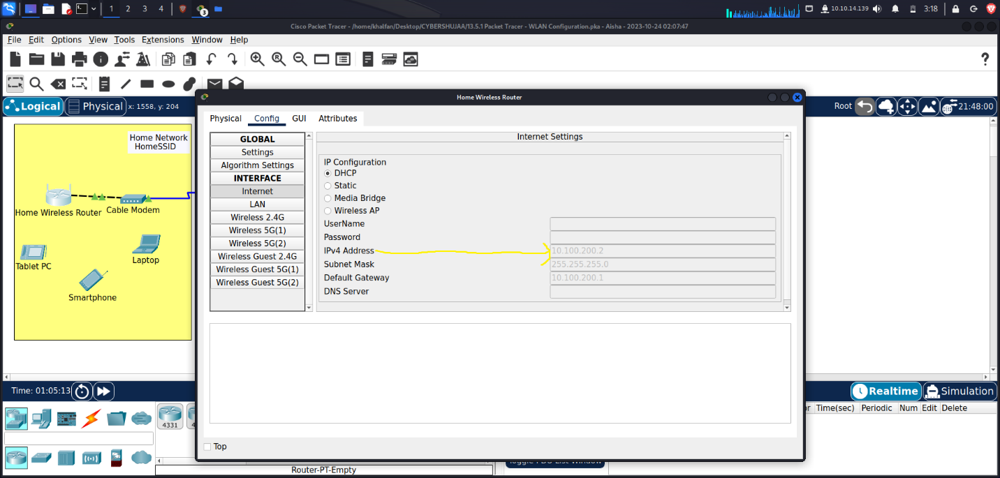{width="6.5in"
> height="3.1083333333333334in"}
>
> e.Configure the static DNS server to the address in the Addressing
> Table
>
> {width="6.5in"
> height="3.1083333333333334in"}
>
> **Step 2: Configure the Wireless LAN.**
>
> a.The network will use the 2.4GHz Wireless LAN interface. Configure
> the interface with the SSID shown in the Wireless LAN information
> table\
> **b.**Use **channel 6.**
>
> Go to tab Wireless. Change configuration as shown below and Save
> Setting
>
> {width="6.5in"
> height="3.1083333333333334in"}
>
> c.Be sure that all wireless hosts in the home will be able to see the
> SSID. To see it, go to Laptop --\> PC Wireless --\> Connect tab
>
> 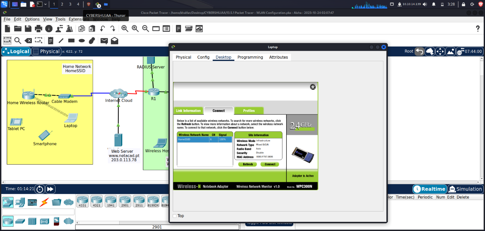{width="6.5in"
> height="3.108332239720035in"}
>
> **Step 3: Configure security.**
>
> a.Configure wireless LAN security. Use WPA2 Personal and the
> passphrase shown in the Wireless LAN information table. Go to Wireless
> tab, Wireless Security\
> b.Secure the router by changing the default password to the value
> shown in the Wireless LAN information table- Go to Administration tab,
> change Router Password to Cisco123 and Save Setting
>
> 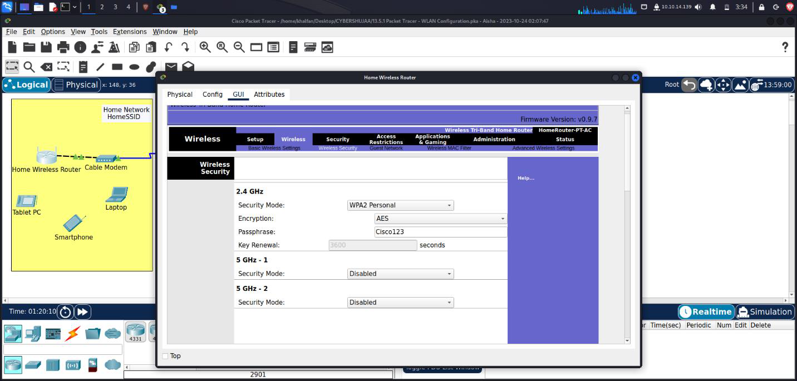{width="6.5in"
> height="3.1083333333333334in"}
>
> 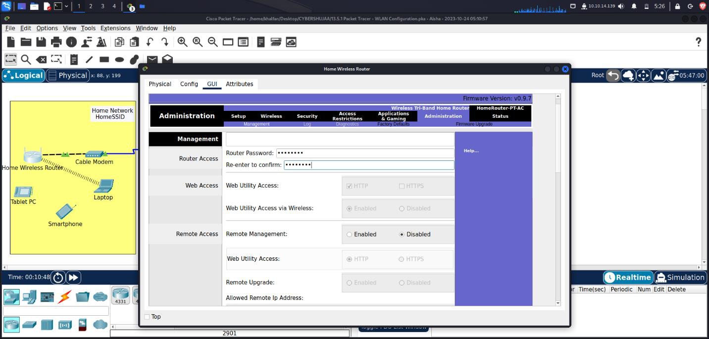{width="6.5in"
> height="3.1069444444444443in"}
>
> **Step 4: Connect clients to the network.**
>
> a.Open the PC Wireless app on the desktop of the laptop and configure
> the client to connect to the network.
>
> 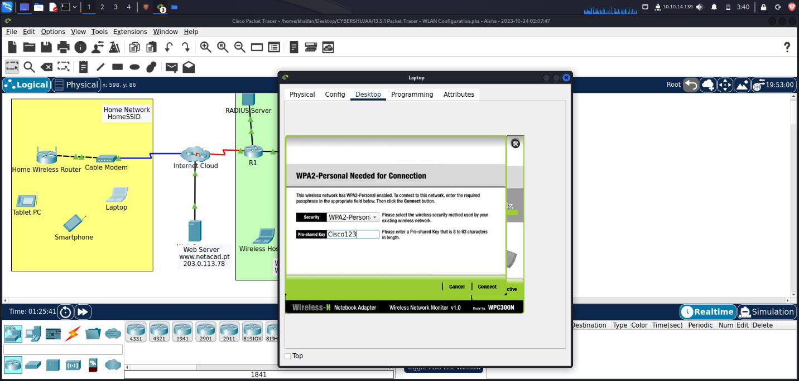{width="6.5in"
> height="3.1083333333333334in"}
>
> b.Open the **Config** tab on the **Tablet PC** and **Smartphone** and
> configure the wireless interfaces to connect to the wireless network.
>
> {width="6.5in"
> height="3.108332239720035in"}
>
> 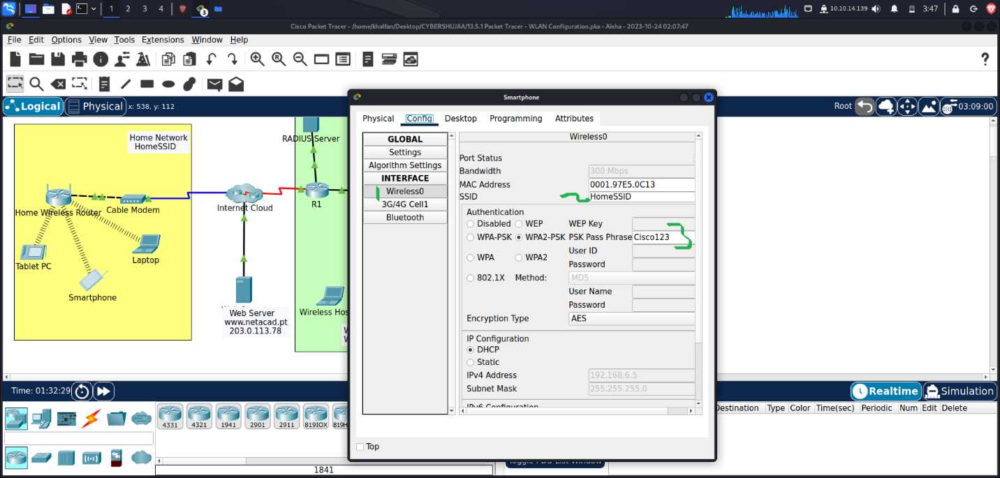{width="6.5in"
> height="3.1083333333333334in"}
>
> c.Verify connectivity. The hosts should be able to ping each other and
> the web server. They should also be able to reach the web server URL.
>
> From Laptop, Tablet PC, Smartphone, ping to Web Server Laptop ping to
> Web Server
>
> 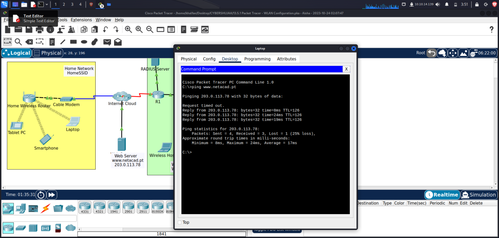{width="6.5in"
> height="3.1083333333333334in"}
>
> Tablet PC ping to Web Server
>
> {width="6.5in"
> height="3.1083333333333334in"}
>
> Smartphone ping to Web Server
>
> 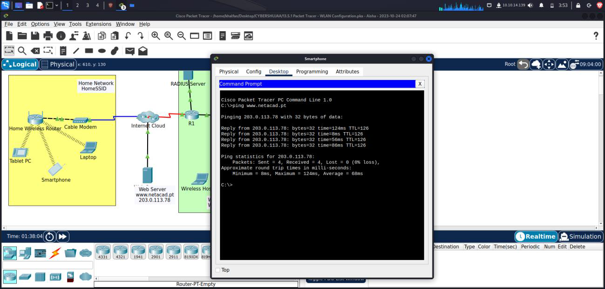{width="6.5in"
> height="3.1083333333333334in"}
>
> **[Part 2: Configure a WLC Controller Network]{.underline}**\
> Configure the wireless LAN controller with two WLANs. One WLAN will
> use WPA2-PSK authentication. The other WLAN will use WPA2-Enterprise
> authentication. You will also configure the WLC to use an SNMP server
> and configure a DHCP scope that will be used by the wireless
> management network.
>
> **Step 1: Configure VLAN interfaces.**
>
> a.From the Enterprise Admin, navigate to the WLC-1 management
> interface via a web browser. To log into WLC-1, use **admin** **o123**
> as the password. Go to Enterprise Admin PC, Web browser app, Enter:
>
> {width="6.5in"
> height="3.1069444444444443in"}
>
> 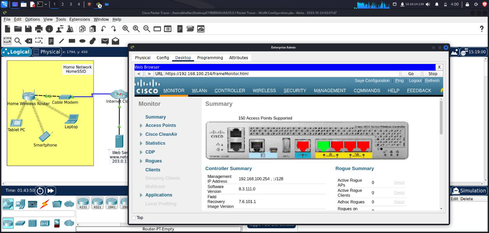{width="6.5in"
> height="3.1083333333333334in"}
>
> **b.Configure an interface for the first WLAN.**
>
> Name: **WLAN 2**\
> VLAN Identifier: **2**\
> Port Number: **1**\
> Interface IP Address: **192.168.2.254**\
> Netmask**: 255.255.255.0**\
> Gateway: **RTR-1 G0/0/0.2 address-** 192.168.2.1/24\
> Primary DHCP Server: **Gateway address**
>
> 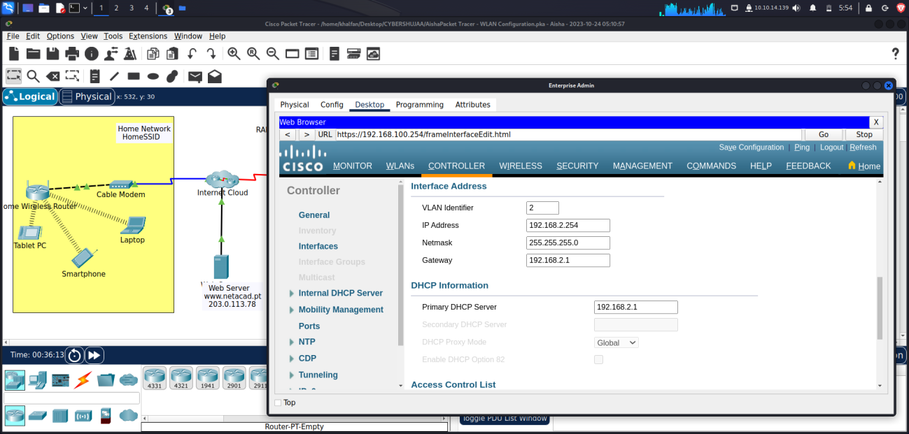{width="6.5in"
> height="3.1083333333333334in"}
>
> **c.Configure an interface for the second WLAN.**
>
> Name: **WLAN 5**\
> VLAN Identifier: **5**\
> Port Number: **1**\
> Interface IP Address: **192.168.5.254**\
> Netmask: **255.255.255.0**\
> Gateway: **RTR-1 interface G0/0/0.5 address-** 192.168.5.1 Primary
> **DHCP Server: Gateway address** 192.168.5.1
>
> 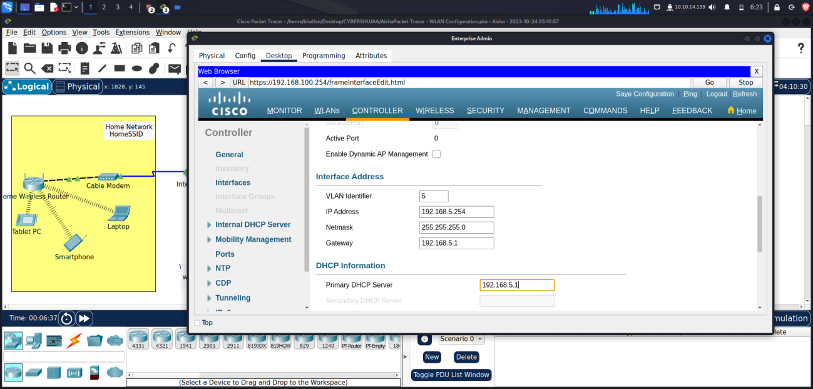{width="6.5in"
> height="3.1083333333333334in"}
>
> {width="6.5in"
> height="3.1083333333333334in"}

**Step 2: Configure a DHCP scope for the wireless management network.**
Configure and enable an internal DHCP scope as follows:\
Scope Name: **management**\
Pool Start Address: **192.168.100.235**\
Pool End Address: **192.168.100.245**\
Network: **192.168.100.0**\
Netmask: **255.255.255.0**\
Default Routers: **192.168.100.1**

{width="6.5in"
height="3.1083333333333334in"}

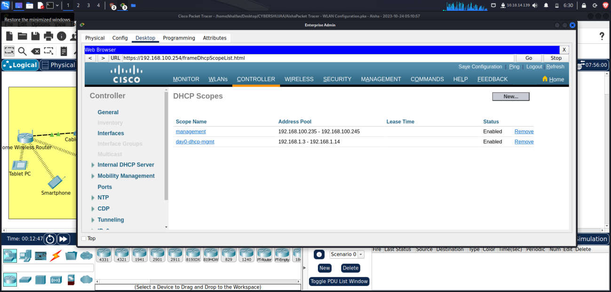{width="6.5in"
height="3.1069444444444443in"}

**Step 3: Configure the WLC with external server addresses.**

**a.Configure the RADIUS server information as follows:**

> Sever Index: **1**\
> Sever Address: **10.6.0.254**\
> Shared Secret: **RadiusPW**
>
> 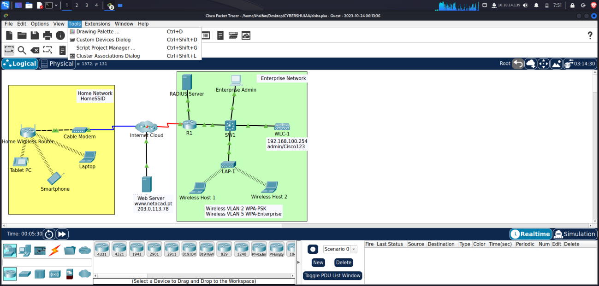{width="6.5in"
> height="3.1083333333333334in"}

**b.Configure the WLC to send logs information to an SNMP server.**
Community Name**: WLAN**\
IP Address**: 10.6.0.254**

> 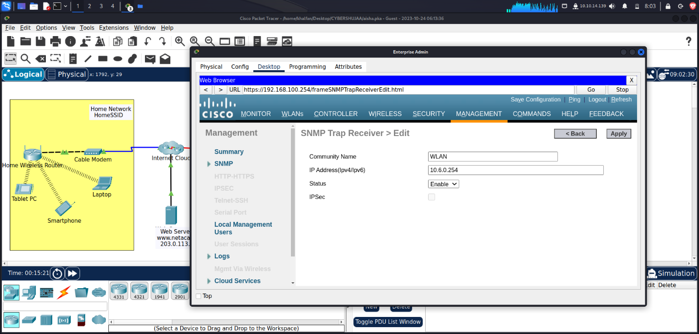{width="6.5in"
> height="3.1083333333333334in"}

**Step 4: Create the WLANs.**\
**a.Create the first WLAN:**

> Profile Name**: Wireless VLAN 2**\
> WLAN SSID: **SSID-2**\
> ID**: 2**\
> Interface: **WLAN 2**\
> Security: **WPA2-PSK**\
> Passphrase**: Cisco123**
>
> 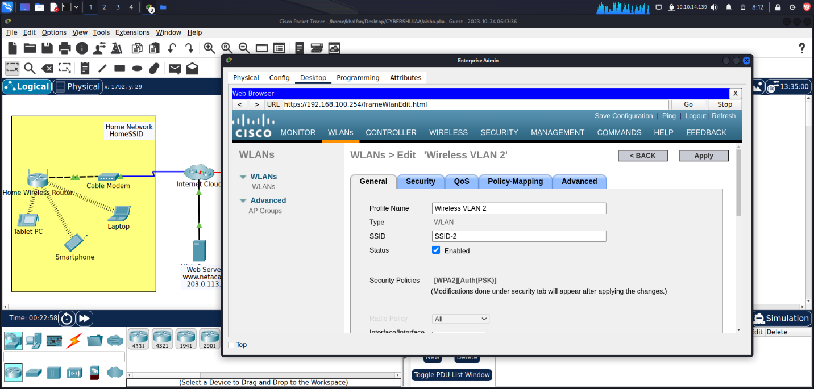{width="6.5in"
> height="3.1083333333333334in"}
>
> 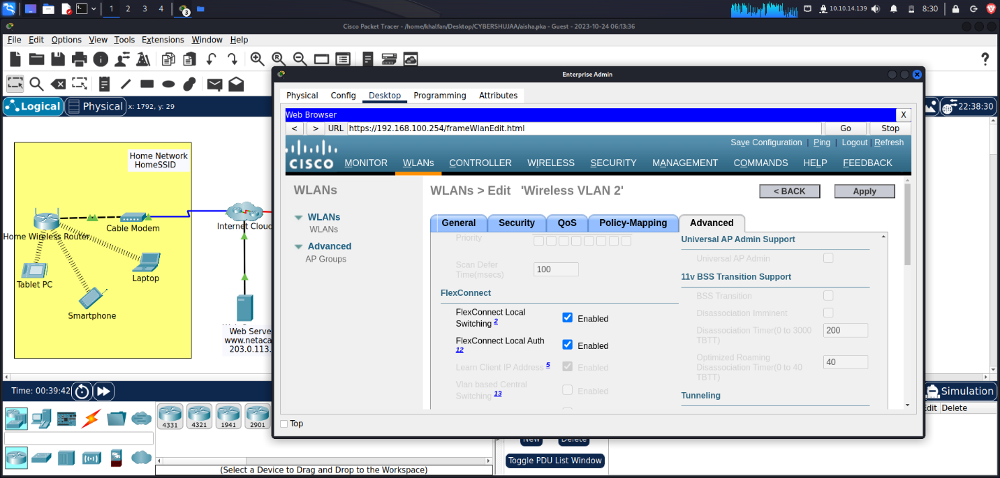{width="6.5in"
> height="3.1069444444444443in"}
>
> **Under the Advanced tab, go to the FlexConnect section. Enable
> FlexConnect Local Switching and FlexConnect Local Auth.**

**b.Create the second WLAN:**\
Profile Name**: Wireless VLAN 5**\
WLAN SSID: **SSID-5**\
Interface: **WLAN 5**\
ID**: 5**\
Security**: 802.1x -- WPA2-Enterprise**\
Configure the WLAN to use the RADIUS server for authentication. Make the
**FlexConnect** settings as was done in Step 4a.

> 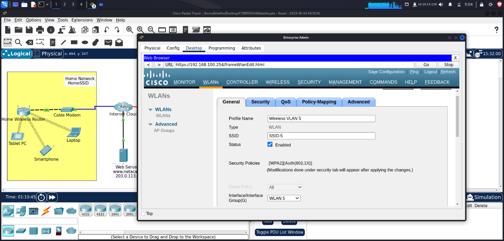{width="6.5in"
> height="3.1083333333333334in"}

{width="6.5in"
height="3.1083333333333334in"}

**Step 5: Configure the hosts to connect to the WLANs.**

Use the desktop PC Wireless app to configure the hosts as follows:
a.Wireless Host 1 should connect to Wireless VLAN 2.

> 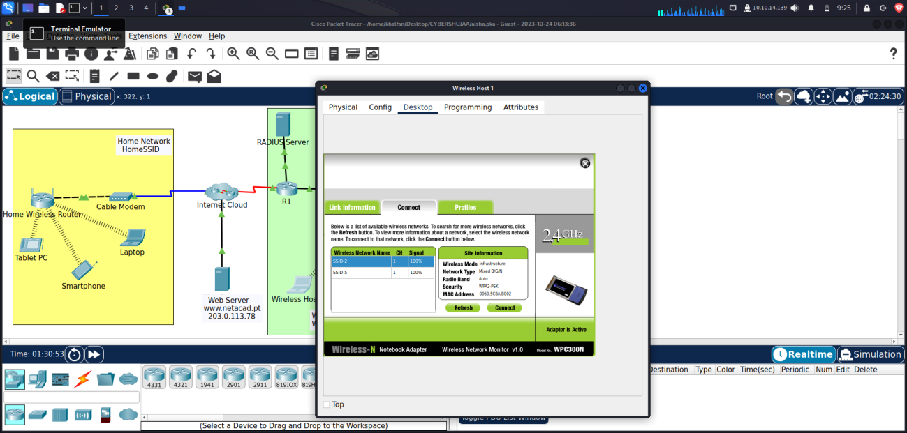{width="6.5in"
> height="3.1083333333333334in"}

b.Wireless Host 2 should connect to Wireless VLAN 5 using the
credentials in the WLAN information table.

{width="6.5in"
height="3.108332239720035in"}

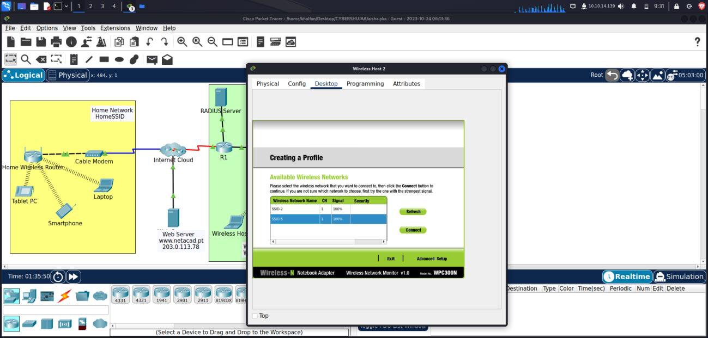{width="6.5in"
height="3.1083333333333334in"}

**Step 6: Test connectivity.**

Test connectivity between the wireless hosts and the Web Server by ping
and URL

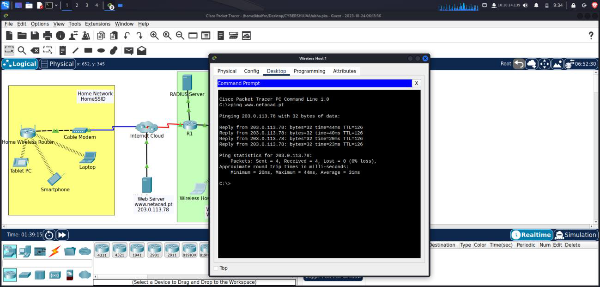{width="6.5in"
height="3.108332239720035in"}

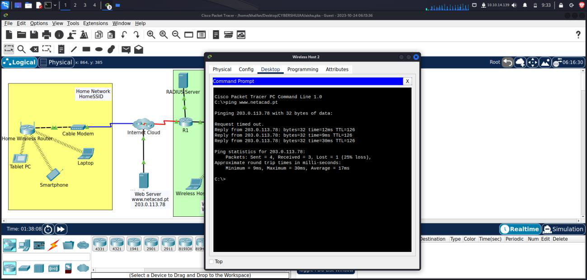{width="6.5in"
height="3.1083333333333334in"}

**Conclusion**\
This practical exercise helped in gaining hands-on experience in network
configuration and security. It demonstrated my ability to effectively
manage wireless networks for both home and enterprise scenarios,
ensuring data integrity, confidentiality, and network reliability. In a
world where connectivity is vital, the importance of robust security
measures cannot be overstated. This activity emphasized the significance
of safeguarding networks in our interconnected environment. Overall, our
successful completion of these objectives highlights our competence in
configuring and securing wireless networks, underscoring our readiness
to tackle real-world networking challenges.
