Week5: **Assignment 1:-Introduction to Web Applications**

Report by: **Aisha Khalifan, cs-cns04-23014**

> **Introduction**
>
> Web applications are the digital backbone of our lives. In this
> module, we will investigate their core elements, front-end and
> back-end distinctions, and the vital technologies behind them. We will
> also scrutinize vulnerabilities and how to address them. By the end,
> you will have the knowledge to confidently understand and secure web
> applications in our interconnected world.
>
> **1.[Introduction to Web Applications]{.underline}**

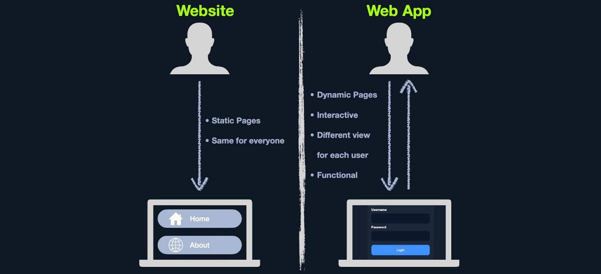{width="6.5in"
height="2.9722222222222223in"}

> **a.Web Application Layout**\
> This consists of many different layers that can be summarized with the
> following three main categories:

+-----------------------------------+-----------------------------------+
| > **Category**                    | > **Types**                       |
+===================================+===================================+
| > Web Application Infrastructure  | > ♦Client-Server\                 |
|                                   | > ♦One Server\                    |
|                                   | > ♦Many Servers - One Database    |
|                                   | > ♦Many Servers - Many Databases  |
+-----------------------------------+-----------------------------------+
| > Web Application Components      | > ♦Client\                        |
|                                   | > ♦Server(Webserver, Web          |
|                                   | > Application Logic, Database)\   |
|                                   | > ♦Services (Microservices)- 3rd  |
|                                   | > Party\                          |
|                                   | > Integrations, Web Application   |
|                                   | > Integrations ♦Functions         |
|                                   | > (Serverless)                    |
+-----------------------------------+-----------------------------------+
| > Web Application Architecture    | > ♦Presentation, Application and  |
|                                   | > Data Layers                     |
+-----------------------------------+-----------------------------------+

> **b.Front End vs. Back End**
>
> 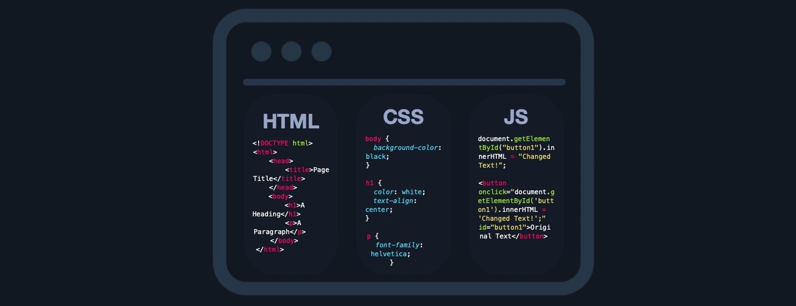{width="6.5in"
> height="2.5069444444444446in"}
>
> 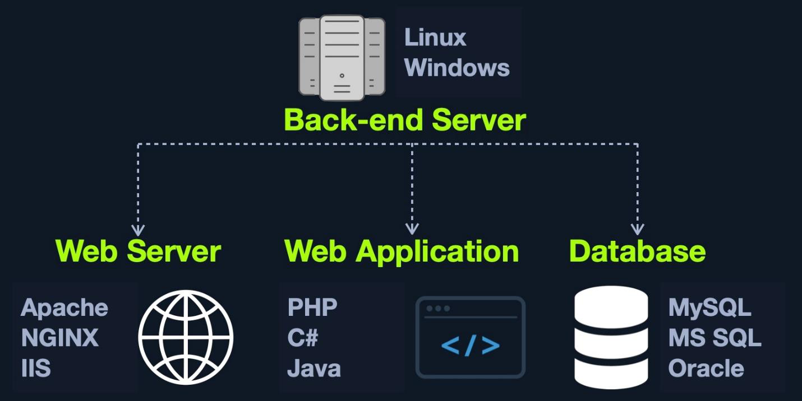{width="6.5in"
> height="3.254166666666667in"}

**2.[Front End Components]{.underline}**\
**a.[HTML ]{.underline}**\
HTML is at the very core of any web page we see on the internet. It
contains each page\'s basic elements, including titles, forms, images,
and many other elements. The web browser, in turn, interprets these
elements and displays them to the end-user.

> 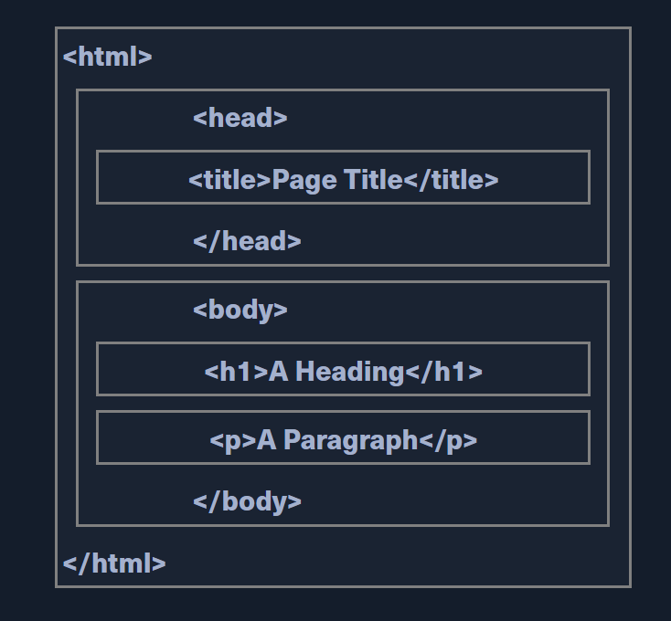{width="5.097222222222222in"
> height="4.722222222222222in"}
>
> 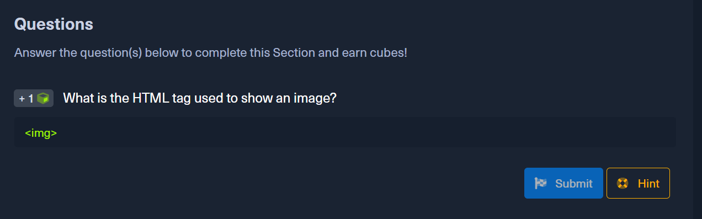{width="6.5in"
> height="2.0277777777777777in"}

**b.Cascading Style Sheets (CSS)**\
♦CSS (Cascading Style Sheets) is the stylesheet language used alongside
HTML to format and set the style of HTML elements.

♦Some of the most common CSS frameworks are: Bootstrap, SASS,
Foundation, Bulma, Pure

> 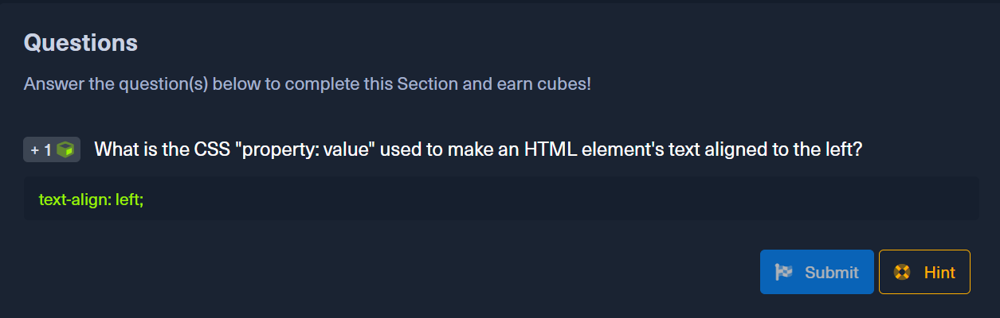{width="6.5in"
> height="2.072221128608924in"}

**c.JavaScript**\
♦JavaScript is usually used on the front end of an application to be
executed within a browser. ♦Some of the most common front end JavaScript
frameworks are: Angular, React, Vue and jQuery

**3.[Front End Vulnerabilities]{.underline}**\
**a.[Sensitive Data Exposure ]{.underline}**\
This refers to the availability of sensitive data in clear-text to the
end-user. This is usually found in the source code of the web page or
page source on the front end of web applications.

> 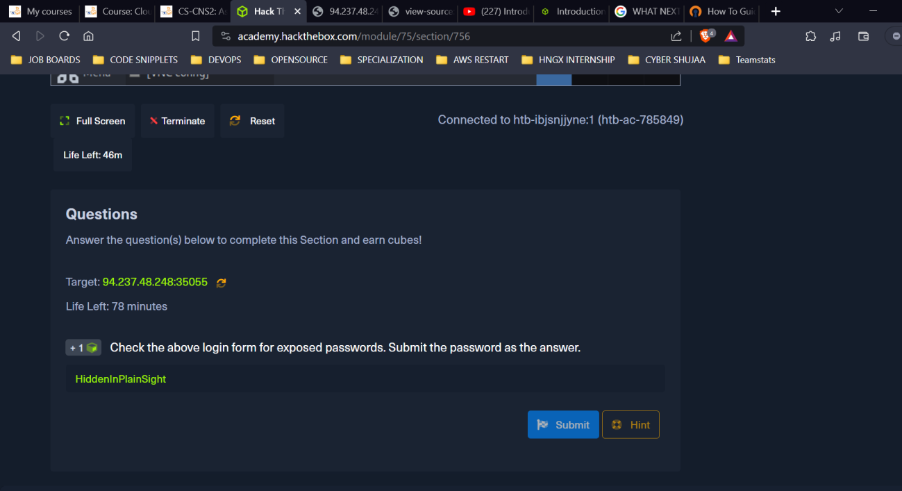{width="6.5in"
> height="3.5402766841644793in"}
>
> 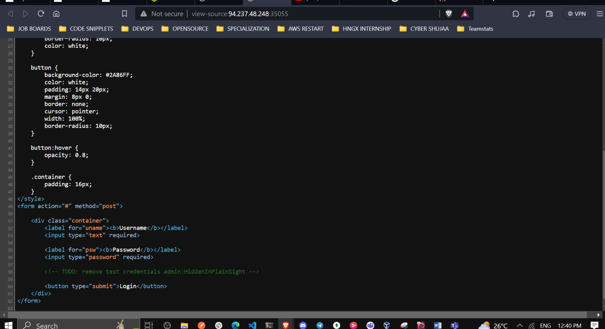{width="6.5in"
> height="3.548611111111111in"}

**b.HTML Injection**\
HTML injection occurs when unfiltered user input is displayed on the
page. This can either be through retrieving previously submitted code,
like retrieving a user comment from the back end database, or by
directly displaying unfiltered user input through JavaScript on the
front end.

> 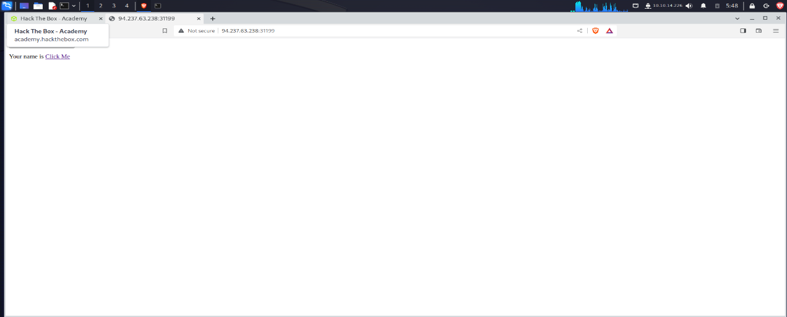{width="5.770833333333333in"
> height="2.326388888888889in"}
>
> 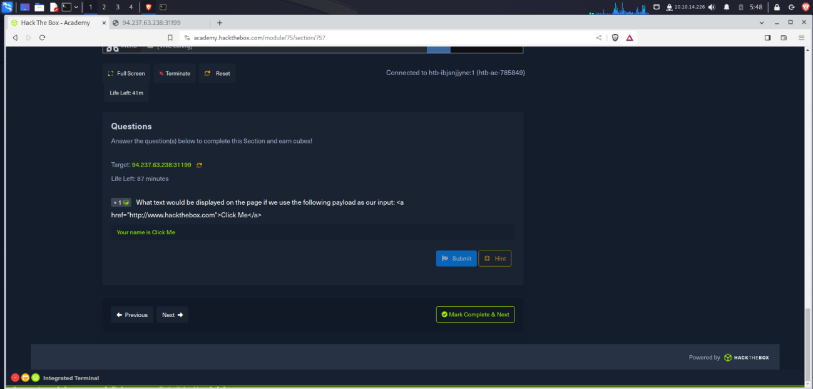{width="6.5in"
> height="3.1083333333333334in"}

**c.Cross-Site Scripting (XSS)**\
HTML Injection vulnerabilities can often be utilized to also perform
Cross-Site Scripting (XSS) attacks by injecting JavaScript code to be
executed on the client-side. Once we can execute code on the victim\'s
machine, we can potentially gain access to the victim\'s account or even
their machine.

> XSS is very similar to HTML Injection in practice. However, XSS
> involves the injection of JavaScript code to perform more advanced
> attacks on the client-side, instead of merely injecting HTML code.
> There are three main types of XSS:
>
> Type Description\
> **Reflected XSS** Occurs when user input is displayed on the page
> after processing (e.g., search result or error message).
>
> **Stored XSS** Occurs when user input is stored in the back end
> database and then displayed upon retrieval (e.g., posts or comments).
>
> **DOM XSS** Occurs when user input is directly shown in the browser
> and is written to an HTML DOM object (e.g., vulnerable username or
> page title).
>
> 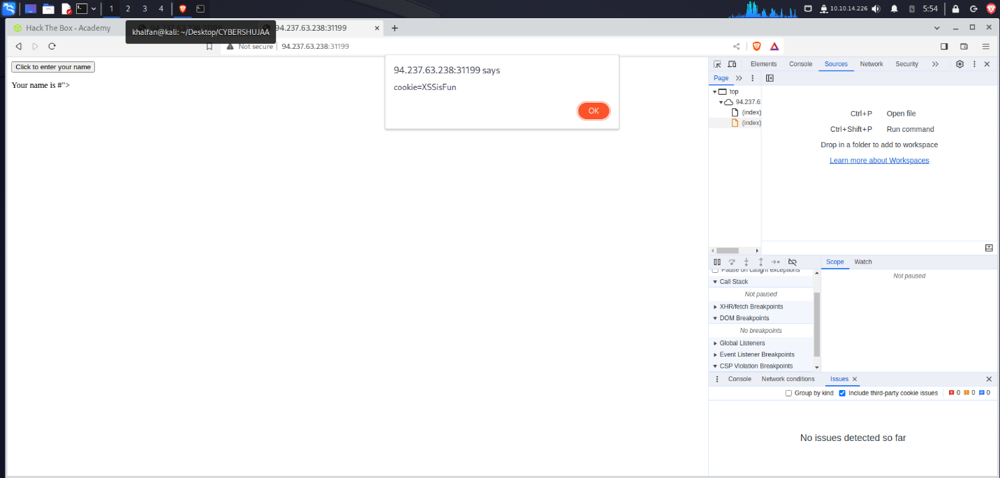{width="6.5in"
> height="3.1083333333333334in"}
>
> 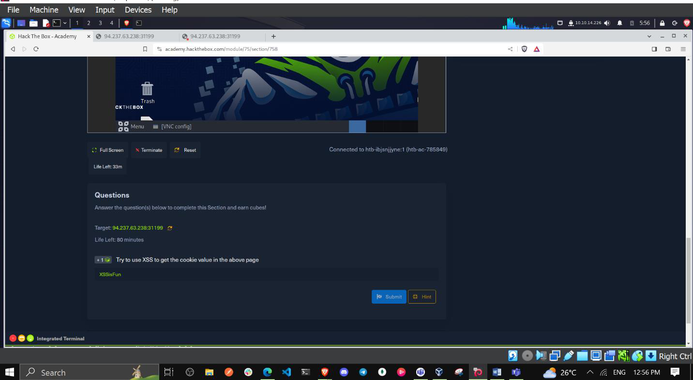{width="6.5in"
> height="3.5680555555555555in"}

**d.Cross-Site Request Forgery (CSRF)**\
The third type of front end vulnerability that is caused by unfiltered
user input is Cross-Site Request Forgery (CSRF). CSRF attacks may
utilize XSS vulnerabilities to perform certain queries, and API calls on
a web application that the victim is currently authenticated to. This
would allow the attacker to perform actions as the authenticated user.
It may also utilize other vulnerabilities to perform the same functions,
like utilizing HTTP parameters for attacks.

> A common CSRF attack to gain higher privileged access to a web
> application is to craft a JavaScript payload that automatically
> changes the victim\'s password to the value set by the attacker. Once
> the victim views the payload on the vulnerable page (e.g., a malicious
> comment containing the JavaScript CSRF payload), the JavaScript code
> would execute automatically. It would use the victim\'s logged-in
>
> session to change their password. Once that is done, the attacker can
> log in to the victim\'s account and control it.
>
> **4.[Back End Components]{.underline}**\
> **a.[Back End Servers ]{.underline}**
>
> A back-end server is the hardware and operating system on the back end
> that hosts all of the applications necessary to run the web
> application**.**
>
> There are many popular combinations of \"stacks\" for back-end
> servers, which contain a specific set of back end components. Some
> common examples include:

+-----------------------------------+-----------------------------------+
| > **Combinations**                | > **Components**                  |
+===================================+===================================+
| > LAMP                            | > Linux, Apache, MySQL, and PHP.  |
+-----------------------------------+-----------------------------------+
| > WAMP                            | > Windows, Apache, MySQL, and     |
|                                   | > PHP.                            |
+-----------------------------------+-----------------------------------+
| > WINS                            | > Windows, IIS, .NET, and SQL     |
|                                   | > Server                          |
+-----------------------------------+-----------------------------------+
| > MAMP                            | > macOS, Apache, MySQL, and PHP.  |
+-----------------------------------+-----------------------------------+
| > XAMPP                           | > Cross-Platform, Apache, MySQL,  |
|                                   | > and PHP/PERL.                   |
+-----------------------------------+-----------------------------------+

> 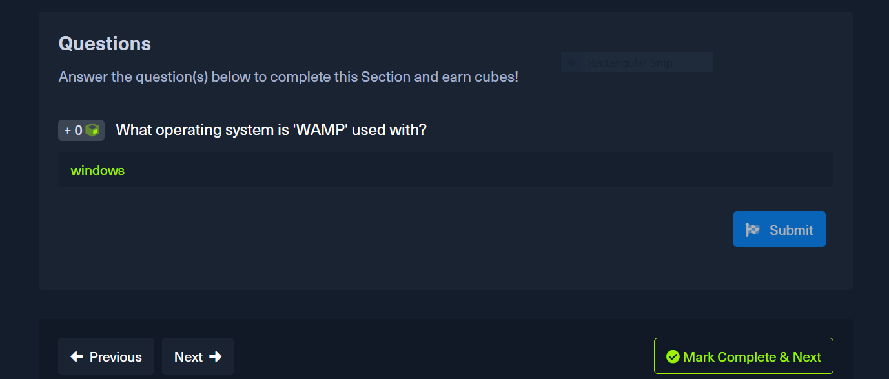{width="6.5in"
> height="2.7805555555555554in"}
>
> **b.Web Servers**\
> A web server is an application that runs on the back end server, which
> handles all of the HTTP traffic from the client-side browser, routes
> it to the requested pages, and finally responds to the client-side
> browser.
>
> 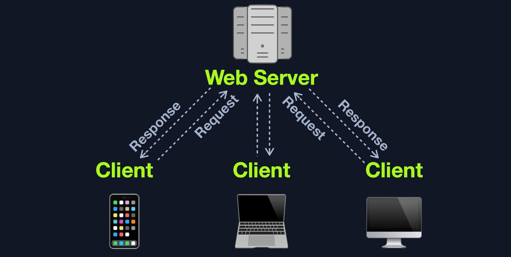{width="6.5in"
> height="3.2736111111111112in"}
>
> 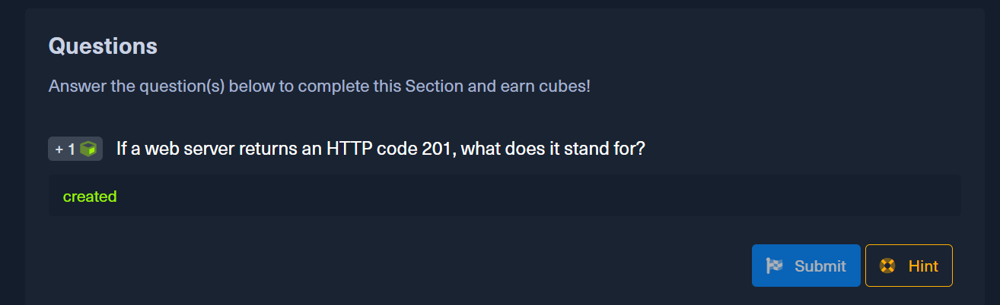{width="6.5in"
> height="1.9888877952755906in"}

**c.Databases**\
♦There are many different types of databases, each of which fits a
certain type of use.

♦Relational (SQL) databases store their data in tables, rows, and
columns. Eg **MySQL, MSSQL, Oracle,** **PostgreSQL, SQLite, MariaDB,
Amazon Aurora, and Azure SQL.**

♦Non-relational (NoSQL) database does not use tables, rows, columns,
primary keys, relationships, or schemas. Instead, a NoSQL database
stores data using various storage models, depending on the type of data
stored. E.g MongoDB, **ElasticSearch, Apache Cassandra, Redis, Neo4j,
CouchDB, and Amazon DynamoDB.**

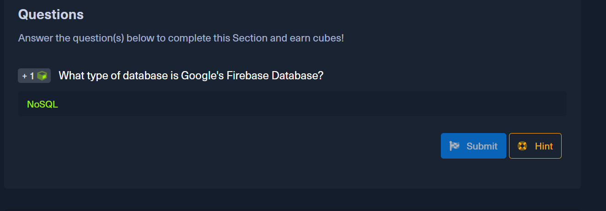{width="6.5in"
height="2.2708333333333335in"}

**d.Development Frameworks & APIs**\
An API (Application Programming Interface) is an interface within an
application that specifies how the application can interact with other
applications.

> 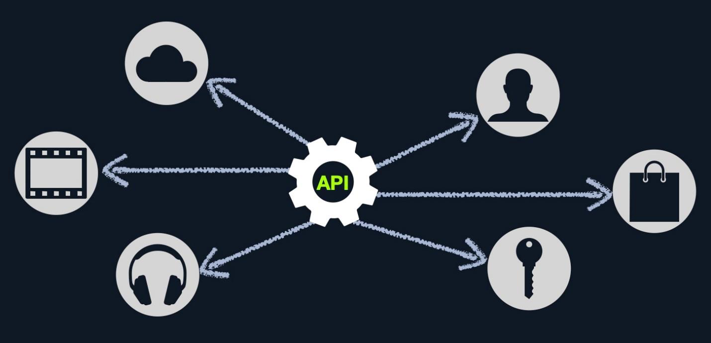{width="6.5in"
> height="3.1333333333333333in"}

♦To enable the use of APIs within a web application, the developers have
to develop this functionality on the back end of the web application by
using the API standards like **SOAP or REST.**

♦**SOAP (Simple Objects Access)** standard shares data through XML,
where the request is made in XML through an HTTP request, and the
response is also returned in XML. Front end components are designed to
parse this XML output properly\
♦REST (Representational State Transfer) standard shares data through the
URL path \'i.e. search/users/1\', and usually returns the output in JSON
format \'i.e. userid 1\'.

> 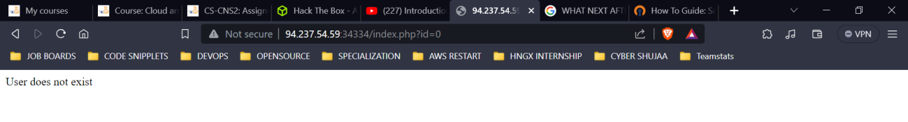{width="6.5in"
> height="0.8805555555555555in"}
>
> 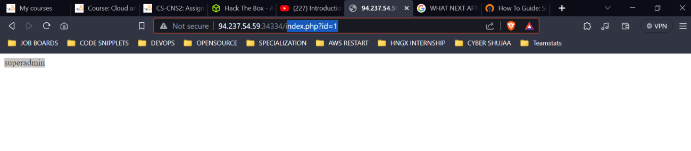{width="6.5in"
> height="1.4305555555555556in"}
>
> 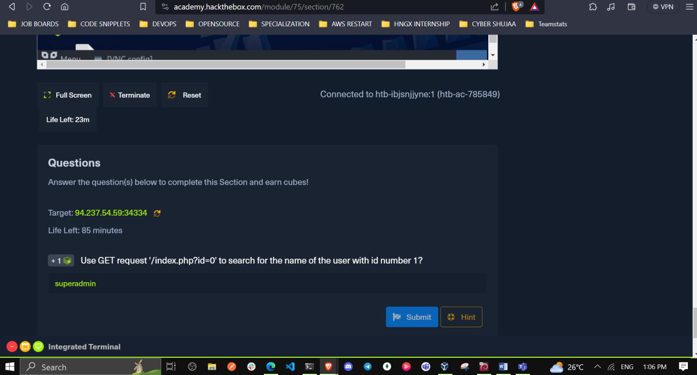{width="6.5in"
> height="3.4972222222222222in"}
>
> **Common Web Vulnerabilities**\
> The below examples are some of the most common vulnerability types for
> web applications, part of OWASP Top 10 vulnerabilities for web
> applications.

♦Broken Authentication/Access Control\
♦Malicious File Upload\
♦Command Injection\
♦SQL Injection (SQLi)

> 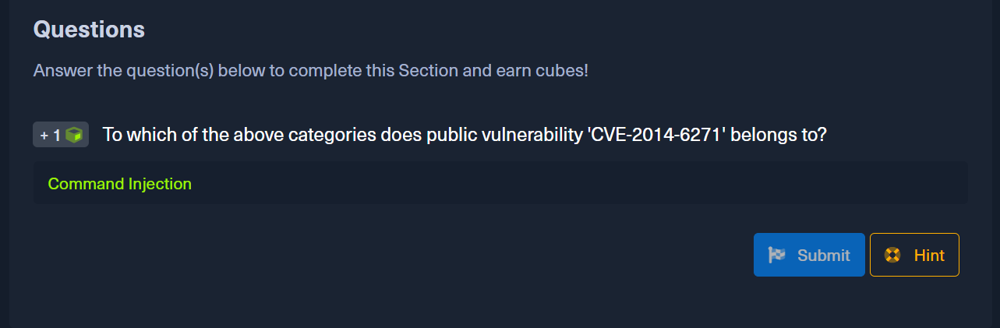{width="6.5in"
> height="2.1319444444444446in"}

a.**Public Vulnerabilities**

> 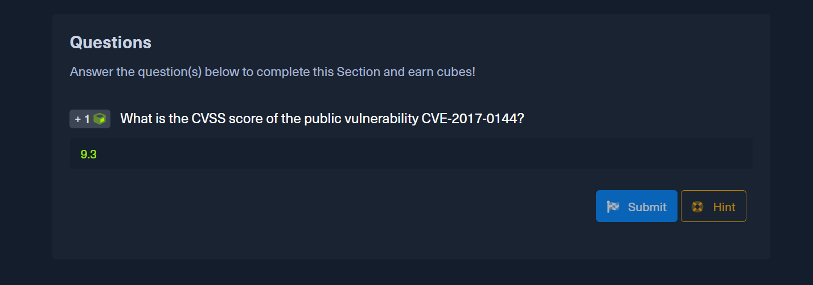{width="6.5in"
> height="2.2847222222222223in"}

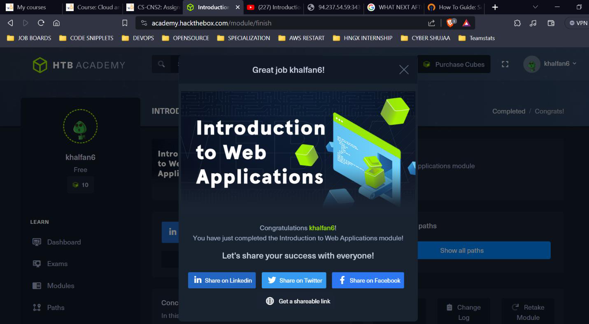{width="6.5in"
height="3.5861111111111112in"}

**CONCLUSION**

Web applications are the backbone of the modern internet, powering
everything from e-commerce websites to social media platforms. However,
they are also a prime target for attackers, who exploit vulnerabilities
to steal data, disrupt operations, and launch further attacks. To
protect web applications, it is important to understand the common
security risks and how to mitigate them. This includes securing the
front-end and back-end components, as well as addressing public
vulnerabilities and following best practices in web application
development and testing.
