> Week5: **Assignment 2:-Configure ASA Basic Settings and Firewall Using
> the CLI** Report by: **Aisha Khalifan, cs-cns04-23014**\
> **Introduction**
>
> 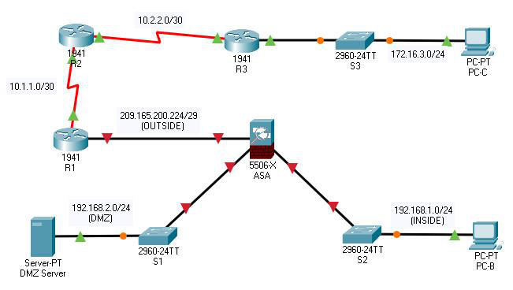{width="4.1125in"
> height="2.327777777777778in"}
>
> **Addressing Table**

+-------------+-------------+-------------+-------------+-------------+
| **Device**  | **          | **IP        | **Subnet    | **Default   |
|             | Interface** | Address**   | Mask**      | Gateway**   |
+=============+=============+=============+=============+=============+
| > R1        | > G0/0      | > 209.      | > 255.      | > N/A       |
|             |             | 165.200.225 | 255.255.248 |             |
+-------------+-------------+-------------+-------------+-------------+
|             | > S0/0/0    | > 10.1.1.1  | > 255.      |             |
|             | > (DCE)     |             | 255.255.252 |             |
+-------------+-------------+-------------+-------------+-------------+
| > R2        | > S0/0/0    | > 10.1.1.2  | > 255.      | > N/A       |
|             |             |             | 255.255.252 |             |
+-------------+-------------+-------------+-------------+-------------+
|             | > S0/0/1    | > 10.2.2.2  | > 255.      |             |
|             | > (DCE)     |             | 255.255.252 |             |
+-------------+-------------+-------------+-------------+-------------+
| > R3        | > G0/1      | >           | > 25        | > N/A       |
|             |             |  172.16.3.1 | 5.255.255.0 |             |
+-------------+-------------+-------------+-------------+-------------+
|             | > S0/0/1    | > 10.2.2.1  | > 255.      |             |
|             |             |             | 255.255.252 |             |
+-------------+-------------+-------------+-------------+-------------+
| > ASA       | > G1/1      | > 209.      | > 255.      | > NA        |
|             |             | 165.200.226 | 255.255.248 |             |
+-------------+-------------+-------------+-------------+-------------+
|             | > G1/2      | >           | > 25        |             |
|             |             | 192.168.1.1 | 5.255.255.0 |             |
+-------------+-------------+-------------+-------------+-------------+
|             | > G1/3      | >           | > 25        |             |
|             |             | 192.168.2.1 | 5.255.255.0 |             |
+-------------+-------------+-------------+-------------+-------------+
| > DMZ       | > NIC       | >           | > 25        | >           |
| > Server    |             | 192.168.2.3 | 5.255.255.0 | 192.168.2.1 |
+-------------+-------------+-------------+-------------+-------------+
| > PC-B      | > NIC       | >           | > 25        | >           |
|             |             | 192.168.1.3 | 5.255.255.0 | 192.168.1.1 |
+-------------+-------------+-------------+-------------+-------------+
| > PC-C      | > NIC       | >           | > 25        | >           |
|             |             |  172.16.3.3 | 5.255.255.0 |  172.16.3.1 |
+-------------+-------------+-------------+-------------+-------------+

**Objectives**

+-----------------------------------+-----------------------------------+
| •\                                | > Verify connectivity and explore |
| •\                                | > the ASA\                        |
| •\                                | > Configure basic ASA settings    |
| •\                                | > and interface security levels   |
| •                                 | > using CLI Configure routing,    |
|                                   | > address translation, and        |
|                                   | > inspection policy using CLI     |
|                                   | > Configure DHCP, AAA, and SSH\   |
|                                   | > Configure a DMZ, Static NAT,    |
|                                   | > and ACLs                        |
+===================================+===================================+
+-----------------------------------+-----------------------------------+

**Scenario**

Your company has one location connected to an ISP. R1 represents a CPE
device managed by the ISP. R2 represents an intermediate Internet
router. R3 represents an ISP that connects an administrator from a
network management company, who has been hired to remotely manage your
network. The ASA is an edge CPE security device that connects the
internal corporate network and DMZ to the ISP while providing NAT and
DHCP services to inside hosts. The ASA will be configured for management
by an administrator on the internal network and by the remote
administrator. The ISP assigned the public IP address space of
209.165.200.224/29, which will be used for address translation on the
ASA.

All router and switch devices have been preconfigured with the
following:

+-----------------------------------+-----------------------------------+
| > •\                              | > Enable password:                |
| > •\                              | > **ciscoenpa55**\                |
| > •                               | > Console password:               |
|                                   | > **ciscoconpa55**\               |
|                                   | > Admin username and password:    |
|                                   | > **admin/adminpa55**             |
+===================================+===================================+
+-----------------------------------+-----------------------------------+

**Note**: This Packet Tracer activity is not a substitute for the ASA
labs. This activity provides additional practice and simulates most of
the ASA 5506-X configurations. When compared to a physical ASA 5506-X,
there may be slight differences in command output or commands that are
not yet supported in Packet Tracer.

**Instructions**

**Part 1: Verify Connectivity and Explore the ASA**

**Step 1: Verify connectivity.**

The ASA is not currently configured. However, all routers, PCs, and the
DMZ server are configured. Verify that PC-C can ping any router
interface. PC-C is unable to ping the ASA, PC-B, or the DMZ server.

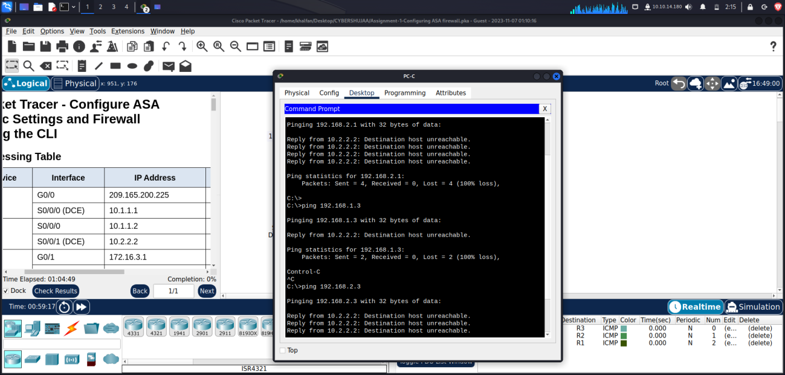{width="6.5in"
height="3.1083333333333334in"}

**Step 2: Determine the ASA version, interfaces, and license.**

Use the **show version** command to determine various aspects of this
ASA device.

{width="6.5in"
height="3.108332239720035in"}

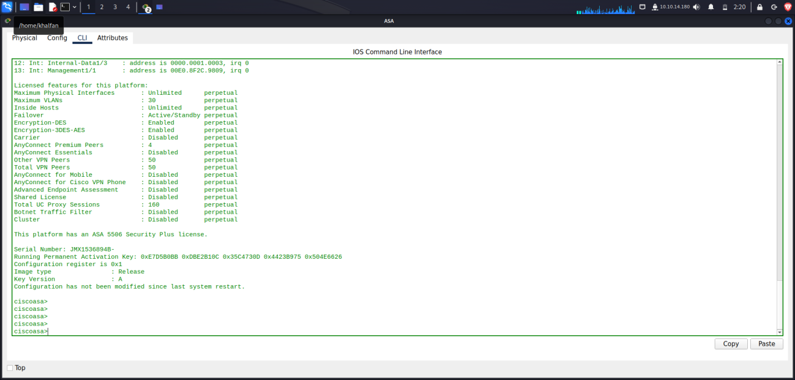{width="6.5in"
height="3.1083333333333334in"}

**Step 3: Determine the file system and contents of flash memory.**

a.Enter privileged EXEC mode. A password has not been set. Press Enter
when prompted for a password.

> 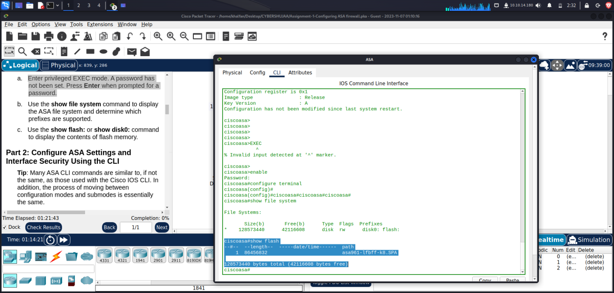{width="6.5in"
> height="3.1083333333333334in"}

b.Use the **show file system**command to display the ASA file system and
determine which prefixes are supported.

> {width="6.5in"
> height="3.1069444444444443in"}

c.Use the **show flash**: or **show disk0**: command to display the
contents of flash memory.

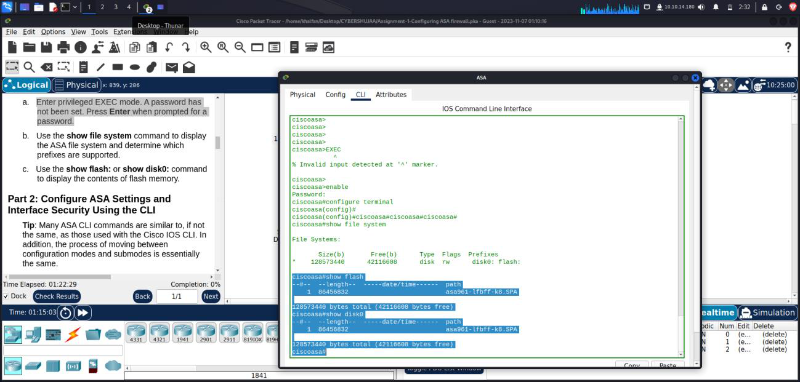{width="6.5in"
height="3.1083333333333334in"}

**Part 2: Configure ASA Settings and Interface Security Using the CLI**\
**Tip:** Many ASA CLI commands are similar to, if not the same, as those
used with the Cisco IOS CLI. In addition, the process of moving between
configuration modes and submodes is essentially the same. **Step 1:
Configure the hostname and domain name.**

**a.**Configure the ASA hostname as **NETSEC-ASA**.

> {width="6.5in"
> height="3.1083333333333334in"}

**b.**Configure the domain name as **netsec.com**.

> {width="6.5in"
> height="3.1083333333333334in"}

**Step 2: Configure the enable mode password.**

Use the **enable password**command to change the privileged EXEC mode
password to **ciscoenpa55.**

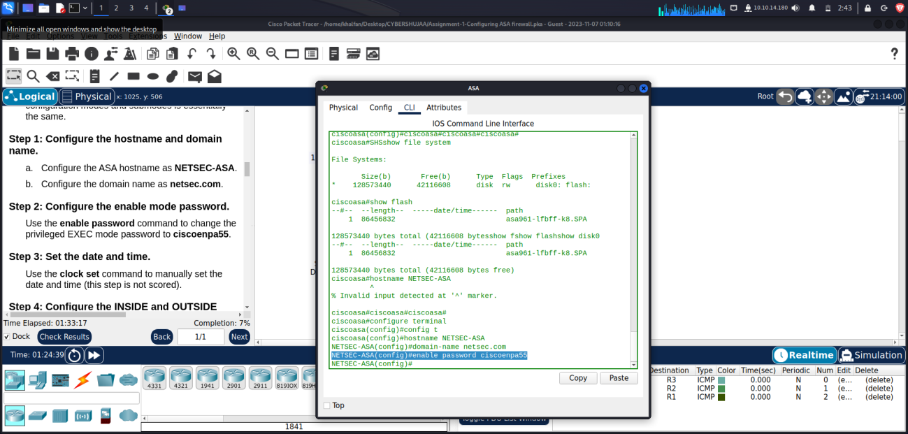{width="6.5in"
height="3.1083333333333334in"}

**Step 3: Set the date and time.**

Use the **clock set**command to manually set the date and time (this
step is not scored).

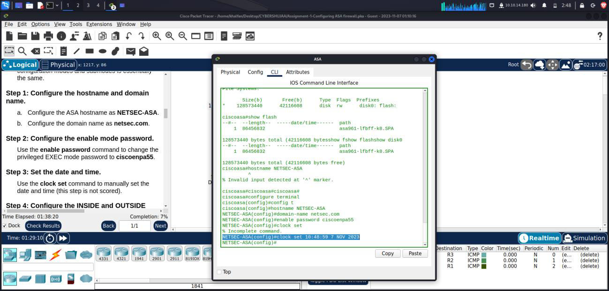{width="6.5in"
height="3.108332239720035in"}

**Step 4: Configure the INSIDE and OUTSIDE interfaces.**

You will only configure the G1/1 (OUTSIDE) and G1/2 (INSIDE) interfaces
at this time. The G1/3 (DMZ) interface will be configured in Part 5 of
the activity.

a.Create the G1/1 interface for the outside network
(209.165.200.224/29), set the security level to the lowest setting of 0,
and enable the interface.

> ***NETSEC-ASA(config-if)# interface g1/1***\
> ***NETSEC-ASA(config-if)# nameif OUTSIDE***\
> ***NETSEC-ASA(config-if)# ip address 209.165.200.226
> 255.255.255.248***
>
> ***NETSEC-ASA(config-if)# security-level 0***\
> ***NETSEC-ASA(config-if)# no shutdown***
>
> {width="6.5in"
> height="3.0902777777777777in"}

b.Configure the G1/2 interface for the inside network (192.168.1.0/24)
and set the security level to the highest setting of 100 and enable the
interface.

> **NETSEC-ASA(config)# interface g1/2**\
> **NETSEC-ASA(config-if)# nameif INSIDE**\
> **NETSEC-ASA(config-if)# ip address 192.168.1.1 255.255.255.0
> NETSEC-ASA(config-if)# security-level 100**\
> **NETSEC-ASA(config-if)# no shutdown**
>
> 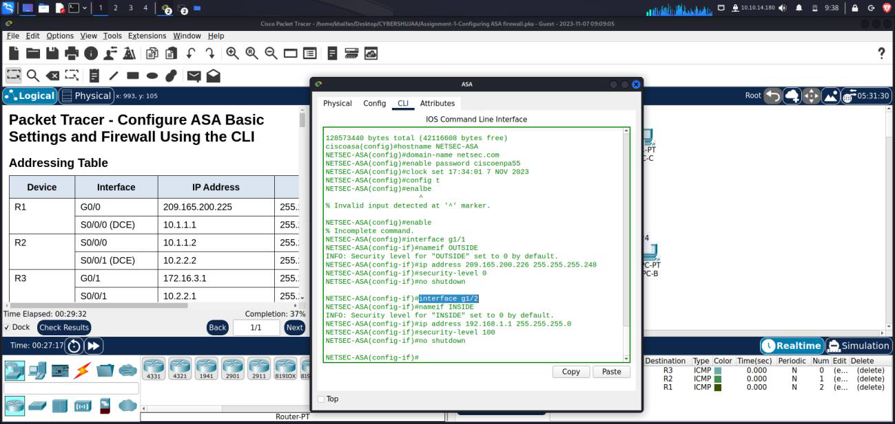{width="6.5in"
> height="3.0902766841644795in"}

c.Use the following verification commands to check your configurations:\
1)Use the **show interface ip brief**command to display the status for
all ASA interfaces.

**Note:** This command is different from the IOS command show ip
interface brief. If any of the physical or logical interfaces previously
configured are not up/up, troubleshoot as necessary before continuing.

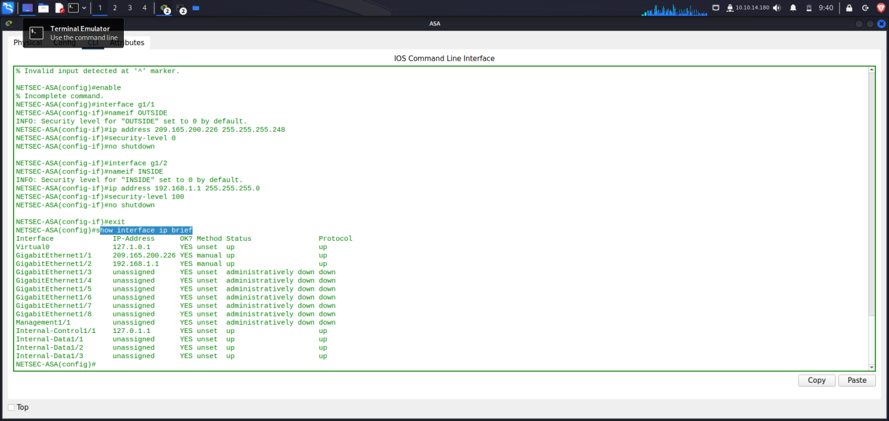{width="6.5in"
height="3.0902777777777777in"}

**Tip:** Most ASA **show** commands, including **ping, copy**, and
others, can be issued from within any configuration mode prompt without
the do command.

2)Use the **show ip address**command to display the interface
information.

{width="6.5in"
height="3.0888877952755904in"}

**Step 5: Test connectivity to the ASA.**

a.You should be able to ping from PC-B to the ASA inside interface
address (192.168.1.1). If the pings fail, troubleshoot the configuration
as necessary.

> 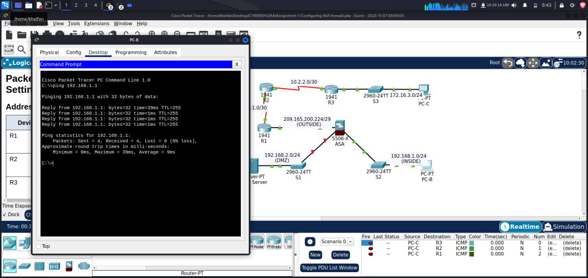{width="6.5in"
> height="3.0902777777777777in"}

b.From PC-B, ping the G1/1 (OUTSIDE) interface at IP address
209.165.200.226. You should not be able to ping this address.

> 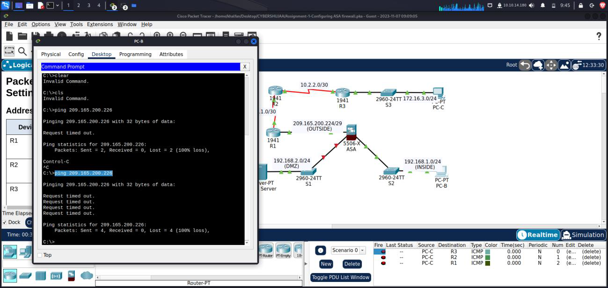{width="6.5in"
> height="3.0888877952755904in"}

**[Part 3: Configure Routing, Address Translation, and Inspection Policy
Using the CLI]{.underline}**

**Step 1: Configure a static default route for the ASA.**

Configure a default static route on the ASA OUTSIDE interface to enable
the ASA to reach external networks.

a.Create a "quad zero" default route using the route command, associate
it with the ASA OUTSIDE interface, and point to the R1 G0/0 IP address
(209.165.200.225) as the gateway of last resort.

> ***NETSEC-ASA(config)# route OUTSIDE 0.0.0.0 0.0.0.0
> 209.165.200.225***

b.Issue the ***show route***command to verify the static default route
is in the ASA routing table.

> {width="6.5in"
> height="3.0902777777777777in"}

c.Verify that the ASA can ping the R1 S0/0/0 IP address 10.1.1.1. If the
ping is unsuccessful, troubleshoot as necessary.

> 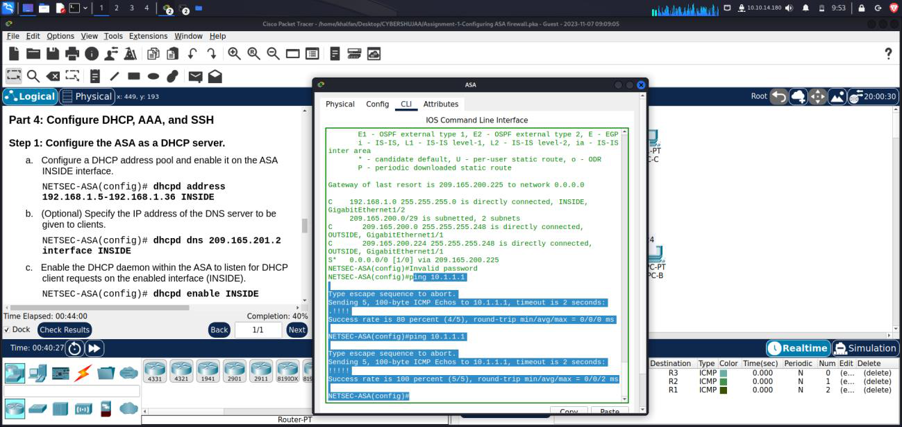{width="6.5in"
> height="3.088888888888889in"}

**[Step 2: Configure address translation using PAT and network
objects]{.underline}.**

a.Create network object **INSIDE-NET** and assign attributes to it using
the **subnet** and **nat** commands.

> ***NETSEC-ASA(config)# object network INSIDE-NET***\
> ***NETSEC-ASA(config-network-object)# subnet 192.168.1.0
> 255.255.255.0***\
> ***NETSEC-ASA(config-network-object)# nat (INSIDE,OUTSIDE) dynamic
> interface NETSEC-ASA(config-network-object)# exit***
>
> 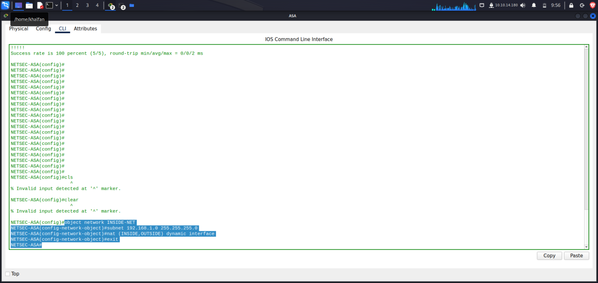{width="6.5in"
> height="3.0902777777777777in"}

b.The ASA splits the configuration into the object portion that defines
the network to be translated and the actual nat command parameters.
These appear in two different places in the running\
configuration. Display the NAT object configuration using the ***show
run***command.

> {width="6.5in"
> height="3.0902777777777777in"}
>
> 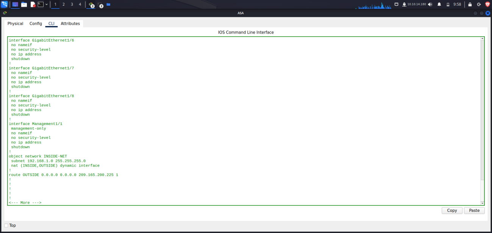{width="6.5in"
> height="3.0902777777777777in"}
>
> 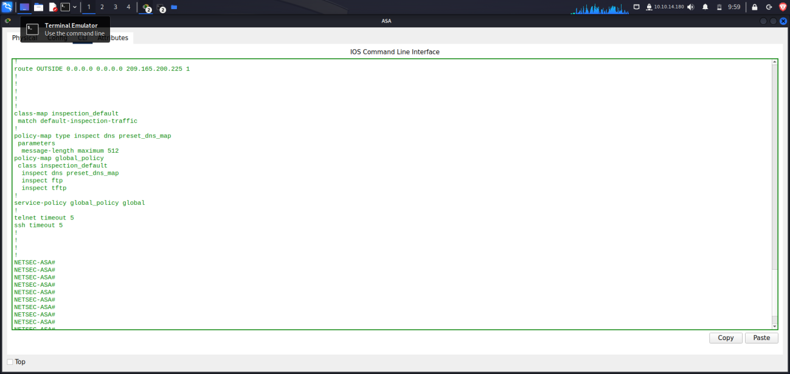{width="6.5in"
> height="3.0888877952755904in"}

c.From PC-B attempt to ping the R1 G0/0 interface at IP address
209.165.200.225. The pings should fail.

> 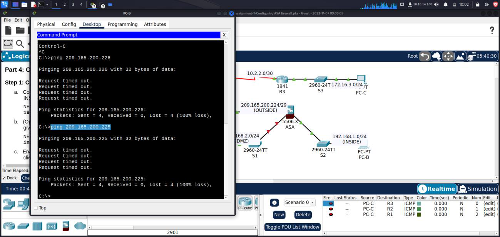{width="6.5in"
> height="3.0902777777777777in"}

d.Issue the ***show nat***command on the ASA to see the translated and
untranslated hits. Notice that, of the pings from PC-B, four were
translated and four were not. The outgoing pings (echos) were translated
and sent to the destination. The returning echo replies were blocked by
the firewall policy.

> 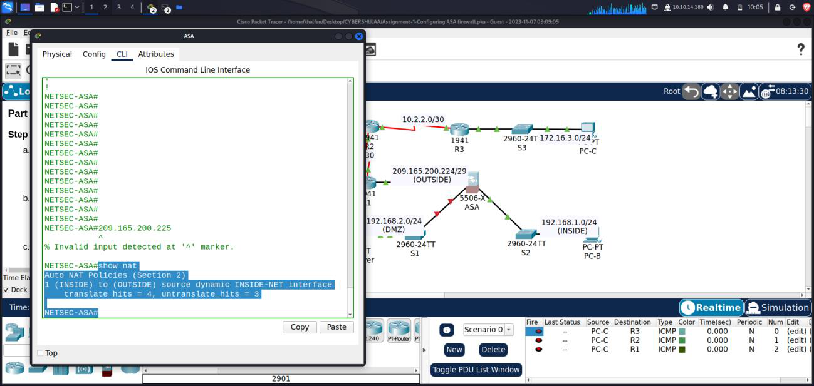{width="6.5in"
> height="3.0888877952755904in"}

**[Part 4: Configure DHCP, AAA, and SSH]{.underline}**\
**Step 1: Configure the ASA as a DHCP server.**

a.Configure a DHCP address pool and enable it on the ASA INSIDE
interface.

*NETSEC-ASA(config)# **dhcpd address 192.168.1.5-192.168.1.36 INSIDE
***b.(Optional) Specify the IP address of the DNS server to be given to
clients.

*NETSEC-ASA(config)# **dhcpd dns 209.165.201.2 interface INSIDE ***

{width="6.5in"
height="3.0902777777777777in"}

c.Enable the DHCP daemon within the ASA to listen for DHCP client
requests on the enabled interface (INSIDE).

> *NETSEC-ASA(config)# **dhcpd enable INSIDE ***
>
> 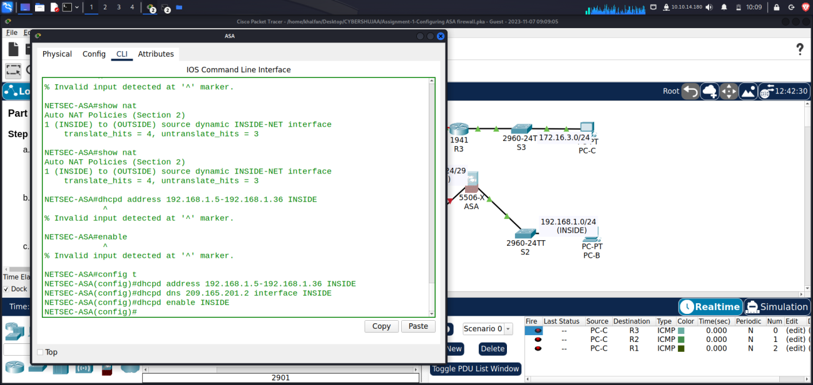{width="6.5in"
> height="3.0888877952755904in"}

d.Change PC-B from a static IP address to a DHCP client and verify that
it receives IP addressing information. Troubleshoot, as necessary to
resolve any problems.

> {width="6.5in"
> height="3.0902777777777777in"}

**[Step 2: Configure AAA to use the local database for
authentication.]{.underline}**

a.Define a local user named admin by entering the username command.
Specify a password of **adminpa55**.

*NETSEC-ASA(config)# **username admin password adminpa55 ***\
b.Configure AAA to use the local ASA database for SSH user
authentication.

> *NETSEC-ASA(config)# **aaa authentication ssh console LOCAL ***

{width="6.5in"
height="3.0902777777777777in"}

**Step 3: Configure remote access to the ASA.**

The ASA can be configured to accept connections from a single host or a
range of hosts on the INSIDE or OUTSIDE network. In this step, hosts
from the OUTSIDE network can only use SSH to communicate with the ASA.
SSH sessions can be used to access the ASA from the inside network.

a.Generate an RSA key pair, which is required to support SSH
connections. Because the ASA device has RSA keys already in place, enter
no when prompted to replace them.

> *NETSEC-ASA(config)# **crypto key generate rsa modulus 1024 ***\
> *WARNING: You have a RSA keypair already defined named
> \<Default-RSA-Key\>.*
>
> *Do you really want to replace them? \[yes/no\]: no*\
> *ERROR: Failed to create new RSA keys named \<Default-RSA-Key\>*
>
> 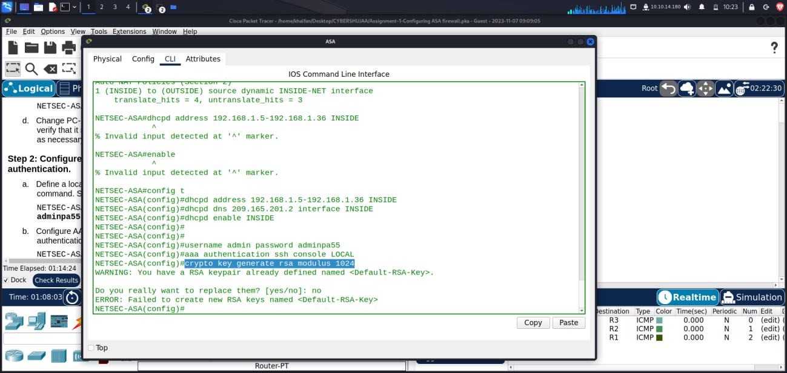{width="6.5in"
> height="3.0902766841644795in"}

b.Configure the ASA to allow SSH connections from any host on the INSIDE
network\
(192.168.1.0/24) and from the remote management host at the branch
office (172.16.3.3) on the OUTSIDE network. Set the SSH timeout to 10
minutes (the default is 5 minutes).

> *NETSEC-ASA(config)# ssh 192.168.1.0 255.255.255.0 INSIDE
> NETSEC-ASA(config)# ssh 172.16.3.3 255.255.255.255 OUTSIDE
> NETSEC-ASA(config)# ssh timeout 10*
>
> 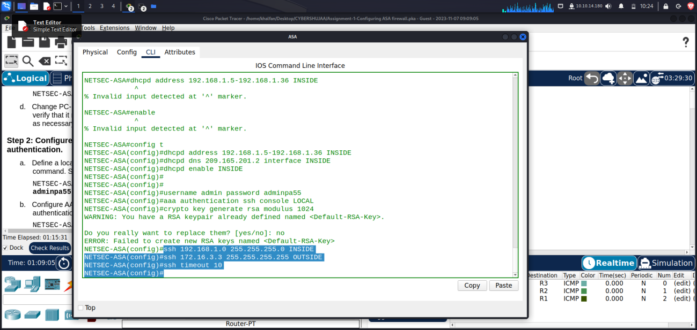{width="6.5in"
> height="3.088888888888889in"}

c.Establish an SSH session from PC-C to the ASA (209.165.200.226).
Troubleshoot if it is not successful.

> **C:\\\> ssh -l admin 209.165.200.226**
>
> 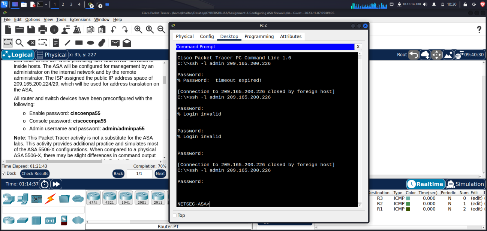{width="6.5in"
> height="3.088888888888889in"}

**d.**Establish an SSH session from PC-B to the ASA (192.168.1.1).
Troubleshoot if it is not successful**.** **C:\\\> ssh -l admin
192.168.1.1**

> {width="6.5in"
> height="3.0888877952755904in"}

**[Part 5: Configure a DMZ, Static NAT, and ACLs]{.underline}**

R1 G0/0 and the ASA OUTSIDE interface already use 209.165.200.225 and
.226, respectively. You will use public address 209.165.200.227 and
static NAT to provide address translation access to the server.

**Step 1: Configure the DMZ interface VLAN 3 on the ASA.**

a.Configure DMZ VLAN 3, which is where the public access web server will
reside. Assign it IP address 192.168.2.1/24, name it DMZ, and assign it
a security level of 70. Because the server does not need to initiate
communication with the inside users, disable forwarding to interface
VLAN 1.

> *NETSEC-ASA(config)# interface g1/3*\
> *NETSEC-ASA(config-if)# ip address 192.168.2.1 255.255.255.0
> NETSEC-ASA(config-if)# nameif DMZ*\
> *INFO: Security level for \"DMZ\" set to 0 by default.*
>
> *NETSEC-ASA(config-if)# security-level 70*\
> *NETSEC-ASA(config-if)# no shutdown*
>
> 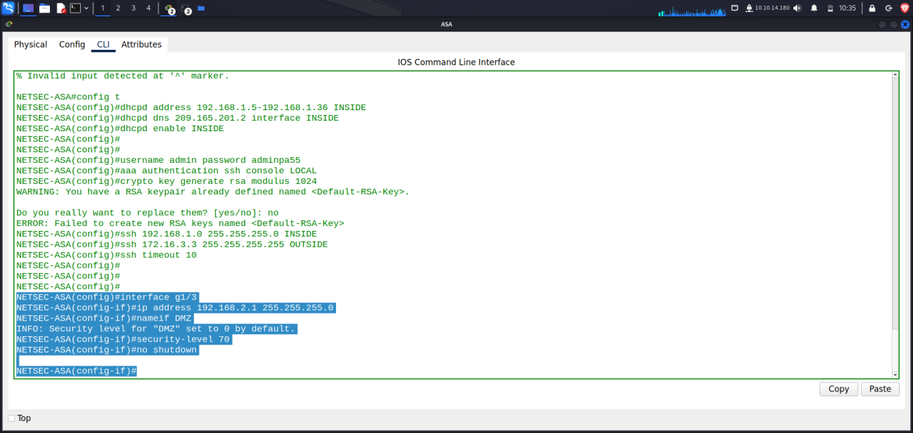{width="6.5in"
> height="3.0902766841644795in"}

b.Use the following verification commands to check your configurations:\
Use the **show interface ip brief** command to display the status for
the ASA interfaces.

> 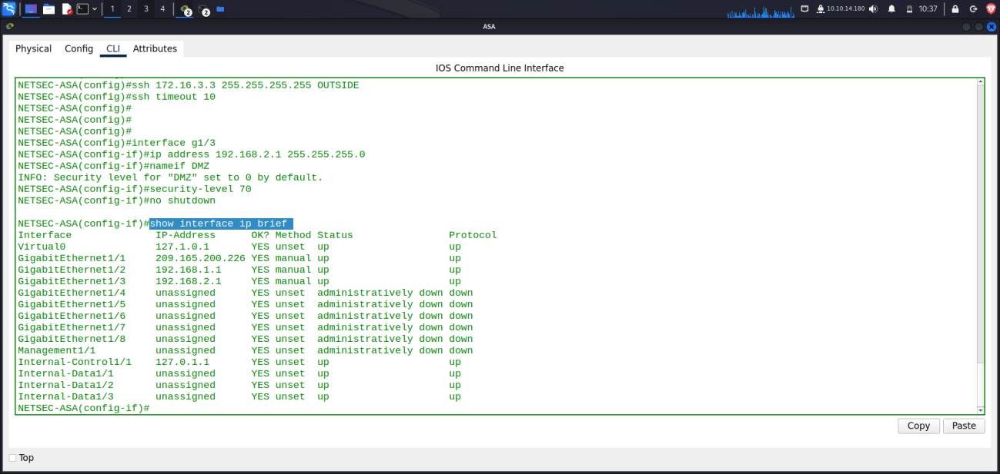{width="6.5in"
> height="3.0902777777777777in"}
>
> Use the **show ip address** command to display the information for the
> ASA interfaces.
>
> {width="6.5in"
> height="3.0902777777777777in"}

**Step 2: Configure static NAT to the DMZ server using a network
object.**

Configure a network object named DMZ-SERVER and assign it the static IP
address of the DMZ server (192.168.2.3). While in object definition
mode, use the nat command to specify that this object is used to
translate a DMZ address to an OUTSIDE address using static NAT, and
specify a public translated address of 209.165.200.227.

*NETSEC-ASA(config)# **object network DMZ-SERVER ***\
*NETSEC-ASA(config-network-object)# **host 192.168.2.3 ***\
*NETSEC-ASA(config-network-object)# **nat (DMZ,OUTSIDE) static
209.165.200.227** NETSEC-ASA(config-network-object)# **exit ***

{width="6.5in"
height="3.0902766841644795in"}

**Step 3: Configure an ACL to allow access to the DMZ server from the
Internet.**

Configure a named access list OUTSIDE-DMZ that permits the TCP protocol
on port 80 from any external host to the internal IP address of the DMZ
server. Apply the access list to the ASA OUTSIDE interface in the "IN"
direction.

> *NETSEC-ASA(config)# access-list OUTSIDE-DMZ permit icmp any host
> 192.168.2.3*

*NETSEC-ASA(config)# access-list OUTSIDE-DMZ permit tcp any host
192.168.2.3 eq 80*

*NETSEC-ASA(config)# access-group OUTSIDE-DMZ in interface OUTSIDE*\
**Note:** Unlike IOS ACLs, the ASA ACL permit statement must permit
access to the internal private DMZ address. External hosts access the
server using its public static NAT address, the ASA translates it to the
internal host IP address, and then applies the ACL.

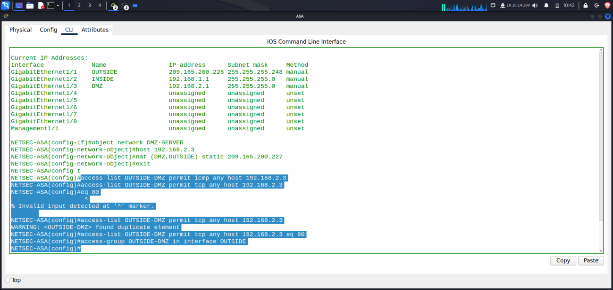{width="6.5in"
height="3.0902777777777777in"}

**Step 4: Test access to the DMZ server.**

From a web browser on PC-C, navigate to the DMZ server
(209.165.200.227). Troubleshoot if it is not successful.

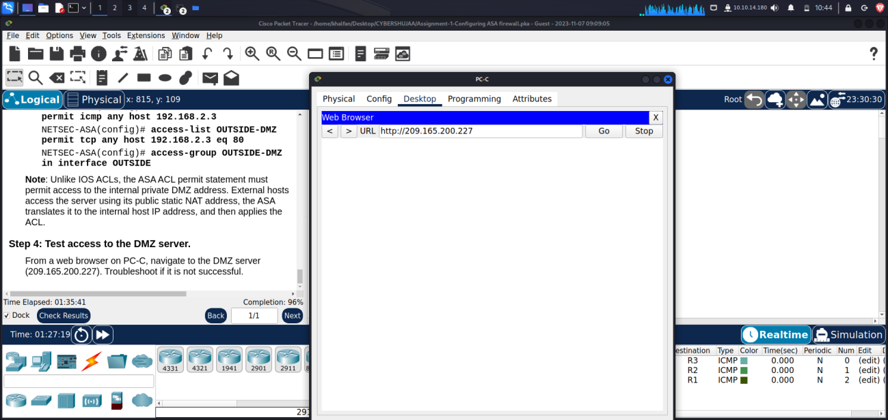{width="6.5in"
height="3.0902777777777777in"}

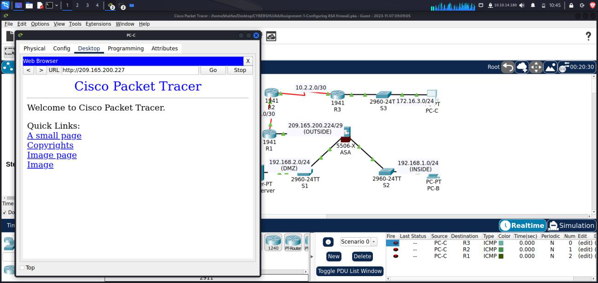{width="6.5in"
height="3.0888877952755904in"}

**Conclusion**

This lab allowed me to explore and configure essential functions on the
ASA, including connectivity verification, basic settings, security
levels, routing, address translation, inspection policies, DHCP, AAA,
SSH, DMZ configuration, Static NAT, and ACLs. This exercise is crucial
for setting up a secure and efficiently managed network, ensuring smooth
communication between the internal corporate network, DMZ, and the ISP
while handling NAT and DHCP services for internal hosts**.**
